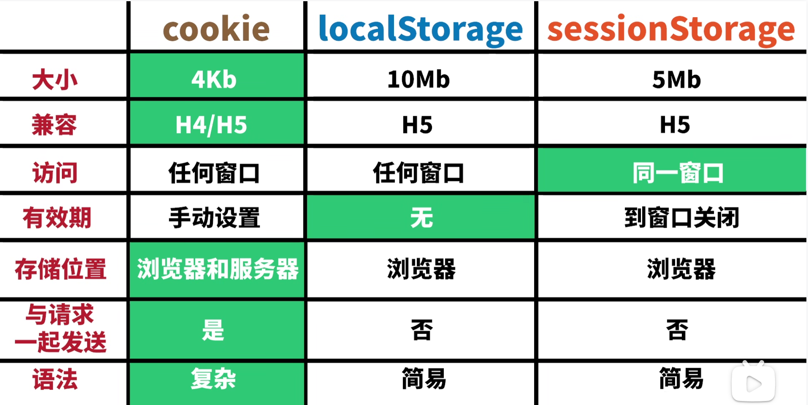

# 1 说明一下Html语义化

当然，让我们通过一个简单的例子来说明 HTML 语义化的概念。假设我们要创建一个博客文章的页面，我们将使用 HTML5 的语义化标签来构建页面结构。

### 非语义化的 HTML 示例

在 HTML5 之前，人们可能会使用 `<div>` 标签来构建整个页面的结构，如下所示：

```html
<div id="header">
  <h1>我的博客</h1>
  <nav>
    <ul>
      <li><a href="#">首页</a></li>
      <li><a href="#">关于我</a></li>
      <li><a href="#">文章</a></li>
      <li><a href="#">联系</a></li>
    </ul>
  </nav>
</div>

<div id="main">
  <div class="article">
    <h2>我的第一个博客文章</h2>
    <p>这里是文章的内容...</p>
  </div>
</div>

<div id="footer">
  <p>版权所有 &copy; 2024</p>
</div>
```

### 语义化的 HTML 示例

使用 HTML5 语义化标签，我们可以这样重构上面的代码：

```html
<header>
  <h1>我的博客</h1>
  <nav>
    <ul>
      <li><a href="#">首页</a></li>
      <li><a href="#">关于我</a></li>
      <li><a href="#">文章</a></li>
      <li><a href="#">联系</a></li>
    </ul>
  </nav>
</header>

<main>
  <article>
    <h2>我的第一个博客文章</h2>
    <p>这里是文章的内容...</p>
  </article>
</main>

<footer>
  <p>版权所有 &copy; 2024</p>
</footer>
```

### 语义化的优势

1. **结构清晰**：通过使用 `<header>`, `<nav>`, `<article>`, `<main>`, 和 `<footer>` 等标签，页面的结构更加清晰，易于理解。

2. **可访问性**：辅助技术（如屏幕阅读器）可以识别这些标签，并提供更好的用户体验。

3. **SEO 友好**：搜索引擎可以更容易地解析页面内容，有助于提高页面的搜索排名。

4. **代码维护**：语义化的标签使得代码更易于阅读和维护，其他开发者可以更快地理解页面结构。

5. **响应式设计**：语义化的 HTML 结构使得在不同设备上调整布局变得更加容易，有助于实现响应式设计。

通过这个例子，你可以看到如何使用 HTML5 的语义化标签来构建一个结构化、易于理解和维护的网页。

# 2 说明一下CSS盒模型

CSS 盒模型是指在网页布局时，每个元素被描绘为一个矩形盒子。这个盒子包括了元素的内容（content）、内边距（padding）、边框（border）、外边距（margin）四个部分。**内边距padding外边距margin不要搞反！**

在 CSS 中，盒模型可以通过 `box-sizing` 属性来控制，这个属性决定了元素的宽度和高度是如何计算的。有两种盒模型：标准盒模型（Standard Box Model）和怪异盒模型（IE Box Model，也称为怪异模式）。

### 标准盒模型（Standard Box Model）

在标准盒模型中，元素的宽度和高度只包括内容区域（content），不包括内边距（padding）、边框（border）和外边距（margin）。这意味着如果你设置了一个元素的宽度为 100px，那么这个宽度只应用于内容区域，内边距和边框的宽度会额外增加到这个宽度上。

#### CSS 代码示例：

```css
.box {
  width: 100px;
  height: 100px;
  padding: 10px;
  border: 5px solid black;
  box-sizing: content-box; /* 默认值，可以省略 */
  /*可以这么记，标准盒模型只包含内容，因此box-sizing叫content-box*/
}
```

#### HTML 代码示例：

```html
<div class="box"></div>
```

在这个例子中，`.box` 的总宽度将是 100px（内容宽度）+ 20px（左右内边距总和）+ 10px（左右边框总和）= 130px。总高度也是同样的道理。

### 怪异盒模型（IE Box Model）

在怪异盒模型中，元素的宽度和高度包括内容区域、内边距和边框，但不包括外边距。这意味着如果你设置了一个元素的宽度为 100px，那么这个宽度将包括内容、内边距和边框的宽度。

#### CSS 代码示例：

```css
.box {
  width: 100px;
  height: 100px;
  padding: 10px;
  border: 5px solid black;
  box-sizing: border-box;
}
```

#### HTML 代码示例：

```html
<div class="box"></div>
```

在这个例子中，`.box` 的总宽度是 100px，这个宽度包括了内容、10px 的内边距和 10px 的边框宽度。因此，内容区域的实际宽度将是 100px - 20px（内边距）- 10px（边框）= 70px。

### 总结

- **标准盒模型**：宽度和高度只包括内容区域。
- **怪异盒模型**：宽度和高度包括内容区域、内边距和边框。

在实际开发中，许多开发者倾向于使用 `box-sizing: border-box;`，因为它使得元素的宽度和高度的控制更加直观，特别是在进行响应式设计时。


# 3 说明一下浮动（这一个理解的不是很清楚）

在 CSS 中，浮动（float）是一种常见的布局技术，用于实现文字环绕图片、多列布局等效果。当一个元素浮动之后，它会尽量向左或向右移动，直到碰到包含框或另一个浮动元素的边缘为止。

在 CSS 中，浮动（Float）是一种布局技术，它允许元素向左或向右浮动，从而围绕它的内容。浮动元素会脱离正常的文档流，这意味着它不再占据文档流中的原始位置，而是移动到容器的左侧或右侧，直到它的外边缘接触到包含框或另一个浮动框的边缘。

### 浮动的基本用法

- `float: left;`：元素向左浮动。
- `float: right;`：元素向右浮动。
- `float: none;`：元素不浮动（默认值）。

### 浮动的影响

1. **环绕文本**：浮动元素周围的文本和内联元素（如图片）会环绕在浮动元素的周围。

2. **脱离文档流**：浮动元素会从文档流中“脱离”，这意味着它不再占据它原本的位置，下方的元素会向上移动来填补空白。

3. **高度塌陷**：当一个元素的所有子元素都浮动时，父元素可能会失去高度，因为它的子元素不再占据空间。

### 浮动的常见用途

1. **创建多列布局**：通过将多个元素设置为浮动，可以创建多列布局。

2. **图片环绕文本**：将图片设置为浮动，可以让文本环绕在图片的一侧。

3. **导航菜单**：浮动可以用于创建水平导航菜单。

### 清除浮动

由于浮动元素会脱离文档流，这可能导致父元素的高度塌陷。为了解决这个问题，可以使用“清除浮动”技术，确保父元素能够正确地包裹其浮动子元素。

- **使用 `clear` 属性**：可以为元素设置 `clear: left;`, `clear: right;`, 或 `clear: both;` 来防止元素被浮动元素覆盖。

- **使用伪元素**：在父元素中添加一个清除浮动的伪元素，例如：

  ```css
  .clearfix::after {
    content: "";
    display: table;
    clear: both;
  }
  ```

  然后在父元素上应用 `.clearfix` 类：

  ```html
  <div class="clearfix">
    <div class="float-left">浮动左侧</div>
    <div class="float-right">浮动右侧</div>
  </div>
  ```

### 现代布局技术

虽然浮动是一种有效的布局技术，但它也有一些局限性，比如需要清除浮动和对高度的控制不够灵活。随着 CSS3 的发展，现在有更多现代的布局技术，如 Flexbox 和 Grid，它们提供了更灵活和强大的布局控制。

- **Flexbox**：提供了一种更加高效的方式来布局、对齐和分配容器内项目的空间，即使它们的大小是未知或者动态变化的。

- **Grid**：是一个二维布局系统，允许你在两个维度上（行和列）精确地控制布局。

这些现代技术使得创建复杂的布局变得更加简单和可靠，但浮动仍然在某些情况下非常有用，尤其是在旧的浏览器兼容性或特定的布局需求中。

# 4 说明一下样式优先级


一般来说，当两个样式优先级相同时，后面的样式会覆盖前面的样式。但是，如果两个样式的优先级不同，那么优先级高的样式会覆盖优先级低的样式。

例1：


两个div最终显示的都是红色，因为无论class定义的顺序怎样，在style标签中定义的.red靠后，优先级来的更高。


看这个例子，设置了两个属性的优先级来的更高。

# 5 说一说CSS尺寸设置的单位

在 CSS 中，可以使用多种单位来设置元素的尺寸，如像素（px）、百分比（%）、vw、vh、em、rem 等。这些单位可以分为绝对单位和相对单位。

1. px：写死单位，固定像素大小
2. %：相对于父元素的百分比
3. vw：浏览器视窗**宽度**的百分比
4. vh：浏览器视窗**高度**的百分比
5. em：相对于**父元素**的字体大小
6. rem：相对于**根元素**的字体大小

# 6 说一说BFC（类似题目：高度坍塌）（这个还不怎么理解）

BFC（Block Formatting Context）块级格式化上下文，目的是**为了形成独立的渲染区域，内部元素的渲染不会影响到外界。**

形成BFC的条件（前面三点比较常见）：

1. 根元素或包含根元素的元素
2. 浮动元素（元素的 float 不是 none）
3. 绝对定位元素（元素的 position 为 absolute 或 fixed）
4. 行内块元素（元素的 display 为 inline-block）
5. overflow 值不为 visible 的块元素
6. 弹性元素（display为 flex 或 inline-flex元素的直接子元素）

# 7 说几个未知宽高元素水平垂直居中方法（这个问题似乎问的不多，先这样）

display: flex + justify-content + align-items

display: grid + justify-items + align-items

transform: translate(-50%, -50%)

绝对定位 + 负margin

# 8 CSS的三栏布局

三栏布局是指页面中有左栏、右栏和中间栏三个部分，其中左右栏宽度固定，中间栏宽度自适应。实现三栏布局的方法有很多种，下面列举了一些常见的方法：

1. 左右浮动 + 外margin

```html
<style>
  .left {
    float: left;
    width: 200px;
    background-color: red;
  }
  .right {
    float: right;
    width: 200px;
    background-color: blue;
  }
  .main {
    margin-left: 200px;
    margin-right: 200px;
    background-color: green;
  }
</style>

<div class="left">左栏</div>
<div class="right">右栏</div>
<div class="main">中间栏</div>
```

缺点：左右栏固定宽度被写死，不适应不同屏幕大小。

2. 左右浮动 + 中间BFC

```html
<style>
  .left {
    float: left;
    width: 200px;
    background-color: red;
  }
  .right {
    float: right;
    width: 200px;
    background-color: blue;
  }
  .main {
    overflow: hidden;
    background-color: green;
  }
</style>

<div class="left">左栏</div>
<div class="right">右栏</div>
<div class="main">中间栏</div>
```

缺点一样是左右栏固定宽度被写死。

3. 使用flex弹性布局

```html
<style>
  .container {
    display: flex;
  }
  .left {
    width: 200px;
    background-color: red;
  }
  .right {
    width: 200px;
    background-color: blue;
  }
  .main {
    flex: 1;
    background-color: green;
  }
</style>

<div class="container">
  <div class="left">左栏</div>
  <div class="main">中间栏</div>
  <div class="right">右栏</div>
</div>
```

4. table布局

```html
<style>
  .container {
    display: table;
    width: 100%;
  }
  .left, .right {
    width: 200px;
    display: table-cell;
  }
  .left {
    background-color: red;
  }
  .right {
    background-color: blue;
  }
  .main {
    display: table-cell;
    background-color: green;
  }
</style>

<div class="container">
  <div class="left">左栏</div>
  <div class="main">中间栏</div>
  <div class="right">右栏</div>
</div>
```

3和4的缺点是左右栏宽度固定，优点是中间栏宽度自适应。

5. 圣杯布局（可以自适应大小）

```html
<style>
  .container {
    padding-left: 200px;
    padding-right: 200px;
  }
  .left {
    float: left;
    width: 200px;
    margin-left: -100%;
    position: relative;
    left: -200px;
  }
  .right {
    float: right;
    width: 200px;
    margin-right: -100%;
    position: relative;
    right: -200px;
  }
  .main {
    background-color: green;
  }
</style>

<div class="container">
  <div class="main">中间栏</div>
  <div class="left">左栏</div>
  <div class="right">右栏</div>
</div>
```

6. 双飞翼布局（可以自适应大小）

# 9 JS的数据类型

JS的数据类型分为两大类：基本数据类型和引用数据类型。

基本数据类型包括：Number、String、Boolean、Null、Undefined、Symbol（ES6新增）、BigInt（ES10新增）。

引用数据类型包括：Object

**基本数据类型存放在栈中，引用数据类型存放在堆中，在栈中存放的是它们的地址。**

### Symbol

Symbol 是 ES6 新增的一种数据类型，表示独一无二的值。Symbol 值是通过 `Symbol()` 函数创建的，**每个 Symbol 值都是唯一的，即使它们的描述相同。**

```js
const sym1 = Symbol('foo');
const sym2 = Symbol('foo');

console.log(sym1 === sym2); // false
```

### BigInt

BigInt 是 ES10 新增的一种数据类型，用于表示**任意长度**的整数。BigInt 值是通过在整数后面加上 `n` 或者调用 `BigInt()` 函数创建的。对于Number而言，它的表示范围是-9007199254740991(-(2^53-1)) 和 9007199254740991(2^53-1)。

```js
const bigIntValue = 1234567890123456789012345678901234567890n;
```

# 10 null 和 undefined 的区别

作者在设计js的时候先设计的null，但是由于null会被隐式转换为0，很不容易发现错误，所以又设计了undefined。

具体区别：null 表示一个空对象指针，**typeof null 返回 "object"**，转为数值时为0；undefined 表示一个未定义的值，**typeof undefined 返回 "undefined"**，转为数值时为 NaN。

# 11 JS 有几种方法判断变量的类型？

1. `typeof`：返回一个表示数据类型的字符串，对于基本数据类型除了 null 都可以显示正确的类型，（null的话会返回object）。引用数据类型除了函数都会显示 object。

2. `instanceof`：用于判断一个变量是否是某个对象的实例，返回布尔值。

```js
const arr = [];
console.log(arr instanceof Array); // true
```

3. `Object.prototype.toString.call()`：可以精确判断数据类型，返回 `[object Type]`。

```js
const arr = [];
console.log(Object.prototype.toString.call(arr)); // [object Array]
```

4. `constructor`：通过判断对象的构造函数来判断数据类型。

```js
const arr = [];
console.log(arr.constructor === Array); // true
```

# 12 JS 数组去重的办法

1. 使用 Set：Set 是 ES6 新增的一种数据结构，它类似于数组，但是成员的值都是唯一的。

```js
const arr = [1, 2, 3, 3, 4, 4, 5];
const uniqueArr = [...new Set(arr)];
console.log(uniqueArr); // [1, 2, 3, 4, 5]
```

PS: 用`Array.from(new Set(arr))`也可以。

2. 自己写一套逻辑。使用indexOf

**indexOf方法是寻找该元素的第一个索引。**

```js
const arr = [1, 2, 3, 3, 4, 4, 5];
const uniqueArr = [];
for (let i = 0; i < arr.length; i++) {
  if (uniqueArr.indexOf(arr[i]) === -1) {   // indexOf返回-1表示没有找到
    uniqueArr.push(arr[i]);
  }
}
console.log(uniqueArr); // [1, 2, 3, 4, 5]
```

3. 使用filter

```js
const arr = [1, 2, 3, 3, 4, 4, 5];
const uniqueArr = arr.filter((item, index) => arr.indexOf(item) === index);
console.log(uniqueArr); // [1, 2, 3, 4, 5]
```

# 13 说一说伪数组和数组的区别

**伪数组：** 又叫对象数组，是一个对象，有length属性，但是没有数组的方法，比如push、pop、slice等。

1. 伪数组长度不可变，数组长度可变。
2. 因为是对象数组，所以伪数组用for in遍历，数组更适合使用for of
3. 函数的arguments（参数），原生获取dom标签（比如获取div）获得的都是伪数组。

PS：原生获取DOM标签的一些方法：`getElementById`、`getElementsByTagName`、`getElementsByClassName`、`querySelectorAll`等。

# 14 说一说map和forEach的区别

1. map：返回一个新数组，数组中的元素为原始数组元素调用函数处理后的值。

```js
const arr = [1, 2, 3];
const newArr = arr.map(item => item * 2);
console.log(newArr); // [2, 4, 6]
```

2. forEach：对数组的每个元素执行一次提供的函数，没有返回值。

```js
const arr = [1, 2, 3];
arr.forEach(item => console.log(item));
```

# 15 说一说ES6箭头函数和普通函数的区别

1. 箭头函数没有自己的this，它的this是继承外层的this。**如果找不到外层的普通函数时，一般指向window。**
  
```js
function foo() {
  setTimeout(() => {
    console.log(this.a);
  }, 100);
}

foo.call({ a: 1 }); // 1
```

2. 箭头函数没有arguments，可以使用rest参数代替。

```js
function foo() {
  console.log(arguments);
}

foo(1, 2, 3); // [1, 2, 3]

const bar = (...args) => {
  console.log(args);
}

bar(1, 2, 3); // [1, 2, 3]
```

PS：针对arguments，请看下面的说明：

在 JavaScript 中，arguments 是一个特殊的类数组对象，它包含了函数调用时传入的所有参数。这个对象在函数体内部可用，它允许你访问函数的参数，即使函数没有使用正式的参数名。

```js
function exampleFunc() {
  console.log(arguments.length); // 输出参数的数量
  console.log(arguments[0]);     // 输出第一个参数
  console.log(arguments[1]);     // 输出第二个参数
}

exampleFunc(1, 2, 3); // 输出：3, 1, 2
```

4. 箭头函数因为没有`this`，所以显然也就不能有`new`来进行调用。

5. 箭头函数没有super。

# 16 事件扩展符用过吗(...)，什么场景下？

**当我们在代码中看到 "..." 时，它要么是 rest 参数，要么是 spread 语法。**

Rest 参数用于创建可接受任意数量参数的函数。Spread 语法用于在函数调用/数组构造时，将数组表达式或者 string 在语法层面展开。

1. `rest`参数

看下面的例子：

```javascript
function sumAll(...args) { // 数组名为 args
  let sum = 0;

  for (let arg of args) sum += arg;

  return sum;
}

alert( sumAll(1) ); // 1
alert( sumAll(1, 2) ); // 3
alert( sumAll(1, 2, 3) ); // 6
```

注意：`...` 只能放在参数的最后。

2. `spread`语法

最大最小值的比较、数组合并连接、复制数组等都可以用到。

```javascript
let arr = [3, 5, 1];
let arr2 = [8, 9, 15];

let merged = [0, ...arr, 2, ...arr2];

alert(merged); // 0,3,5,1,2,8,9,15（0，然后是 arr，然后是 2，然后是 arr2）
```

```javascript
let str = "Hello";

alert( [...str] ); // H,e,l,l,o
console.log( ...str ); // H e l l o
```

3. `arguments`参数

在过去，它是获取函数所有参数的唯一方法。现在它仍然有效。

# 操作系统

周转时间 = 任务完成时间 - 到达时间

相应比 = （等待时间 + 服务时间）/ 服务时间

# 17 什么是闭包？

**闭包**是指一个函数可以记住其外部变量并可以访问这些变量。JavaScript 中的函数会自动通过隐藏的 `[[Environment]]` 属性记住创建它们的位置，所以它们都可以访问外部变量。

https://zh.javascript.info/closure#step-4-fan-hui-han-shu 这一段还不太懂，前面的已经看懂。

# 18 JS 变量提升

**JS在预编译阶段会将`函数`和`var`定义的变量提升至最前面先执行。**

1. var 声明的变量没有块级作用域，它们仅在当前函数内可见，或者全局可见（如果变量是在函数外声明的）。
2. var 变量声明在函数开头就会被处理（脚本启动对应全局变量）。

而let和const声明的变量只是创建提升，在预编译中将其创建，形成暂时性死区，不能提前访问和调用变量，只能在赋值之后进行调用和访问。

# 19 `this`指向

普通函数指向调用处，箭头函数指向定义处。此外，如果普通函数的调用者是window，那么在非严格模式下，this指向window，严格模式下指向undefined。

# 20 `apply` `call` 与 `bind`

首先，call apply bind三个方法都可以用来改变函数的this指向，具体区别如下：
   
  1. fn.call (newThis,params) call函数的第一个参数是this的新指向，后面依次传入函数fn要用到的参数。会立即执行fn函数。  
 
  2. fn.apply (newThis,paramsArr) apply函数的第一个参数是this的新指向,第二个参数是fn要用到的参数数组，会立即执行fn函数。  
 
  3. fn.bind (newThis,params) bind函数的第一个参数是this的新指向，后面的参数可以直接传递，也可以按数组的形式传入。  不会立即执行fn函数，且**只能改变一次fn函数的指向，后续再用bind更改无效**。返回的是已经更改this指向的新fn。**bind是把修改好了绑定对象的东西赋值给新函数。**


**`call`喜欢一个一个调，`apply`喜欢一组一组调。**

要指定函数的this指向哪个对象，可以用函数本身的apply方法，它接收两个参数，第一个参数就是需要绑定的this变量，第二个参数是Array，表示函数本身的参数。

```javascript
function getAge() {
    let y = new Date().getFullYear();
    return y - this.birth;
}

let xiaoming = {
    name: '小明',
    birth: 1990,
    age: getAge
};

xiaoming.age(); // 25
getAge.apply(xiaoming, []); // 25, this指向xiaoming, 参数为空
```

另一个与apply()类似的方法是call()，唯一区别是：

apply()把参数打包成Array再传入；

call()把参数按顺序传入。

```javascript
Math.max.apply(null, [3, 5, 4]); // 5
Math.max.call(null, 3, 5, 4); // 5
```

下面是bind:

```javascript
let user = {
    name_: "xiaoming",
    id: "woshiniba"
};

let newUser = {
    name_: "daming",
    id: "woshinibaba"
};

function getId() {
    console.log(this.name_);
    console.log(this.id);
}

// user.getId();

getId();

let getUserId = getId.bind(user);

getUserId();

let getNewUserId = getId.bind(newUser);

getNewUserId();

let newFunc1 = getUserId.bind(newUser);
let newFunc2 = getId.bind(newUser);

newFunc1();
newFunc2();
```

打印的结果为：

```javascript
undefined
undefined
xiaoming
woshiniba
daming
woshinibaba
xiaoming
woshiniba
daming
woshinibaba
```

# 21 JS有哪些继承方法及优缺点？

在JavaScript高级程序设计一书中，提到js中有六种继承方式，但阅读后，个人觉得这六种方式，其实最终也只是对原型和构造函数通过不同的技巧实现的继承设计方式罢了，为了满足需要其实我们也可以自己去定义技巧实现继承，那么如此说来继承方式岂非不是仅仅只有六种乎？

原型链继承、借用构造函数继承、组合继承、原型式继承、寄生继承、寄生组合继承。

# 22 说一说new会发生什么？

1. 创建了一个新对象
2. this指向了这个对象
3. 构造函数的属性和方法都赋给了这个对象
4. 返回这个新对象

# 23 说一说`defer`和`async`的异同

`defer`和`async`都是用来异步加载脚本的属性。`async` 和 `defer` 有一个共同点：加载这样的脚本都不会阻塞页面的渲染。**而如果在html中遇到普通的`<script>`标签，DOM树会暂停渲染，浏览器会马上下载标签中的js脚本并执行，待执行完成之后才会继续渲染DOM树。** 因此，用户可以立即阅读并了解页面内容。

但是，它们之间也存在一些本质的区别：

|         | 顺序 | `DOMContentLoaded` |
|---------|---------|---------|
| `async` | **加载优先顺序**。脚本在文档中的顺序不重要 —— 先加载完成的先执行 | 不相关。可能在文档加载完成前加载并执行完毕。如果脚本很小或者来自于缓存，同时文档足够长，就会发生这种情况。 |
| `defer` | **文档顺序**（它们在文档中的顺序） | 在文档加载和解析完成之后（如果需要，则会等待），即在 `DOMContentLoaded` 之前执行。 |

**在实际开发中，`defer` 用于需要整个 DOM 的脚本，和/或脚本的相对执行顺序很重要的时候。简单来说，如果脚本依赖页面中的DOM元素，那么就要用defer（例如评论区和代码语法高亮）。此外它会按照我们定义的顺序做依次执行。**

**`async` 用于独立脚本，例如计数器或广告，这些脚本的相对执行顺序无关紧要。**

# 24 Promise 的使用

JS是一门单线程的编程语言，它的所有程序都运行在同一个线程中。**好处就是它能减少线程内存开销以及线程切换开销。**

Promise是一种处理异步代码，而不会陷入回调地狱的方式。**它解决了前端程序员的“回调地狱”问题。**

# 视频: https://www.bilibili.com/video/BV1454y1R7vj?p=10

视频作者: 杰哥课堂(B站)

## 1.1 为什么需要Promise
- **需求**
  通过AJAX请求id ,再根据id请求用户名.再根据用户名,再根据用户名获取email
- **回调地狱**
  回调函数中嵌套回调
  Promise解决了回调地狱

## 1.2 Promise 的基本使用
### 语法
```javascript
new Promise((resolve, reject) => {})
```
- Promise接受一个函数作为参数
- 在参数函数中有两个参数
  - `resolve`: 成功函数
  - `reject`: 失败函数

### Promise实例
Promise实例有两个属性
- `state`: 状态
- `result`: 结果

#### 1) Promise的状态
- 第一种状态: `pending`
- 第二种状态: `fulfilled`
- 第三种状态: `rejected`

#### 2) Promise状态的改变
示例1
```javascript
const p = new Promise((resolve, reject) => {
  resolve();
});
console.dir(p); // fulfilled
```
示例2
```javascript
const p = new Promise((resolve, reject) => {
  reject();
});
console.dir(p);
```
- `resolve()`: 调用函数, 使当前Promise对象的状态改成`fulfilled`
- `reject()`: 调用函数,使当前Promise对象状态改成`rejected`
Promise状态的改变是一次性的

#### 3) Promise 的结果
示例
```javascript
const p = new Promise((resolve, reject) => {
  resolve("成功的结果");
});
console.dir(p);
```

### 1.3 Promise的方法
#### 1) then方法
示例1
```javascript
const p = new Promise((resolve, reject) => {
  reject("失败的结果");
});

p.then(() => {
  console.log("成功的回调");
}, () => {
  console.log("失败时调用");
});
```
示例2
```javascript
const p = new Promise((resolve, reject) => {
  reject("失败的结果");
});

p.then((value) => {
  console.log("成功的回调", value);
}, (err) => {
  console.log("失败时调用", err);
});
```
- 在then方法的参数函数中,通过形参使用Promise对象的结果
- `then`方法返回一个新的Promise实例,状态是`pending`

#### 2) catch方法
示例
```javascript
const p = new Promise((resolve, reject) => {
  throw new Error("出错了");
});

p.catch((reason) => {
  console.log("失败", reason);
});
```

### 1.4 优化代码
示例
```javascript
function getData(url, data = {}) {
  return new Promise((resolve, reject) => {
    $.ajax({
      type: "GET",
      url: url,
      data: data,
      success: function (res) {
        resolve(res);
      },
      error: function (res) {
        reject(res);
      }
    });
  });
}

getData("data1.json")
  .then((data) => {
    const { id } = data;
    return getData("data2.json", {id});
  })
  .then((data) => {
    const { usename } = data;
    return getData("data3.json", {usename});
  })
  .then((data) => {
    console.log(data);
  });
```

# 25 说一说JS实现异步的方法

1. Promise
2. 定时器（`setTimeout` `setInterval`）
它们两个语法相同，只是一个是等待一定时间后执行一次，一个是每隔一定时间执行一次。
3. 回调函数(**要注意的是它并不是JS中内置的，而是人为定义的一个东西。**)

# 26 说一说 `cookie` `sessionStorage` `localStorage` 的区别

它们都是用来存储数据的，但是有一些区别：



# 27 如何实现可过期的localStorage

1. 惰性删除：存储数据时使用对象类型，添加一个key值为当前存储时间，当下一次使用时，判断与当前时间的间隔，如果超过过期时间就清除数据；
2. 定时删除：每隔一段时间进行一次删除操作，通过限制删除操作执行的次数和频率，来减少删除操作对CPU的长期占用，获取所有设置过期时间的key判断是否过期，过期就存储到数组中，遍历数组，每隔1S（固定时间）删除5个（固定个数），直到把数组中的key从localstorage中全部删除。

# 28 说一说`token`可以存放在`cookie`中吗？

1. 实现上是可以的，功能上不推荐，容易产生csrf问题。

2. token一般存储在sessionStorage/localStorage里面。token的出现就是为了解决用户登录后的鉴权问题，如果采用cookie+session的鉴权方式，则无法有效地防止CSRF攻击，同时，如果服务端采用负载均衡策略进行分布式架构，session也会存在一致性问题，需要额外的开销维护session一致性。

# 29 说一说axios拦截器原理及应用

1. 拦截器分为 请求（request）拦截器和 响应（response）拦截器。
2. 请求拦截器用于在接口请求之前做的处理，比如为每个请求带上相应的参数（token，时间戳等）。
3. 返回拦截器用于在接口返回之后做的处理，比如对返回的状态进行判断（token是否过期）
4. 拦截器原理：创建一个chn数组，数组中保存了拦截器相应方法以及dispatchRequest（dispatchRequest这个函数调用才会真正的开始下发请求），把请求拦截器的方法放到chn数组中dispatchRequest的前面，把响应拦截器的方法放到chn数组中dispatchRequest的后面，把请求拦截器和相应拦截器forEach将它们分unshift,push到chn数组中，为了保证它们的执行顺序，需要使用promise，以出队列的方式对chn数组中的方法挨个执行。
5. 从浏览器中创建 XMLHttpRequests,从 node.js 创建 http 请求,支持 Promise API,可拦截请求和响应，可转换请求数据和响应数据，可取消请求，可自动转换 JSON 数据，客户端支持防御 XSRF

# 30 说一说创建AJAX的过程

1. 创建XHR对象：new XMLHttpRequest()
2. 设置请求参数：request.open(Method, 服务器接口地址);
3. 发送请求: request.send()，如果是get请求不需要参数，post请求需要参数request.send(data)
4. 监听请求成功后的状态变化：根据状态码进行相应的处理:

```javascript
XHR.onreadystatechange = function () { 
    if (XHR.readyState == 4 && XHR.status == 200) { 
    console.log(XHR.responseText); // 主动释放,JS本身也会回收的 
    XHR = null; 
    } 
 };
```

# 31 说一下fetch请求方式

fetch 是 XMLHttpRequest 的一种替代方案，fetch是js原生语法也能像ajax一样获取后台数据

优点：
- 基于标准Promise实现，支持async/ await
- 语法简洁，更加语意化fetch 可以理解成简化版的 XMLHttpRequest
缺点：
- 兼容性不好，不支持IE
- 不能中断请求（xhr有个xhr.abort 方法能直接中断请求）
- 没法检测请求进度

# 32 说一说有什么办法可以保持前后端的实时通信

1. 轮询、长轮询、 iframe流、WebSocket、SSE
2. 轮询是客户端和服务器之间会一直进行连接，每隔一段时间就询问一次。
3. 长轮询是对轮询的改进版，客户端发送HTTP给服务器之后，如果没有新消息，就一直等待。有新消息，才会返回给客户端。
4. iframe流方式是在页面中插入一个隐藏的iframe，利用其src属性在服务器和客户端之间创建一条长连接，服务器向iframe传输数据（通常是HTML，内有负责插入信息的javascript），来实时更新页面。
5. WebSocket是类似Socket的TCP长连接的通讯模式，一旦WebSocket连接建立后，后续数据都以帧序列的形式传输。
6. SSE(Server-Sent Event)是建立在浏览器与服务器之间的通信渠道，然后服务器向浏览器推送信息。
7. 应用：
轮询适用于：小型应用，实时性不高

长轮询适用于：一些早期的对及时性有
一些要求的应用：web IM 聊天 

iframe适用于：客服通信等 

WebSocket适用于：微信、网络互动游戏等 

SSE适用于：金融股票数据、看板等


## 说一说进程与线程的区别

## 说一说键入URL发生了什么？