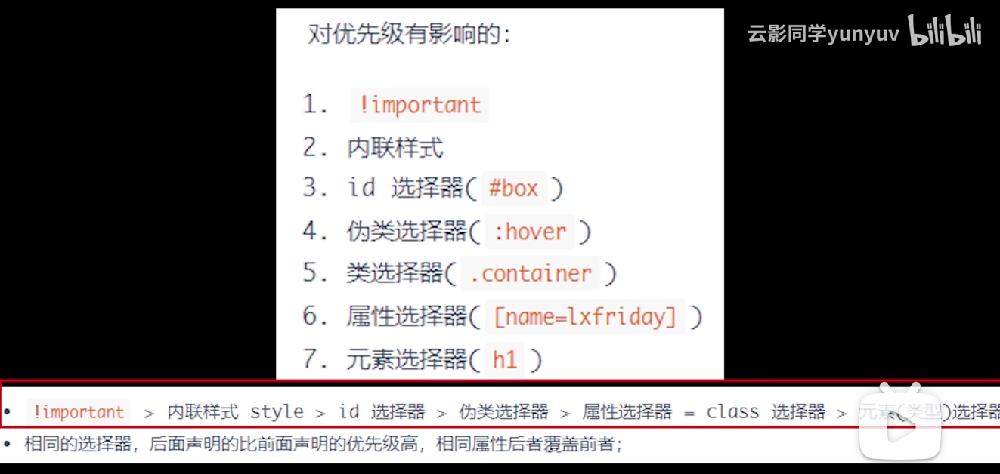
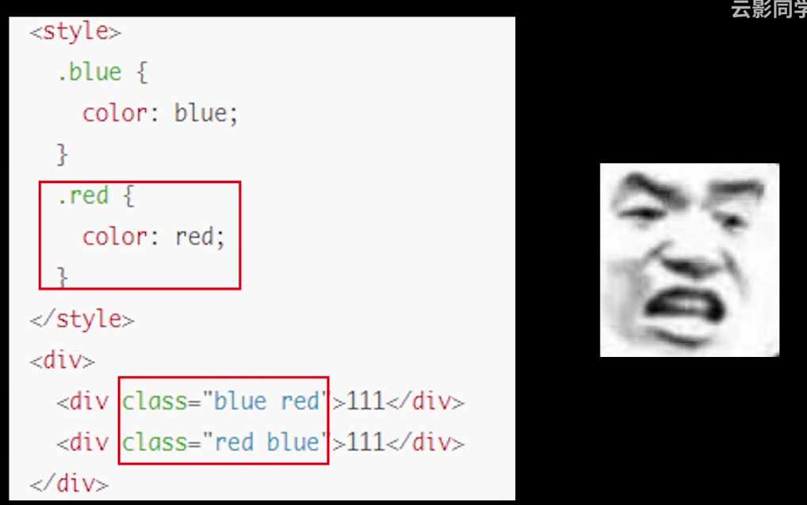
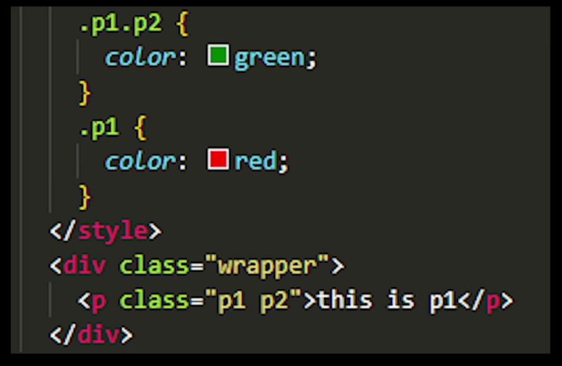

# 1 说明一下Html语义化

当然，让我们通过一个简单的例子来说明 HTML 语义化的概念。假设我们要创建一个博客文章的页面，我们将使用 HTML5 的语义化标签来构建页面结构。

### 非语义化的 HTML 示例

在 HTML5 之前，人们可能会使用 `<div>` 标签来构建整个页面的结构，如下所示：

```html
<div id="header">
  <h1>我的博客</h1>
  <nav>
    <ul>
      <li><a href="#">首页</a></li>
      <li><a href="#">关于我</a></li>
      <li><a href="#">文章</a></li>
      <li><a href="#">联系</a></li>
    </ul>
  </nav>
</div>

<div id="main">
  <div class="article">
    <h2>我的第一个博客文章</h2>
    <p>这里是文章的内容...</p>
  </div>
</div>

<div id="footer">
  <p>版权所有 &copy; 2024</p>
</div>
```

### 语义化的 HTML 示例

使用 HTML5 语义化标签，我们可以这样重构上面的代码：

```html
<header>
  <h1>我的博客</h1>
  <nav>
    <ul>
      <li><a href="#">首页</a></li>
      <li><a href="#">关于我</a></li>
      <li><a href="#">文章</a></li>
      <li><a href="#">联系</a></li>
    </ul>
  </nav>
</header>

<main>
  <article>
    <h2>我的第一个博客文章</h2>
    <p>这里是文章的内容...</p>
  </article>
</main>

<footer>
  <p>版权所有 &copy; 2024</p>
</footer>
```

### 语义化的优势

1. **结构清晰**：通过使用 `<header>`, `<nav>`, `<article>`, `<main>`, 和 `<footer>` 等标签，页面的结构更加清晰，易于理解。

2. **可访问性**：辅助技术（如屏幕阅读器）可以识别这些标签，并提供更好的用户体验。

3. **SEO 友好**：搜索引擎可以更容易地解析页面内容，有助于提高页面的搜索排名。

4. **代码维护**：语义化的标签使得代码更易于阅读和维护，其他开发者可以更快地理解页面结构。

5. **响应式设计**：语义化的 HTML 结构使得在不同设备上调整布局变得更加容易，有助于实现响应式设计。

通过这个例子，你可以看到如何使用 HTML5 的语义化标签来构建一个结构化、易于理解和维护的网页。

# 2 说明一下CSS盒模型

CSS 盒模型是指在网页布局时，每个元素被描绘为一个矩形盒子。这个盒子包括了元素的内容（content）、内边距（padding）、边框（border）、外边距（margin）四个部分。**内边距padding外边距margin不要搞反！**

在 CSS 中，盒模型可以通过 `box-sizing` 属性来控制，这个属性决定了元素的宽度和高度是如何计算的。有两种盒模型：标准盒模型（Standard Box Model）和怪异盒模型（IE Box Model，也称为怪异模式）。

### 标准盒模型（Standard Box Model）

在标准盒模型中，元素的宽度和高度只包括内容区域（content），不包括内边距（padding）、边框（border）和外边距（margin）。这意味着如果你设置了一个元素的宽度为 100px，那么这个宽度只应用于内容区域，内边距和边框的宽度会额外增加到这个宽度上。

#### CSS 代码示例：

```css
.box {
  width: 100px;
  height: 100px;
  padding: 10px;
  border: 5px solid black;
  box-sizing: content-box; /* 默认值，可以省略 */
  /*可以这么记，标准盒模型只包含内容，因此box-sizing叫content-box*/
}
```

#### HTML 代码示例：

```html
<div class="box"></div>
```

在这个例子中，`.box` 的总宽度将是 100px（内容宽度）+ 20px（左右内边距总和）+ 10px（左右边框总和）= 130px。总高度也是同样的道理。

### 怪异盒模型（IE Box Model）

在怪异盒模型中，元素的宽度和高度包括内容区域、内边距和边框，但不包括外边距。这意味着如果你设置了一个元素的宽度为 100px，那么这个宽度将包括内容、内边距和边框的宽度。

#### CSS 代码示例：

```css
.box {
  width: 100px;
  height: 100px;
  padding: 10px;
  border: 5px solid black;
  box-sizing: border-box;
}
```

#### HTML 代码示例：

```html
<div class="box"></div>
```

在这个例子中，`.box` 的总宽度是 100px，这个宽度包括了内容、10px 的内边距和 10px 的边框宽度。因此，内容区域的实际宽度将是 100px - 20px（内边距）- 10px（边框）= 70px。

### 总结

- **标准盒模型**：宽度和高度只包括内容区域。
- **怪异盒模型**：宽度和高度包括内容区域、内边距和边框。

在实际开发中，许多开发者倾向于使用 `box-sizing: border-box;`，因为它使得元素的宽度和高度的控制更加直观，特别是在进行响应式设计时。


# 3 说明一下浮动（这一个理解的不是很清楚）

在 CSS 中，浮动（float）是一种常见的布局技术，用于实现文字环绕图片、多列布局等效果。当一个元素浮动之后，它会尽量向左或向右移动，直到碰到包含框或另一个浮动元素的边缘为止。

在 CSS 中，浮动（Float）是一种布局技术，它允许元素向左或向右浮动，从而围绕它的内容。浮动元素会脱离正常的文档流，这意味着它不再占据文档流中的原始位置，而是移动到容器的左侧或右侧，直到它的外边缘接触到包含框或另一个浮动框的边缘。

### 浮动的基本用法

- `float: left;`：元素向左浮动。
- `float: right;`：元素向右浮动。
- `float: none;`：元素不浮动（默认值）。

### 浮动的影响

1. **环绕文本**：浮动元素周围的文本和内联元素（如图片）会环绕在浮动元素的周围。

2. **脱离文档流**：浮动元素会从文档流中“脱离”，这意味着它不再占据它原本的位置，下方的元素会向上移动来填补空白。

3. **高度塌陷**：当一个元素的所有子元素都浮动时，父元素可能会失去高度，因为它的子元素不再占据空间。

### 浮动的常见用途

1. **创建多列布局**：通过将多个元素设置为浮动，可以创建多列布局。

2. **图片环绕文本**：将图片设置为浮动，可以让文本环绕在图片的一侧。

3. **导航菜单**：浮动可以用于创建水平导航菜单。

### 清除浮动

由于浮动元素会脱离文档流，这可能导致父元素的高度塌陷。为了解决这个问题，可以使用“清除浮动”技术，确保父元素能够正确地包裹其浮动子元素。

- **使用 `clear` 属性**：可以为元素设置 `clear: left;`, `clear: right;`, 或 `clear: both;` 来防止元素被浮动元素覆盖。

- **使用伪元素**：在父元素中添加一个清除浮动的伪元素，例如：

  ```css
  .clearfix::after {
    content: "";
    display: table;
    clear: both;
  }
  ```

  然后在父元素上应用 `.clearfix` 类：

  ```html
  <div class="clearfix">
    <div class="float-left">浮动左侧</div>
    <div class="float-right">浮动右侧</div>
  </div>
  ```

### 现代布局技术

虽然浮动是一种有效的布局技术，但它也有一些局限性，比如需要清除浮动和对高度的控制不够灵活。随着 CSS3 的发展，现在有更多现代的布局技术，如 Flexbox 和 Grid，它们提供了更灵活和强大的布局控制。

- **Flexbox**：提供了一种更加高效的方式来布局、对齐和分配容器内项目的空间，即使它们的大小是未知或者动态变化的。

- **Grid**：是一个二维布局系统，允许你在两个维度上（行和列）精确地控制布局。

这些现代技术使得创建复杂的布局变得更加简单和可靠，但浮动仍然在某些情况下非常有用，尤其是在旧的浏览器兼容性或特定的布局需求中。

# 4 说明一下样式优先级



一般来说，当两个样式优先级相同时，后面的样式会覆盖前面的样式。但是，如果两个样式的优先级不同，那么优先级高的样式会覆盖优先级低的样式。

例1：



两个div最终显示的都是红色，因为无论class定义的顺序怎样，在style标签中定义的.red靠后，优先级来的更高。



看这个例子，设置了两个属性的优先级来的更高。

# 5 说一说CSS尺寸设置的单位

在 CSS 中，可以使用多种单位来设置元素的尺寸，如像素（px）、百分比（%）、vw、vh、em、rem 等。这些单位可以分为绝对单位和相对单位。

1. px：写死单位，固定像素大小
2. %：相对于父元素的百分比
3. vw：浏览器视窗**宽度**的百分比
4. vh：浏览器视窗**高度**的百分比
5. em：相对于**父元素**的字体大小
6. rem：相对于**根元素**的字体大小

# 6 说一说BFC（类似题目：高度坍塌）（这个还不怎么理解）

BFC（Block Formatting Context）块级格式化上下文，目的是**为了形成独立的渲染区域，内部元素的渲染不会影响到外界。**

形成BFC的条件（前面三点比较常见）：

1. 根元素或包含根元素的元素
2. 浮动元素（元素的 float 不是 none）
3. 绝对定位元素（元素的 position 为 absolute 或 fixed）
4. 行内块元素（元素的 display 为 inline-block）
5. overflow 值不为 visible 的块元素
6. 弹性元素（display为 flex 或 inline-flex元素的直接子元素）

# 7 说几个未知宽高元素水平垂直居中方法（这个问题似乎问的不多，先这样）

display: flex + justify-content + align-items

display: grid + justify-items + align-items

transform: translate(-50%, -50%)

绝对定位 + 负margin

# 8 CSS的三栏布局

三栏布局是指页面中有左栏、右栏和中间栏三个部分，其中左右栏宽度固定，中间栏宽度自适应。实现三栏布局的方法有很多种，下面列举了一些常见的方法：

1. 左右浮动 + 外margin

```html
<style>
  .left {
    float: left;
    width: 200px;
    background-color: red;
  }
  .right {
    float: right;
    width: 200px;
    background-color: blue;
  }
  .main {
    margin-left: 200px;
    margin-right: 200px;
    background-color: green;
  }
</style>

<div class="left">左栏</div>
<div class="right">右栏</div>
<div class="main">中间栏</div>
```

缺点：左右栏固定宽度被写死，不适应不同屏幕大小。

2. 左右浮动 + 中间BFC

```html
<style>
  .left {
    float: left;
    width: 200px;
    background-color: red;
  }
  .right {
    float: right;
    width: 200px;
    background-color: blue;
  }
  .main {
    overflow: hidden;
    background-color: green;
  }
</style>

<div class="left">左栏</div>
<div class="right">右栏</div>
<div class="main">中间栏</div>
```

缺点一样是左右栏固定宽度被写死。

3. 使用flex弹性布局

```html
<style>
  .container {
    display: flex;
  }
  .left {
    width: 200px;
    background-color: red;
  }
  .right {
    width: 200px;
    background-color: blue;
  }
  .main {
    flex: 1;
    background-color: green;
  }
</style>

<div class="container">
  <div class="left">左栏</div>
  <div class="main">中间栏</div>
  <div class="right">右栏</div>
</div>
```

4. table布局

```html
<style>
  .container {
    display: table;
    width: 100%;
  }
  .left, .right {
    width: 200px;
    display: table-cell;
  }
  .left {
    background-color: red;
  }
  .right {
    background-color: blue;
  }
  .main {
    display: table-cell;
    background-color: green;
  }
</style>

<div class="container">
  <div class="left">左栏</div>
  <div class="main">中间栏</div>
  <div class="right">右栏</div>
</div>
```

3和4的缺点是左右栏宽度固定，优点是中间栏宽度自适应。

5. 圣杯布局（可以自适应大小）

```html
<style>
  .container {
    padding-left: 200px;
    padding-right: 200px;
  }
  .left {
    float: left;
    width: 200px;
    margin-left: -100%;
    position: relative;
    left: -200px;
  }
  .right {
    float: right;
    width: 200px;
    margin-right: -100%;
    position: relative;
    right: -200px;
  }
  .main {
    background-color: green;
  }
</style>

<div class="container">
  <div class="main">中间栏</div>
  <div class="left">左栏</div>
  <div class="right">右栏</div>
</div>
```

6. 双飞翼布局（可以自适应大小）

# 9 JS的数据类型

JS的数据类型分为两大类：基本数据类型和引用数据类型。

基本数据类型包括：Number、String、Boolean、Null、Undefined、Symbol（ES6新增）、BigInt（ES10新增）。

引用数据类型包括：Object

**基本数据类型存放在栈中，引用数据类型存放在堆中，在栈中存放的是它们的地址。**

### Symbol

Symbol 是 ES6 新增的一种数据类型，表示独一无二的值。Symbol 值是通过 `Symbol()` 函数创建的，**每个 Symbol 值都是唯一的，即使它们的描述相同。**

```js
const sym1 = Symbol('foo');
const sym2 = Symbol('foo');

console.log(sym1 === sym2); // false
```

### BigInt

BigInt 是 ES10 新增的一种数据类型，用于表示**任意长度**的整数。BigInt 值是通过在整数后面加上 `n` 或者调用 `BigInt()` 函数创建的。对于Number而言，它的表示范围是-9007199254740991(-(2^53-1)) 和 9007199254740991(2^53-1)。

```js
const bigIntValue = 1234567890123456789012345678901234567890n;
```

# 10 null 和 undefined 的区别

作者在设计js的时候先设计的null，但是由于null会被隐式转换为0，很不容易发现错误，所以又设计了undefined。

具体区别：null 表示一个空对象指针，**typeof null 返回 "object"**，转为数值时为0；undefined 表示一个未定义的值，**typeof undefined 返回 "undefined"**，转为数值时为 NaN。

# 11 JS 有几种方法判断变量的类型？

1. `typeof`：返回一个表示数据类型的字符串，对于基本数据类型除了 null 都可以显示正确的类型，（null的话会返回object）。引用数据类型除了函数都会显示 object。

2. `instanceof`：用于判断一个变量是否是某个对象的实例，返回布尔值。

```js
const arr = [];
console.log(arr instanceof Array); // true
```

3. `Object.prototype.toString.call()`：可以精确判断数据类型，返回 `[object Type]`。

```js
const arr = [];
console.log(Object.prototype.toString.call(arr)); // [object Array]
```

4. `constructor`：通过判断对象的构造函数来判断数据类型。

```js
const arr = [];
console.log(arr.constructor === Array); // true
```

