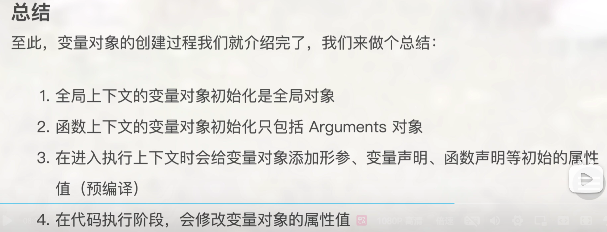
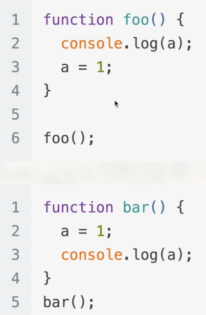

# 2024.8.18

## 1 执行上下文

用自己的话说，执行上下文就是函数执行时的环境。在函数执行时，会创建一个执行上下文，用来存储函数的参数、局部变量、`this`指向等信息。**JS执行到一个函数时，就会进行准备工作，用一个更专业的说法就是“创建执行上下文”。**

每个执行上下文，都有三个重要属性：①变量对象、②作用域链、③this。

### 1.1 执行上下文栈

JS引擎会创建一个执行上下文栈（Execution Context Stack，ECS）来管理执行上下文。栈底永远是**全局执行上下文**，栈顶是当前执行的函数的执行上下文。

```javascript
var scope = "global scope";

function checkscope() {
    var scope = "local scope";
    function f() {
        return scope;
    }
    return f;
}

var result = checkscope()();
console.log(result);    // local scope
```

问题：尝试对上面的代码分析执行上下文栈的变化？

### 1.2 变量对象

变量对象是执行上下文中的一个数据结构，用来存储上下文中定义的变量和函数声明。



**在浏览器环境中，全局对象是window对象。它包含了浏览器窗口的所有属性和方法。**

看下面这个例子：



分析：第一段代码，会打印“a未定义”说明，因为在第一段代码执行时，变量对象中没有`a`这个变量。第二段代码，会打印`a`的值，因为在第二段代码执行时，变量对象(window)中有`a`这个变量。**注意第二段代码，如果变量前未加let/var，那么它将被定义为全局变量，被定义在全局上下文中。**

### 1.3 作用域链

作用域链是一个指向变量对象的指针列表，它保证了执行上下文中的变量对象能够有序访问。

简单说，在当前函数的执行上下文上找不到的变量，就会沿着作用域链向上查找，直到找到全局执行上下文为止。

### 1.4 闭包

闭包 = 内层函数 + 引用的外层函数变量

### 1.5 this

this是普通函数的自由变量。箭头函数没有this。大多数情况只需要记住：1.在浏览器中全局的this指向window。2.谁调用的函数，函数中的this指向谁。**3.在箭头函数中不存在this。它沿用上一级的this，至于怎么查找，向外层作用域中，一层一层查找this，直到有this的定义。**

**执行上下文在创建的同时，this的指向被确定。**

## 2 this的进阶（改变this的指向）

### 2.1 call

这家伙的地位最低，使用场景相对比较少。

使用方法是：`fun.call(thisArg, arg1, arg2, ...)
`

`call`有两个作用：①调用函数，②改变this的指向。

其中，`thisArg`是函数执行时的`this`的指向，`arg1, arg2, ...`是函数的参数。函数的返回值是被调用函数的返回值。

### 2.2 apply

这家伙比`call`的使用场景要多一些。一个很好的场景是，求数组的最大值。

使用方法是：`fun.call(thisArg, arg1, arg2, ...)
`

同样，`apply`也有两个作用：①调用函数，②改变this的指向。**只不过，`apply`的参数是一个数组。** 函数的返回值是被调用函数的返回值。

### 面试题：模拟实现`call`和`apply`方法

待补充

### 2.3 bind

最重要。

一个重要的场景是：**在事件监听中，改变this的指向。**

使用方法是：`fun.bind(thisArg, arg1, arg2, ...)
`

它的使用语法和`call`相似，但是它不会调用函数。它返回了一个原函数的拷贝，并且拷贝的函数的`this`指向`thisArg`。