# 2026.2.15

var let const 区别，①先要答出来var和let const的作用域不同，前者是函数作用域，或者全局作用域（当我们声明在全局时），后者是块级作用域；②然后要知道var会被提升，并且只提升声明，不提升赋值。最后还有最基础的，哪个是不能修改值的，哪个可以不必赋初始值（var可以稍后赋值）。此外我们还要知道，ES6前是没有let const的，只有var。

# 2026.3.1

数据基本、复杂类型的存储区别（要知道栈内存和堆内存）：

1. 基本类型：存储在**栈内存**中，值直接存储在变量中。
2. 复杂类型：存储在**堆内存**中，变量中存储的是指向堆内存中数据的引用。

拓展：栈内存和堆内存的区别：https://zhuanlan.zhihu.com/p/528715048 **简单来说，代码里看得见的在栈里，看不见的在堆里，堆一般比栈来的更大，也需要手动分配和回收。**（可以这么记：堆一堆一堆肯定更多，所以也就更大）

# 2026.3.7

作用域：有两种，分别是局部作用域（又包含块作用域{}和函数作用域）和全局作用域。var声明的变量在函数作用域和全局作用域中，也就是说如果它声明在函数里，那么只有函数内能访问，而如果声明在全局，那么所有地方都能访问，它不具有块级作用域。let const在块级作用域。

闭包：作用就是实现数据私有，而问题呢就是有可能导致内存泄漏，解决方法就是使用完之后及时将引用闭包的变量设置为null，这样垃圾回收机制就可以回收相关的内存。


**手写闭包**：

```javascript
function fn() {
  let count = 0
  return function () {
    count++
    console.log(count)
  }
}
const result = fn()
result() // 1
result() // 2
```

为啥会内存泄漏？上面的示例中result一直占用着fn里面的count资源不放，如果count是一个很大的数组，垃圾回收机制又回收不掉，那么显然就内存泄漏了。

箭头函数：关于箭头函数的基本语法就不用再讲了，说一下箭头函数没有arguments动态参数（不用任何定义，arguments就是每个函数都有的伪数组，专门用来接收参数的），但是有剩余参数（...args）。

关于箭头函数的this指向，它指向的是外部作用域的this，原因是箭头函数没有自己的this，它的this是继承而来的。另外我们需要注意的是，对象字面量是不产生作用域的。

关于更多的`this`指向，看下面的几个例子好好体会：


对最后一张图的理解：在对象方法中的箭头函数，`this`指向外部作用域，原因是**对象字面量不产生作用域**，所以最后一张图的`this`指向`window`，另外第二张图也可以用这个来解释，具体见：https://blog.csdn.net/2301_81854535/article/details/148829976

模板字符串：需要知道它就是用反引号``来定义的，它可以直接在字符串中插入变量，而不需要用加号拼接。

JS判断null的方法：

方法一就是使用严格相等运算符（===）来判断变量是否为null：

```javascript
let variable = null

if (variable === null) {
  console.log('变量是null')
} else {
  console.log('变量不是null')
}
```

方法二就是使用typeof运算符来判断变量是否为object，并且同时判断它是否等于null：

```javascript
let variable = null

if (typeof variable === 'object' && variable == null) {
  // 这里不需要再严格相等
  console.log('变量是null')
} else {
  console.log('变量不是null')
}
```

事实上，typeof null 会返回 'object'，这是一个历史遗留问题，因为在 JS 最初的实现中，null被错误的认为成了一个对象。

方法三，使用Object.is()方法来判断变量是否为null：

```javascript
let variable = null

if (Object.is(variable, null)) {
  console.log('变量是null')
} else {
  console.log('变量不是null')
}
```

# 2026.3.21

关于JS的 == 和 ===，只在下面给出几个例子去体会：

```javascript
console.log(1 == '1') // true
console.log(true == 1) // true
console.log(null == undefined) // true

console.log(1 === '1') // false
console.log(true === 1) // false
console.log(null === undefined) // false
console.log(1 === 1) // true
```

# 2026.3.22

今天看到CSS，最频繁的考点就是盒模型。盒模型又可以分成标准盒模型和怪异盒模型（IE盒模型）两种，它们的区别是：

在标准盒模型中，元素的宽度和高度只包括内容区域（content），不包括内边距（padding）、边框（border）和外边距（margin）。（这四个英文单词要非常熟悉）这意味着如果你设置了一个元素的宽度为 100px，那么这个宽度只应用于内容区域，内边距和边框的宽度会额外增加到这个宽度上。

在怪异盒模型中，元素的宽度和高度包括内容区域、内边距和边框，但不包括外边距。这意味着如果你设置了一个元素的宽度为 100px，那么这个宽度将包括内容、内边距和边框的宽度。

实际开发中，开发者往往更喜欢使用标准和模型，因为它可以让元素的宽度和高度更好地暴露出来，符合我们的预期。

display的block、inline、还有inline-block属性：

这个题也经常问，我们从字面意思上去理解，block就是块级元素，inline就是行内元素，inline-block就是行内块元素。另外，我们还需要再清楚一点：display属性是CSS中用来控制元素显示类型的核心属性，它可以改变元素的默认行为，实现不同的布局效果。具体来说：


除了上述三种，display还有其他常用值，例如：

- display: flex：弹性布局，用于一维（行或列）排列。
- display: grid：网格布局，用于二维（行和列）排列。
- display: none：元素隐藏且不占据空间。

接下来我们来看几个效果，首先是block：


然后是inline：


这里inline多解释一句，图中可以看到宽度和高度显然是不能设置的，但是很多对“内边距上下有效”的说法理解有争议，再来解释一下：图中这幅卡着的状态（盒2与盒3内容是黏在一起的），你是很明显能够看到两个盒子内边距上下是无效的，但是如果你单看盒2或者盒3，你就能看到实际上蓝色的外面有个绿色的就是内边距。所以最准确的说法是，**inline的padding没有占位，但在实际的某个元素中看它是有的**。

最后就是inline-block，这个还好理解：


另外我们再来看一下常见的行级元素和块级元素：


# 2026.3.24（感觉BFC记不住）

BFC：

【前端面试：什么是BFC？如何解决BFC带来的问题？】 https://www.bilibili.com/video/BV1irqTYUEhP/?share_source=copy_web&vd_source=adb76b0abd2583fe45600a97ce5e6760

这个概念初学时没怎么搞懂，其实说白了，BFC主要用于解决两个问题，一个是**margin合并**，另一个是**浮动塌陷**。今天复习先学到了一个概念，就是CSS中的**margin合并**：

当两个块级元素的**垂直外边距**相邻时，它们的外边距会合并。例如，一个元素的 margin-bottom 和另一个元素的 margin-top 会合并，最终的外边距高度为两者的**较大值**。

我们说解决上述问题的一个办法，就是使用BFC：


如上图所示，把一个盒子放入到BFC容器里，就可以解决margin合并的问题。

那么BFC究竟是干什么的呢？

BFC全称叫做块级格式化上下文（Block Formatting Context），它是一个完全独立的空间（布局环境），让空间里的子元素不会影响到外面的布局。

面试中常考触发BFC的方法，总结如下：


（其中table-cell是表格单元格布局）

上面有规律可循，其实就是**当元素需要独立管理内部布局或者避免外部干扰时**，浏览器会触发BFC。

上面说完了margin合并以及常见的触发BFC的方式，我们再来看第二个内容：**浮动塌陷**。在理解这个之前，我们先来看BFC的三个特性：


前面两个我们已经讲过了，我们来理解第三个：

我们来看下面的一段代码：


（图中有一部分被文字挡住了，它和下面一行代码相同也是box）

由于这个box是个浮动元素（设置了float），当元素浮动起来后，普通的父元素就不会去计算这个浮动元素的高度，所以导致父元素会认为自己的高度为0，我们给container设置了颜色，但是显然是看不到的。这个时候，如果我们把container给加一层属性比如display: inline-block，目的是把它变成BFC，那么在这个BFC中就会去计算浮动元素的高度，从而黑色背景就会正常显示了。

# 2026.4.5

Vue2和Vue3的生命周期对比：这个知识点我们要知道①首先它们的生命周期函数叫法发生了改变，Vue2的生命周期函数是：beforeCreate、created、beforeMount、mounted、beforeUpdate、updated、beforeDestroy、destroyed。Vue3的生命周期函数是：setup（这个setup把beforeCreate和created合到了一起）、onBeforeMount、onMounted、onBeforeUpdate、onUpdated、onBeforeUnmount、onUnmounted。

②同时我们要知道，在Vue3的内部逻辑里，setup()函数比Vue2中的beforeCreate()、created()函数更早执行，我们可以在setup()函数中初始化一些数据，然后再把它return出去，这样在template里面我们可以直接使用这些数据。同时我们也要知道，由于setup函数执行的时候，组件实例并没有被创建，因此在Vue3的setup()函数中是没有this的。

③此外，Vue3的生命周期函数，都需要import后去使用，这也是组合式API的一种函数式编程风格。实际上，在Vue3的任何生命周期函数里都没有this。这是因为在函数式编程之后，我们不再需要使用this来访问组件实例的属性和方法。

关于上面的说法，看一个例子：

Vue2：

```vue
<template>
  <div ref="container">Hello</div>
</template>

<script>
export default {
  mounted() {
    // 使用 this 访问组件实例的 $refs
    console.log(this.$refs.container) // 输出 DOM 元素
    this.$refs.container.style.color = 'red' // 修改样式
  },
}
</script>
```

Vue3:

```vue
<template>
  <div ref="container">Hello</div>
</template>

<script setup>
import { onMounted, ref } from 'vue'

// 定义 ref 引用 DOM 元素
const container = ref(null)

onMounted(() => {
  // 直接访问 ref 的 value 属性，无 this
  console.log(container.value) // 输出 DOM 元素
  container.value.style.color = 'red' // 修改样式
})
</script>
```

ref和reactive的区别：


请注意，reactive只能定义对象型的数据。另外在template中ref定义的数据可以直接使用，不需要加.value，要加的地方是在script中。

原型/原型链：看下面这张图就可以


# 2026.4.19

JS的三种常见实现继承的方式：①简单原型链继承、②ES5寄生组合式继承、③ES6 extends语法实现现代继承。以上的三种写法，我们在面试中要都能默写出来。

①简单原型链继承：

```javascript
function Parent() {
  this.name = 'parent'
}
Parent.prototype.say = function () {
  console.log('hello')
}

function Child() {}
// 核心：子类原型 = 父类实例
Child.prototype = new Parent()

const child = new Child()
child.say() // hello
```

该种写法主要存在两个问题：①Parent中的引用属性，因为子类是new了一个Parent实例出来，作为所有Child的原型对象，导致所有由Child new出来的子类都会共用这同一引用属性，一旦对其修改，所有子类都会发生变化②子类也不能向父类的构造函数传参。

另：基本类型为什么不乱？


②ES5 寄生组合式继承：

```javascript
function Parent(name) {
  this.name = name
}
Parent.prototype.say = function () {
  console.log(this.name)
}

function Child(name, age) {
  // 借用构造函数继承属性
  Parent.call(this, name)
  this.age = age
}

// 核心：继承原型，不调用父构造函数
Child.prototype = Object.create(Parent.prototype)
Child.prototype.constructor = Child

const child = new Child('zs', 18)
child.say() // zs
```

我们说所谓的寄生组合式继承，就是通过借用构造函数来继承属性，通过`call`方法，实现子类可以在父类的构造函数中传参，同时也可以避免之前的引用类型共用问题；通过原型链的混成形式来继承方法。

③ES6 extends继承：

```javascript
class Parent {
  constructor(name) {
    this.name = name
  }
  say() {
    console.log(this.name)
  }
}

class Child extends Parent {
  constructor(name, age) {
    super(name) // 必须先调用super
    this.age = age
  }
}

const child = new Child('ls', 20)
child.say() // ls
```

是语法糖，本质上还是一个寄生组合式继承。

# 2026.4.20

对于事件循环的宏任务与微任务这个知识点，我们不再讲了，直接去看HeiMaAJAX.md里面的“事件循环中的宏任务与微任务”这一节即可，搞定那两个问题就没问题了。

我们需要注意，目前学过的东西，只有Promise.then()/.catch()/.finally()，以及async/await属于微任务，其他都是宏任务。

防抖与节流：这两个知识点我们就是要求会自己手写，两个的核心都是用到了定时器。先来手写一下防抖，防抖的作用是，如果在一段时间内频繁触发了一个事件，那么只执行最后一个，就像是我们如果快速在搜索引擎的输入框打字时，只返回最后一次输入的结果。

```javascript
function debounce(fn, delay) {
  let t = null
  return function () {
    if (t !== null) {
      clearTimeout(t)
    }
    t = setTimeout(() => {
      fn.call(this)
    }, delay)
  }
}
```

记忆关键点：

- 闭包保存 timer。
- 每次触发时 clearTimeout(timer)。
- 用 setTimeout 延迟执行。
- 需要用到`call`。

对于节流：其实就是打王者释放技能，每一定的时间里只能释放一次该技能：

```javascript
function throttle(fn, delay) {
  let t = null
  return function () {
    if (!t) {
      t = setTimeout(() => {
        fn.call(this)
        t = null
      }, delay)
    }
  }
}
```

**请注意，如果直接赋值`t = null`，并不会阻止定时器的执行！！！所以在防抖函数中，我们需要使用`clearTimeout`来清除定时器。**

# 2026.5.2

CSS中Flex布局实现圣杯布局、双飞翼布局：

①我们首先要知道，什么是圣杯布局，什么是双飞翼布局。它们两者要实现的最终页面效果一模一样：页面分为三栏：左边固定、中间自适应最宽、右边固定。上下还有通栏的头部和底部。

而关键的区别在于，圣杯布局的代码结构顺序，和我们在页面上看到的顺序是一模一样的；双飞翼布局，则是通过了CSS，把内容最多的中间部分放在代码的最前面。这就导致了双飞翼布局在网速比较慢的时候，优先加载重要内容，性能比圣杯布局要好。

②下来看一段圣杯布局的代码，了解一下Flex布局：

```javascript
<!DOCTYPE html>
<html lang="zh-CN">
<head>
  <meta charset="UTF-8">
  <title>Flex 圣杯布局</title>
  <style>
    * {
      margin: 0;
      padding: 0;
      box-sizing: border-box;
    }
    html, body {
      height: 100%;
    }
    body {
      display: flex;
      flex-direction: column;
    }
    /* 头部底部 */
    header, footer {
      height: 60px;
      background: #333;
      color: #fff;
      text-align: center;
      line-height: 60px;
    }
    /* 中间容器 */
    .container {
      flex: 1;
      display: flex;
    }
    /* 左侧侧边栏 */
    .left {
      width: 200px;
      background: #666;
    }
    /* 中间主体 */
    .main {
      flex: 1;
      background: #eee;
    }
    /* 右侧侧边栏 */
    .right {
      width: 200px;
      background: #999;
    }
  </style>
</head>
<body>
  <header>头部</header>
  <div class="container">
    <div class="left">左栏</div>
    <div class="main">中间主体（自适应）</div>
    <div class="right">右栏</div>
  </div>
  <footer>底部</footer>
</body>
</html>
```

③而双飞翼布局，通过设置order实现：

```javascript
<!DOCTYPE html>
<html lang="zh-CN">
<head>
  <meta charset="UTF-8">
  <title>Flex 双飞翼布局</title>
  <style>
    * {
      margin: 0;
      padding: 0;
      box-sizing: border-box;
    }
    html,body {
      height: 100%;
    }
    body {
      display: flex;
      flex-direction: column;
    }
    header, footer {
      height: 60px;
      background: #222;
      color: #fff;
      text-align: center;
      line-height: 60px;
    }
    .wrap {
      flex: 1;
      display: flex;
    }
    /* 中间主体放最前面 */
    .main {
      flex: 1;
      background: #f5f5f5;
    }
    .left {
      width: 200px;
      background: #444;
      /* 调整顺序 */
      order: -1;
    }
    .right {
      width: 200px;
      background: #777;
    }
  </style>
</head>
<body>
  <header>头部</header>
  <div class="wrap">
    <div class="main">中间主体（DOM优先渲染）</div>
    <div class="left">左栏</div>
    <div class="right">右栏</div>
  </div>
  <footer>底部</footer>
</body>
</html>
```

④关于Flex的一些细碎知识点：

(i) flex: 1，这玩意儿实际上是`flex-grow: 1; flex-shrink: 1; flex-basis: 0%;`这三个玩意儿的合写，具体可以问豆包，我们只需要知道，如果一个元素设置的flex: 1, 另一个设置的flex: 2，那么这两个占盒子的比例就是1:2。

(ii) flex-direction：主轴方向，设置为row时，里面的元素从左向右排，设置为column时，从上到下排。

媒体查询：这个概念是我在复习的时候新学的，之前没有学过，比较简单好理解。首先我们要知道什么叫做响应式Web设计，就是我的视口宽度发生变化时，比如说从电脑换到手机后，我们的同一套代码要实现手机的排版也是好看的，自动发生变化，这就是响应式设计。这可以通过媒体查询来实现。


一般采用上面的简写形式。


另外我们需要注意一下媒体查询的书写顺序，由于CSS会层叠覆盖的原因。如上图所示，用脑子简单想想就能想明白。

# 2026.5.3

rem/vw/vh：三者都是相对单位，分别是根元素的字体大小、视口宽度的1%、视口高度的1%。

云智怼人题：为什么不用 JS 获取屏幕做适配？实际上，我们的JS在获取屏幕信息时，这个操作会晚于DOM的渲染，所以就会导致屏幕闪烁，此外，这种方法还会在横屏/折叠屏上面失效。

Vue2双向绑定数据（响应式）原理：这个点也是在我复习时候新学的，Vue2采用`Object.defineProperty`来实现响应式数据绑定，这个API是ES5内置的，通过重写`getter`和`setter`来实现数据的响应式绑定。由于ES5比较老，因此面试的时候经常会问它有什么缺陷，我们来看一个具体例子：

```javascript
let num = 3
const cat = {
  name: '大橘',
  sex: 'boy',
  age: 5,
}
Object.defineProperty(cat, 'age', {
  get() {
    console.log('get value')
    return num
  },
  set(val) {
    console.log('set value', val)
    num = val
  },
})
cat.age = 6 // 可以被监听到
cat.breed = '狸花猫' // 无法被监听到
```

上面其实就是Vue2进行双向绑定数据的原理，在访问`cat.age`时，会触发`get()`，在设置`cat.age`时，会触发`set()`。显然上面的代码就引出了第一个问题，**如果我们要在对象上添加一个新的属性，比如`cat.breed`，那么这个属性就不会被监听到**。

而为了解决这个问题，Vue2里面又使用Vue2自己实现的`$set`和`$delete`来添加和删除属性。

另外，**Vue2无法监听数组下标的变化，通过数组下标修改元素，无法实时响应**。

再有就是，我们在初始化的时候，Vue2其实会遍历对象的所有属性，如果对象里面还有深层对象，那么会进行递归遍历，给每个属性都添加`getter`和`setter`，这样就可以实现响应式数据绑定。这就导致了**在初始化的时候效率非常的低**。

# 2026.5.7

上面说完了Vue2中使用`Object.defineProperty`来实现响应式数据绑定的一些过程与缺陷，下面就来讲一讲，Vue3是怎么解决这些缺陷的。

在Vue3中，ES6出来了，带来了`Proxy`这个API，这个玩意儿被创造出来就是用来实现对对象的属性的监听的，用来做到拦截。

实际上，`Proxy`可以创建原有对象的代理对象，当访问代理对象的属性时，会触发`Proxy`的拦截函数，从而实现对属性的监听。

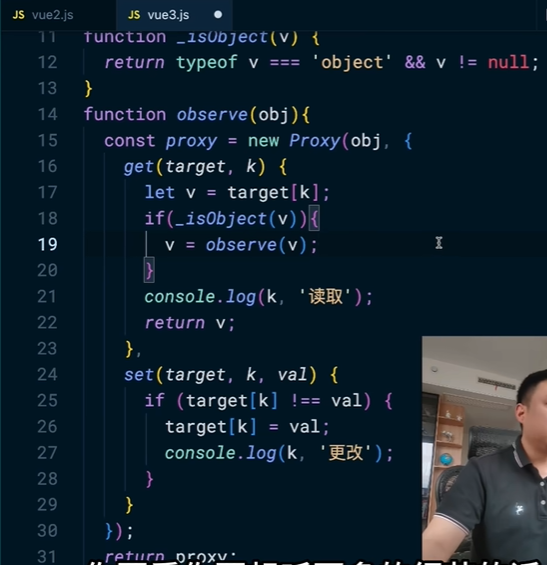

上图就是非常简化的原理。有同学说我上面不是还是有递归吗，实则不然，只有我在访问那个属性的时候才会触发递归，而不是像Vue2那样，初始化的时候就会递归遍历所有属性，大大提高了效率。

# 2026.5.10

在ES6的export和import中，我们要知道一些概念：默认导出/导入、命名导出/导入，按需导入等。这一部分内容感觉就是需要多写，就自动就会了。

另外要注意三点：

- ES6 模块是严格模式：默认 use strict，变量必须声明，不能全局泄露。
- 导入导出是「只读引用」：导入的变量不能直接修改，是值的映射。
- 浏览器使用必须加 type="module"

```javascript
<script type="module" src="main.js"></script>
```

如果是`Node.js`环境，那么要在`package.json`中添加`type: "module"`，否则会报错。

对于ES6 Module（ESM）和CommonJS（CJS）的区别，我们要知道，面试的时候可能会经常问：

CommonJS：Node 早期默认，ES6 Module：JS ES6 官方标准。

CommonJS的写法是，使用`require`来导入模块，使用`module.exports`来导出模块。这种写法也决定了它和ESM的一大区别是：**CommonJS只有在运行到`require`时才会才会导入模块，而ESM是在编译时最初时就会导入模块**，这也使得执行效率提升。

第二大区别：值的特点：拷贝 vs 引用

CommonJS：值拷贝（浅复制）

导入后和原模块互不影响，原模块变了，导入的值不会跟着变。

ES6 Module：动态只读引用

导入的是原变量的地址映射，原模块值变了，导入的值自动同步更新。

第三大区别，能否动态条件引入：

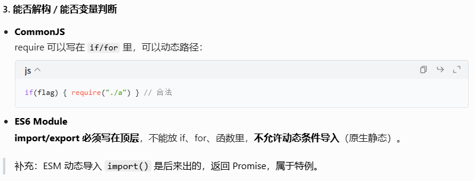

第四大区别，是否开启严格模式：

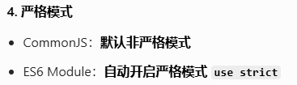

localStorage/sessionStorage/cookie的区别和使用场景，这个问题我们要知道localStorage是持久化的存储，sessionStorage是会话级别的存储，关闭网页之后数据就会消失，cookie是请求头中的存储。前两者大概都能存5MB，后一个比较小，大概是4KB。

localStorage：适合存储用户信息、主题设置等持久化的数据。

sessionStorage：适合存储临时表单数据，防止刷新丢失，存页面间传递的临时数据。

cookie：适合存储用户登录状态、以及需要随请求发送的少量数据。

数组扁平化：在真实业务中，我们往往会拿到多层的数组套数组的结构，这个时候往往我们要把它展平成一维的，方便后续业务的开展。在JS中我们有一个API可以直接调用，就是`Array.flat(depth)`方法，其中depth代表层数，代表了你想展开几层。

此外，在面试中面试官可能要求我们手写实现数组扁平化，那么使用数组的`reduce`递归一定要会，其实很好理解，代码见下：

```javascript
function flatArr(arr) {
  return arr.reduce((prev, cur) => {
    return prev.concat(Array.isArray(cur) ? flatArr(cur) : cur)
  }, [])
}
flatArr(arr)
```

再来回顾一下，对于深拷贝和浅拷贝，只针对引用类型。浅拷贝是指只复制对象的第一层属性，如果属性是引用类型，则只复制引用地址。也就是说，如果原对象的有某些属性是引用类型，那么拷贝后的新对象和原对象的那些属性仍然指向同一个内存地址，修改新对象的属性仍旧会影响原对象。我们有三种办法去实现深拷贝。第一种方法是手写，见下：

```javascript
const o = {}
function deepCopy(newObj, oldObj) {
  for (let k in oldObj) {
    // 遍历对象用for in，k是属性名，oldObj[k]是属性值
    if (oldObj[k] instanceof Array) {
      newObj[k] = [] // 如果是数组，先创建一个新数组
      deepCopy(newObj[k], oldObj[k]) // 递归拷贝数组元素
    } else if (oldObj[k] instanceof Object) {
      newObj[k] = {} // 如果是对象，先创建一个新对象
      deepCopy(newObj[k], oldObj[k]) // 递归拷贝对象属性
    } else {
      newObj[k] = oldObj[k] // 浅拷贝
    }
  }
}
deepCopy(o, obj)
```

需要注意的是，我们在写这个函数时，需要先考虑数组的情况，再考虑对象的情况，不能颠倒。这是因为在 JavaScript 中，数组也是对象的一种特殊形式，因此我们需要先处理数组的拷贝逻辑，确保能够正确地拷贝包含数组的对象。否则如果先把数组当成了对象，那么就没法正确拷贝数组了。

另外两种办法分别是使用lodash库的`cloneDeep()`方法，以及`JSON.parse(JSON.stringify(obj))`，使用JSON转换是最简单的深拷贝方式。

# 2026.5.21

进程和线程的区别：

1. 资源分配：进程有独立的内存空间，线程是共享进程的内存和资源。

2. 调度单位：进程是资源分配的基本单位，线程是CPU调度的基本单位。

3. 开销：进程切换需要保存和恢复整个内存状态，开销较大；线程切换只需保存和恢复少量寄存器，开销较小。

4. 独立性：进程之间互不影响，一个进程崩溃不会影响其他进程；线程共享进程资源，一个线程崩溃可能导致整个进程终止。（这一点尤其容易出错）

5. 通信方式：进程间通信需要使用管道、消息队列、共享内存等机制；线程间可以直接通过共享内存进行通信，但需要同步机制保证数据一致性。

# 2026.5.23

浏览器多窗口的进程/线程机制：窗口其实就是Tab，默认情况下，每个Tab都是一个独立渲染进程，每个进程都有自己的内存空间和资源。标签页的 JS、DOM、渲染、事件循环都跑在该 Tab 对应的渲染进程。

除了这个主进程外，**同源**的站点还会共享一个Service Worker后台进程，这个进程用于离线缓存、后台同步、推送等，请记住，所有的同源站点，共享这一个Service Worker进程。

另外，

1. 同源可以创建多个不同的 SharedWorker，各自为独立进程，供同源多个标签页跨进程共享。

2. 每个标签页进程下还能创建多个Web Worker线程，仅属于当前页面，不能够跨标签页共享。

再说一下，同源需要协议、域名、端口三者都相同，才能算是同源。

关于移动端开发的布局方式：在现代移动端开发中，一般会采用rem+vw合写的形式，来实现动态rem布局，例：

```css
/* 750设计稿，1rem=100px */
html {
  font-size: 13.3333vw;
}
```

这样写，就避免使用JS去获取屏幕信息，不会导致出现闪屏了。此外也还有纯vw适配的，虽然写起来比较简单，但实际上难控制。

CSS选择器优先级，或者说是特异度：

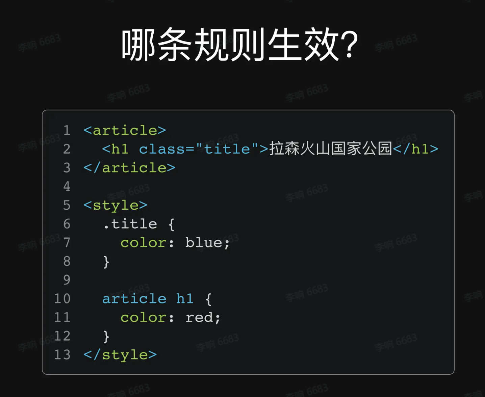

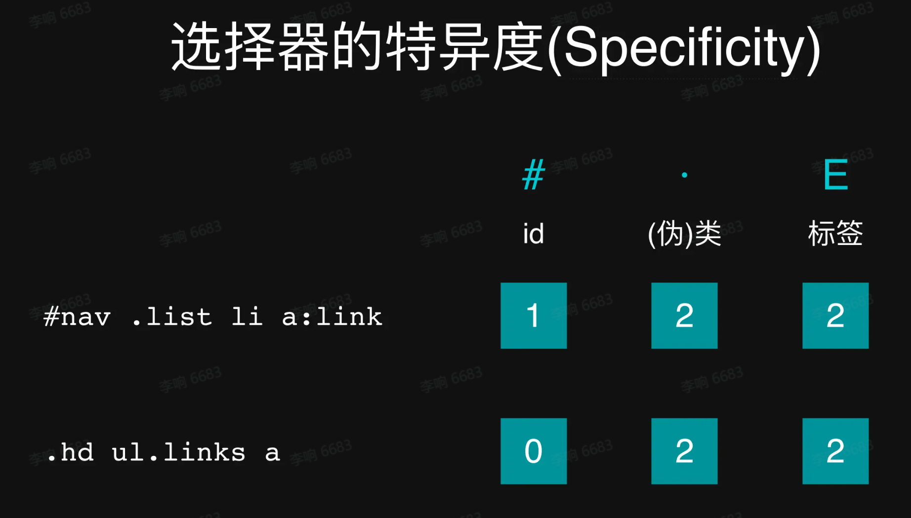

就像是数字比较大小一样，优先级：id >（伪）类 > 标签。数一下谁的特异度大就听谁的。

# 2026.5.24

Vue3加上`:deep`选择器，可以实现对子组件的样式进行覆盖。`<style scoped>` 会给当前组件根标签自动加唯一 `data-v` 前缀属性，样式默认只锁在当前组件内部，`:deep()` 就是打破这个锁定，让样式穿透去修改子组件 / 第三方组件里面的元素。我们来看一下官方的编译对照：

```css
<style scoped>
.a :deep(.b) {
  color: red;
}
</style>
```

经过编译，就会变成如下：

```css
.a[data-v-f3f3eg9] .b {
  color: red;
}
```

a只会对特定的某一类生效，而b针对所有类生效。

# 2026.6.1

CSS变量：

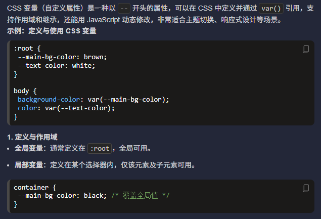

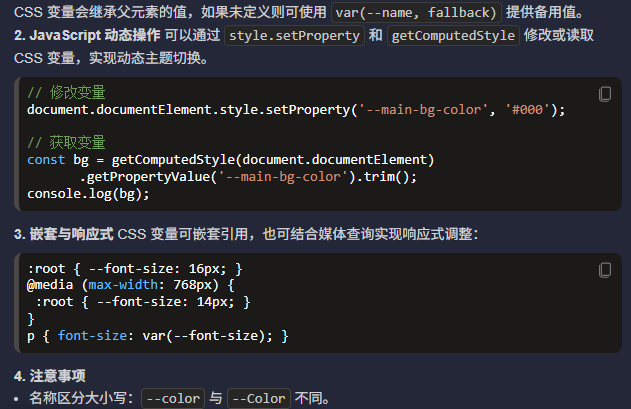

你只要记住两个减号定义 + var 使用，就能搞定 CSS 变量 90% 的日常用法。

diff算法：还要知道Vue2中和Vue3中的区别。这个知识点是个重头戏，我今天几乎看了一个多小时才弄明白。两年前已经看过，但是记不清楚了。我们首先要知道，diff算法的作用，就是在数据更新之后，需要更新视图，那怎么更新呢，就是对比两个DOM树，找出差异，只更新差异部分，而不是全部更新。

**首先，需要了解什么是虚拟DOM？** 虚拟DOM是表示真实DOM的JS对象，下图就是一个例子：

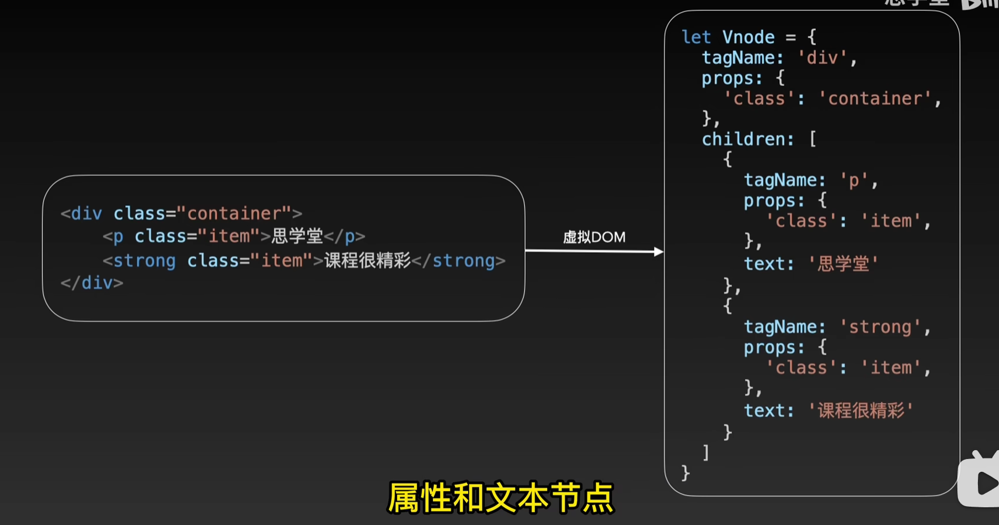

现在，如果我修改了某个标签的文本内容，那么就会生成一个新的虚拟DOM，**diff算法旨在找出这两个虚拟DOM的差异，并最小化的更新视图。**

框架会将所有的结点先转化为虚拟节点Vnode，在发生更改后将VNode和原本页面的OldNode进行对比，然后以VNode为基准，在oldNode上进行准确的修改。（修改准则：原本没有新版有，则增加；原本有新版没有，则删除；都有则进行比较，都为文本结点则替换值；都为静态资源不处理；都为正常结点则替换）

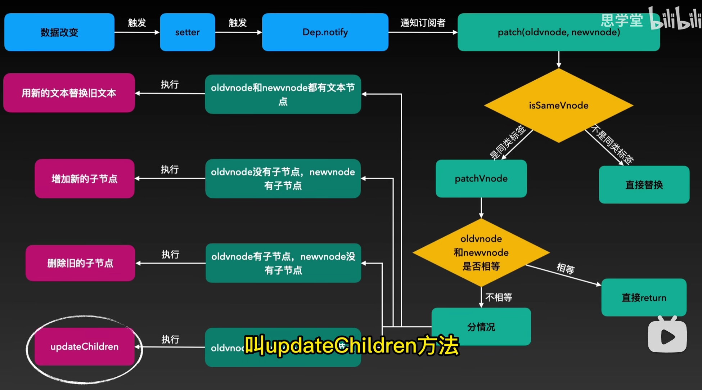

其中的updateChildren函数会根据新旧节点的不同情况，进行不同的操作。永远只比较同级。

对于上面的知识点，我们可以看【6分钟彻底掌握vue的diff算法，前端面试不再怕！】 https://www.bilibili.com/video/BV1JR4y1R7Ln/

我们说Vue2和Vue3 diff算法有不同，什么地方不同呢，就是这个updateChildren函数不同。上面的视频是基于Vue2讲解的。

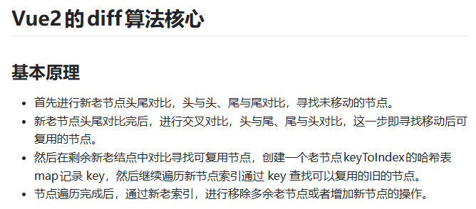

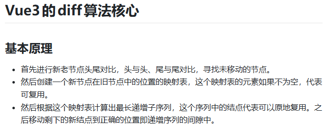

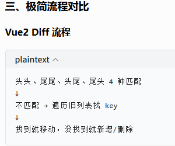

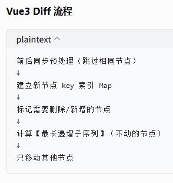

通过求出一个最长递增子序列，来实现最小化移动次数。

- vue2、vue3 的 diff 算法实现差异主要体现在：处理完首尾节点后，对剩余节点的处理方式。

- vue2 是通过对旧节点列表建立一个 { key, oldVnode }的映射表，然后遍历新节点列表的剩余节点，根据newVnode.key在旧映射表中寻找可复用的节点，然后打补丁并且移动到正确的位置。

- vue3 则是建立一个存储新节点数组中的剩余节点在旧节点数组上的索引的映射关系数组，建立完成这个数组后也即找到了可复用的节点，然后通过这个数组计算得到最长递增子序列，这个序列中的节点保持不动，然后将新节点数组中的剩余节点移动到正确的位置。

至于算法的详情与详细的举例，要见这一篇文章：https://segmentfault.com/a/1190000042586883

`$nextTick`的原理以及使用场景：

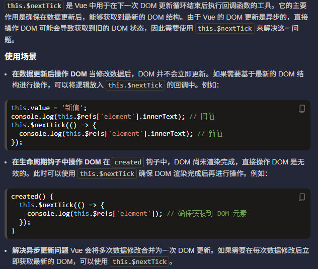

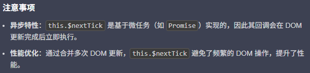

# 2026.6.2

今天又花了一个多小时，把Vue组件通信的几种方式给重新学习了。实际上Vue组件通信有6种方式，但是我们重点了解四种，完整的6种去看这篇文章：https://juejin.cn/post/6844903845642911752

- `props/$emit`：这是父子之间通信的方式，见我之前的Vue笔记，写的很明白了，
- `$emit/$on`：通过事件总线来进行传递，可以是任意的两个组件，但是对于大型项目，我们一般依赖Vuex或者pinia。
- `provide/inject`：用于在具有层级关系的组件间进行数据的传递。
- `Vuex/Pinia`：这是Vue的官方状态管理库，用于管理大型项目的状态和操作。

强缓存、协商缓存：https://juejin.cn/post/6844903838768431118

这个知识点也是复习时新学的，感觉知识很多，永远也学不完。

强缓存：浏览器不会像服务器发送任何请求，直接从本地缓存中读取文件并返回Status Code: 200 OK

协商缓存: 一旦强缓存过期，那么客户机就会向服务器发送请求，服务器会根据这个请求的request header的一些参数来判断是否命中协商缓存，如果命中，则返回304状态码并带上新的response header通知浏览器从缓存中读取资源。

如果强缓存和协商缓存都过期了，那么就重新拉取。

# 2026.6.4

## 从输入URL到页面完整渲染全流程（精简标准版，分7大阶段）

### 一、DNS解析：域名→IP

1. 浏览器先查**浏览器缓存DNS** → 没有查**操作系统DNS缓存(hosts文件)**
2. 仍无：向**本地DNS服务器（运营商DNS/8.8.8.8）** 递归查询
3. 本地DNS无记录：迭代查询根域名服务器→顶级域→权威DNS，拿到目标服务器IP
4. 缓存本次DNS结果备用

### 二、TCP三次握手建立连接（HTTP基于TCP）

1. **第一次握手**：客户端发SYN报文，请求建立连接
2. **第二次握手**：服务端回SYN+ACK，同意连接
3. **第三次握手**：客户端回ACK，连接就绪
   > HTTPS额外：握手后执行**TLS握手**，协商加密套件、生成会话密钥，建立安全加密通道

### 三、发送HTTP请求

1. 浏览器组装**HTTP请求报文（请求行+请求头+请求体）**，通过TCP通道发给服务器
2. 若有Cookie、缓存标识、UA等信息封装在请求头

### 四、服务器处理请求 & 返回HTTP响应

1. Nginx/Apache接收请求，反向代理分发到后端应用（Java/Node/PHP）
2. 后端查数据库、执行业务逻辑，拼接页面数据
3. 服务端返回**HTTP响应报文（状态码+响应头+响应体HTML）**
4. **TCP四次挥手断开连接**：数据传输完毕，双方分阶段关闭TCP连接

对于Nginx/Apache，我们说它们就像是网站的“大门保安”，由它来帮你处理请求，分发到后端应用，最后返回响应。

### 五、浏览器接收HTML，解析构建DOM/CSSOM（关键渲染第一步）

#### 1. HTML解析生成DOM树

- 浏览器字节流→字符→Token（标签）→节点→**DOM树**
- 遇到`<link css>`/`<script>`阻塞规则：
  - **外链JS默认阻塞HTML解析、DOM构建**（JS可修改DOM/CSS）
  - CSS加载**阻塞后续JS执行**，不阻塞HTML解析，但阻塞渲染
  - defer/async异步JS不阻塞HTML解析

#### 2. CSS解析生成CSSOM树

CSS文件解析为样式规则，生成**CSSOM（CSS对象模型）**，CSSOM默认全部样式，含隐藏元素样式。

### 六、生成渲染树(Render Tree)→布局(Reflow回流)→绘制(Paint)

1. **构建RenderTree**：DOM+CSSOM结合，只包含**需要显示的节点**（display:none元素不入渲染树）
2. **Layout（回流/重排）**：计算渲染树每个节点**几何位置、宽高坐标**，页面布局尺寸变更触发回流
3. **Paint（重绘）**：按布局信息，分层填充像素、颜色、图片、文字，生成页面像素图层
   > 进阶：**Composite（合成）**：页面分层（GPU图层），滚动/transform只重绘对应图层，优化性能

对于回流/重绘，在下面也会详细讲解。

### 七、后续资源加载 & 页面交互

1. HTML解析时遇到图片、字体、iframe等资源，**异步并行请求加载**
2. 资源加载完成后触发局部重绘；
3. JS绑定事件，用户操作（点击、滚动）触发回流/重绘，页面可交互。

### 补充关键优化概念

- **DNS预解析**：`<link rel="dns-prefetch" href="xxx">`提前解析域名
- **预加载preload**：提前加载关键JS/CSS
- **回流vs重绘**：尺寸位置变=回流；颜色背景变=重绘

对于阻塞规则，我们来详细解释一下：

## 最关键、最难懂：阻塞规则

### 1. 外链 JS 默认 **阻塞 HTML 解析**

```html
<div>
  <script src="a.js"></script>
  <!-- 外链JS -->
  <p>我会等JS加载完才出现</p>
</div>
```

#### 为什么会阻塞？

**因为 JS 可以改 DOM、改样式**
浏览器怕 JS 把前面的结构删了、改了，所以：
**遇到外链 JS → 停止解析 HTML → 先把 JS 下载 + 执行完 → 再继续解析**

结果：
**JS 没加载完，后面的 HTML 不解析、不显示。**

---

### 2. CSS 加载 **阻塞 JS 执行**，但**不阻塞 HTML 解析**

```html
<link rel="stylesheet" href="style.css" />
<script>
  alert('我要等CSS加载完才执行')
</script>
```

#### 为什么？

因为 JS 经常要获取样式：

```js
console.log(document.body.style.color)
```

如果 CSS 还没下载完，JS 读到的样式是错的。

所以浏览器规定：
**CSS 没下载完 → JS 不许执行**

但：
**CSS 不阻塞 HTML 继续解析**
（HTML 还在继续往下读，只是页面不显示出来）

---

### 3. CSS 阻塞 **页面渲染**

页面要显示，必须等：

- DOM 树构建完
- CSSOM 树构建完
- 两者合并成渲染树

所以：
**CSS 下载慢 → 页面白屏时间变长**

---

### 4. defer / async：JS 不阻塞 HTML

```html
<script src="a.js" defer></script>
<script src="b.js" async></script>
```

- **defer**：异步下载，等 HTML 解析完再执行
- **async**：异步下载，下载完立即执行

共同点：
**都不会阻塞 HTML 解析**
页面不会白屏等 JS。

---

### 我把规则总结成最简单版本（你记这个就够）

1. **JS 会阻塞 HTML 解析**（因为 JS 能改页面）
2. **CSS 会阻塞 JS 执行**（因为 JS 要读样式）
3. **CSS 会阻塞页面渲染**（没样式不能显示）
4. **CSS 不阻塞 HTML 解析**
5. **defer/async JS 不阻塞解析**

---

### 最直观的一句话总结整个过程

**浏览器先把 HTML 翻译成 DOM（结构），把 CSS 翻译成 CSSOM（样式），
遇到 JS 就停下来等，遇到 CSS 会让 JS 等，
等两者都准备好了，才开始画页面。**

## 回流(Layout/重排)、重绘(Paint)通俗详解，搭配生活例子+区分，前端必考

### 核心一句话

1. **回流：元素位置/大小变了，重新算布局（搬家改占地面积）**
2. **重绘：颜色/背景变了，只重新上色，位置不动（家具不动只刷漆）**

### 一、回流（Reflow = Layout 重排）

#### 定义

渲染树元素**几何属性发生变化**：宽、高、边距、定位、字体大小、DOM增删、窗口缩放。
浏览器要**重新计算所有受影响元素的坐标、占用空间**，整段布局重新排版。

> 类比：一间屋子家具长宽变了、新增柜子，所有家具位置全部重新摆放测量 → **回流**

#### 触发回流常见操作

1. DOM操作：新增/删除DOM节点
2. 修改元素：`width/height/margin/padding/top/left/font-size`
3. 获取布局类API：`offsetWidth、clientHeight、getBoundingClientRect()`（浏览器为了拿到实时尺寸强制触发回流）
4. 浏览器窗口resize

**特点：回流开销大，会连带父级、子元素全部重新计算布局**，一个小改动可能带动大片页面回流。

#### 示例

```css
.box{width:100px}
.box.style.width = '200px' // 宽度变化 → 触发回流，盒子变大，旁边元素位置跟着变
```

### 二、重绘（Repaint/Paint）

#### 定义

元素**外观样式变，但尺寸、位置完全不变**：color、background、box-shadow、visibility。
不用重新算布局，只用按照原有位置，重新填充像素颜色、图片。

> 类比：家具摆放位置不变，只是给柜子换个喷漆颜色 → **重绘**

#### 触发重绘常见操作

- `color、background-color、outline、opacity`
- `visibility:hidden`（元素隐藏但占位，尺寸不变，只重绘）

```css
.box.style.background = 'red' // 仅换背景色，大小位置不变 → 只重绘，不回流
```

**特点：开销比回流小很多，不用计算几何布局，仅像素渲染**

### 三、层级关系：必然顺序

**回流一定伴随重绘；重绘不会触发回流**

1. 布局变动 → 先回流（重新算位置大小）
2. 算完位置 → 再重绘（按新尺寸上色）

### 四、补充：合成Composite（进阶，transform优化原理）

使用 `transform/opacity` 不会触发回流、重绘，走**图层合成**：
浏览器把元素单独提升到GPU图层，修改transform只改动图层位置，不影响文档流布局，性能最优。

> 类比：画好的贴纸，直接挪动贴纸位置，不用重新排版画布、不用重新涂色。

### 五、速记口诀

改大小位置 → **回流+重绘**
改颜色背景 → **只重绘**
transform位移 → **既不回流也不重绘（合成）**

### 六、前端优化思路（面试延伸）

1. 批量修改DOM，不要频繁单个改样式
2. 样式修改统一写class，不要频繁style逐个赋值
3. 频繁动画优先用`transform、opacity`，避开top/left/width

# 2026.6.9

## CORS跨域请求头解析

CORS，全称为“跨域资源共享”（Cross-Origin Resource Sharing），是一种机制，它使用额外的 HTTP 头来告诉浏览器允许一个网页从另一个域（不同于该网页所在的域）请求资源。这样可以在服务器和客户端之间进行安全的跨域通信。

当一个网页向不同源发出请求时，CORS 会通过以下几个步骤来处理：

- 预检请求（Preflight Request）：对于某些类型的请求（如使用 HTTP 方法 PUT、DELETE，或者请求带有非简单头部），浏览器会首先发送一个 OPTIONS 请求，这个请求称为“预检请求”。服务器收到这个请求后，会返回一个响应头部，指明实际请求是否被允许。

- 实际请求（Actual Request）：如果预检请求通过，浏览器会继续发送实际的请求。

- 响应头部（Response Headers）：服务器在响应中会包含一些特定的 CORS 头部，如 Access-Control-Allow-Origin，以指示哪些域名可以访问资源。

CORS 通过在 HTTP(s) 请求和响应中使用特定的头部字段来实现跨域资源共享，具体来说，CORS 分为两种类型的请求处理方式：**简单请求和预检请求**。

- 简单请求：对于某些简单的 HTTP 请求（如GET、POST请求且不包含自定义头部），浏览器会直接发送请求，并在响应中检查 CORS 头部。

- 预检请求：对于复杂类型的请求（如使用PUT、DELETE方法，或包含自定义头部），浏览器会首先发送一个OPTIONS请求，称为预检请求（Preflight Request），以确定服务器是否允许实际请求。

**简单请求**

简单请求是指满足以下条件的 HTTP 请求：

- 使用GET、POST、HEAD方法

- 请求头部仅包含以下字段：Accept、Accept-Language、Content-Language、Content-Type（且值为application/x-www-form-urlencoded、multipart/form-data或text/plain）

对于简单请求，浏览器会直接发送请求并在响应中检查以下 CORS 头部：

- Access-Control-Allow-Origin：指示允许访问资源的源。

- Access-Control-Allow-Credentials：指示是否允许发送凭据（如Cookies）。

- Access-Control-Expose-Headers：指示哪些头部可以作为响应的一部分被访问。

比如，下面一个示例：

客户端请求：

```
GET /api/data HTTP/1.1   Host: www.yuanjava.com   Origin: https://yuanjava.com
```

服务器响应：

```
HTTP/1.1 200 OK   Access-Control-Allow-Origin: https://yuanjava.com   Content-Type: application/json      {"message": "Hello, CORS!"}
```

**预检请求**

对于复杂请求，浏览器会首先发送一个 OPTIONS 请求，包含以下头部字段：

- Origin：指示请求的源。

- Access-Control-Request-Method：指示实际请求将使用的方法。

- Access-Control-Request-Headers：指示实际请求将包含的自定义头部。

服务器收到预检请求后，会返回一个响应，包含以下头部字段以指示是否允许请求：

- Access-Control-Allow-Origin：表明允许访问资源的源，可以是具体的源或通配符 \*；

- Access-Control-Allow-Methods：表明允许的方法，如 GET, POST, PUT, DELETE；

- Access-Control-Allow-Headers：表明允许的自定义头部；

- Access-Control-Allow-Credentials：表明是否允许发送凭据（如 Cookies）；

- Access-Control-Expose-Headers：表明哪些头部可以作为响应的一部分被访问；

- Access-Control-Max-Age：表明预检请求的结果可以被缓存的时间，单位是秒；

如果预检请求通过，浏览器会继续发送实际请求。

比如，下面一个示例：

预检请求：

```
OPTIONS /api/data HTTP/1.1   Host: api.yuanjava.com   Origin: https://yuanjava.com   Access-Control-Request-Method: PUT   Access-Control-Request-Headers: Content-Type
```

预检响应：

```
HTTP/1.1 204 No Content   Access-Control-Allow-Origin: https://yuanjava.com   Access-Control-Allow-Methods: GET, POST, PUT   Access-Control-Allow-Headers: Content-Type   Access-Control-Allow-Credentials: true   Access-Control-Max-Age: 3600
```

实际请求：

```
PUT /api/data HTTP/1.1   Host: api.yuanjava.com   Origin: https://yuanjava.com   Content-Type: application/json      {"data": "example"}
```

实际响应：

```
HTTP/1.1 200 OK   Access-Control-Allow-Origin: https://yuanjava.com   Content-Type: application/json      {"message": "Data updated"}
```

## JSONP和代理跨域

有的时候，浏览器或者服务端不支持跨域请求，但是我们仍旧需要跨域，这个时候就需要使用JSONP或者代理跨域来实现。

### 一、JSONP 适用场景（极窄、过时）

JSONP：利用script标签的src属性不受同源策略限制的特点，通过script标签引入一个js文件，这个js文件载入成功后会执行我们在url参数中指定的函数，并且会把我们需要的json数据作为参数传入。

#### 适用

1. **请求第三方老接口**（对方只提供 JSONP，不支持 CORS）
2. **只需要 GET 请求**（JSONP 本质 script 标签，不支持 POST/PUT/DELETE）
3. **兼容极老浏览器**（IE8 以下，完全不支持 CORS）

#### 不适用

- 自己的后端接口（**应该用 CORS，不要用 JSONP**）
- 需要 POST / 提交数据
- 有安全风险（信任第三方脚本，容易 XSS）

### 二、代理跨域 适用场景（最常用）

#### 适用

1. **本地开发跨域**（webpack/vite 代理，90% 前端都在用）
2. **后端不方便开 CORS**
3. **隐藏真实接口地址**（前端只请求 `/api`，不暴露后端域名）
4. **生产环境反向代理**（Nginx 代理后端服务）
5. **跨域请求需要携带 Cookie**（代理是同域，浏览器允许带凭证）

#### 不适用

- 直接请求**第三方公开接口**（对方允许 CORS 就直接用）

#### 特点

- 支持所有请求：GET/POST/PUT/DELETE
- 安全、无限制
- **前端开发标准方案**
- 本质：**浏览器 → 代理服务器 → 目标接口**（浏览器认为是同域）

另外简单补充一下，这个代理是哪里来的，是在你启动 Vite/Webpack 项目时，本地同时跑了一个小型服务（端口比如 5173），这个服务就是开发代理。
