# 2026.2.15

var let const 区别，①先要答出来var和let const的作用域不同，前者是函数作用域，或者全局作用域（当我们声明在全局时），后者是块级作用域；②然后要知道var会被提升，并且只提升声明，不提升赋值。最后还有最基础的，哪个是不能修改值的，哪个可以不必赋初始值（var可以稍后赋值）。此外我们还要知道，ES6前是没有let const的，只有var。

# 2026.3.1

数据基本、复杂类型的存储区别（要知道栈内存和堆内存）：

1. 基本类型：存储在**栈内存**中，值直接存储在变量中。
2. 复杂类型：存储在**堆内存**中，变量中存储的是指向堆内存中数据的引用。

拓展：栈内存和堆内存的区别：https://zhuanlan.zhihu.com/p/528715048 **简单来说，代码里看得见的在栈里，看不见的在堆里，堆一般比栈来的更大，也需要手动分配和回收。**（可以这么记：堆一堆一堆肯定更多，所以也就更大）

# 2026.3.7

作用域：有两种，分别是局部作用域（又包含块作用域{}和函数作用域）和全局作用域。var声明的变量在函数作用域和全局作用域中，也就是说如果它声明在函数里，那么只有函数内能访问，而如果声明在全局，那么所有地方都能访问，它不具有块级作用域。let const在块级作用域。

闭包：作用就是实现数据私有，而问题呢就是有可能导致内存泄漏，解决方法就是使用完之后及时将引用闭包的变量设置为null，这样垃圾回收机制就可以回收相关的内存。

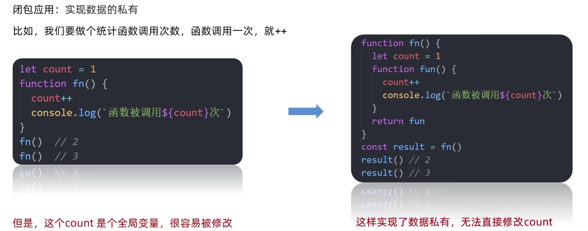

**手写闭包**：

```javascript
function fn() {
  let count = 0
  return function () {
    count++
    console.log(count)
  }
}
const result = fn()
result() // 1
result() // 2
```

为啥会内存泄漏？上面的示例中result一直占用着fn里面的count资源不放，如果count是一个很大的数组，垃圾回收机制又回收不掉，那么显然就内存泄漏了。

箭头函数：关于箭头函数的基本语法就不用再讲了，说一下箭头函数没有arguments动态参数（不用任何定义，arguments就是每个函数都有的伪数组，专门用来接收参数的），但是有剩余参数（...args）。

关于箭头函数的this指向，它指向的是外部作用域的this，原因是箭头函数没有自己的this，它的this是继承而来的。另外我们需要注意的是，对象字面量是不产生作用域的。

关于更多的`this`指向，看下面的几个例子好好体会：

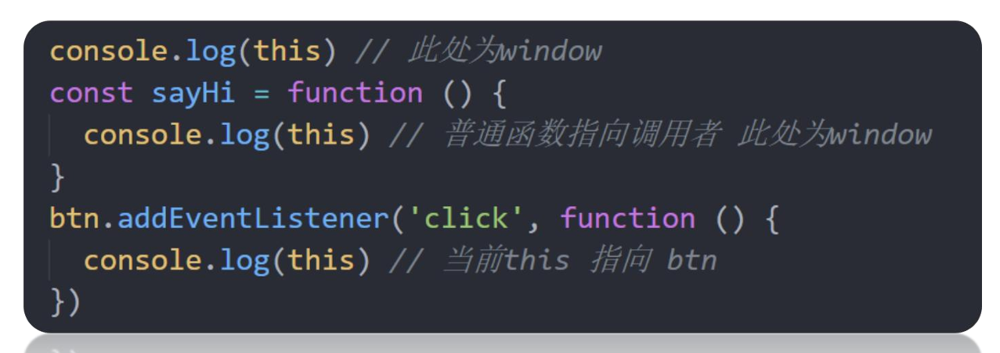

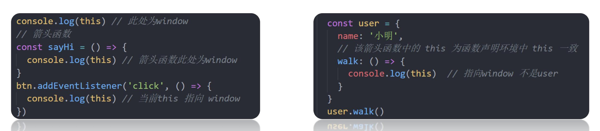

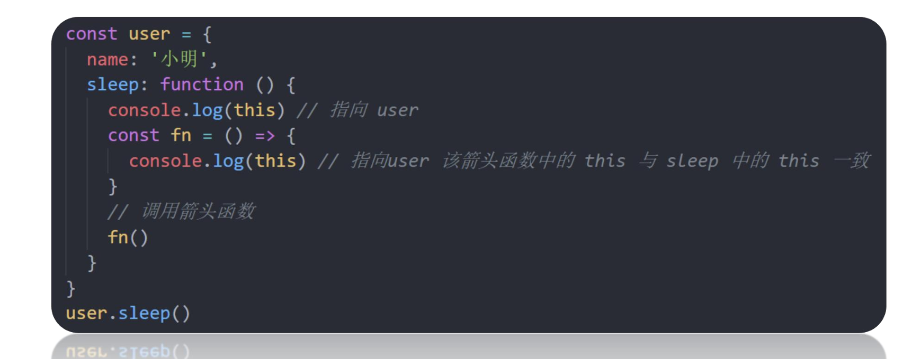

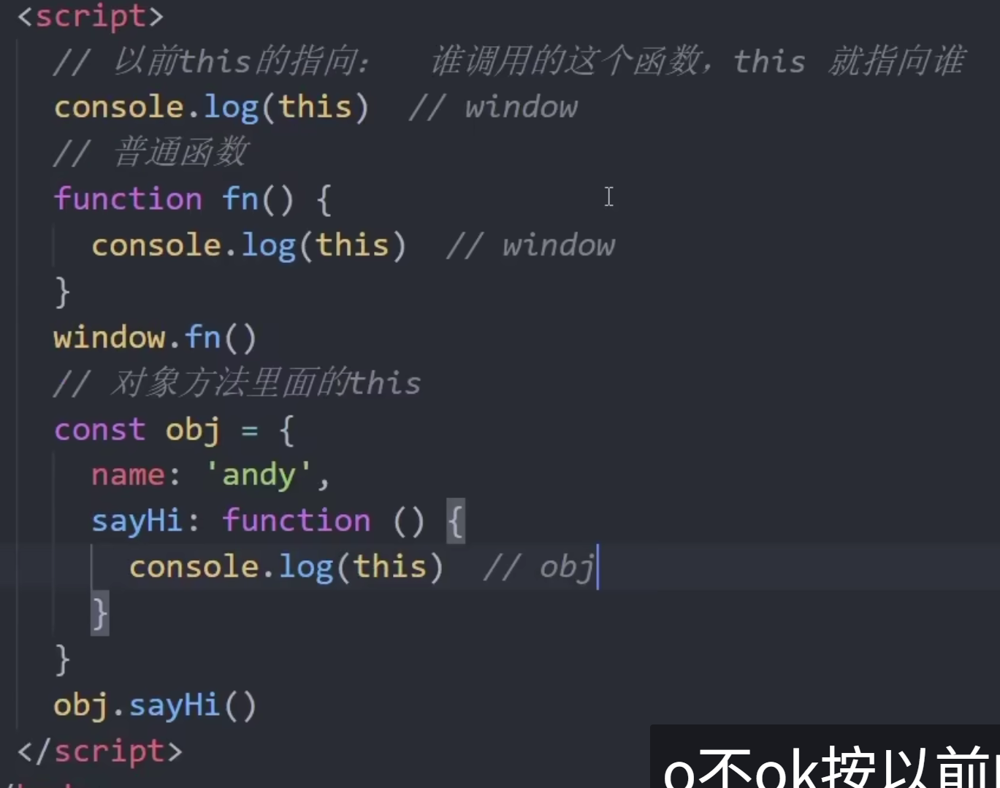

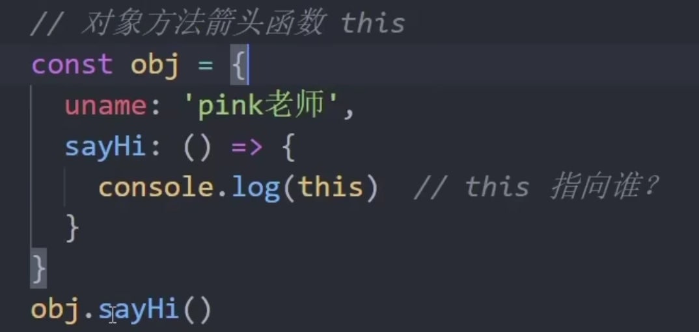

对最后一张图的理解：在对象方法中的箭头函数，`this`指向外部作用域，原因是**对象字面量不产生作用域**，所以最后一张图的`this`指向`window`，另外第二张图也可以用这个来解释，具体见：https://blog.csdn.net/2301_81854535/article/details/148829976

模板字符串：需要知道它就是用反引号``来定义的，它可以直接在字符串中插入变量，而不需要用加号拼接。

JS判断null的方法：

方法一就是使用严格相等运算符（===）来判断变量是否为null：

```javascript
let variable = null

if (variable === null) {
  console.log('变量是null')
} else {
  console.log('变量不是null')
}
```

方法二就是使用typeof运算符来判断变量是否为object，并且同时判断它是否等于null：

```javascript
let variable = null

if (typeof variable === 'object' && variable == null) {
  // 这里不需要再严格相等
  console.log('变量是null')
} else {
  console.log('变量不是null')
}
```

事实上，typeof null 会返回 'object'，这是一个历史遗留问题，因为在 JS 最初的实现中，null被错误的认为成了一个对象。

方法三，使用Object.is()方法来判断变量是否为null：

```javascript
let variable = null

if (Object.is(variable, null)) {
  console.log('变量是null')
} else {
  console.log('变量不是null')
}
```

# 2026.3.21

关于JS的 == 和 ===，只在下面给出几个例子去体会：

```javascript
console.log(1 == '1') // true
console.log(true == 1) // true
console.log(null == undefined) // true

console.log(1 === '1') // false
console.log(true === 1) // false
console.log(null === undefined) // false
console.log(1 === 1) // true
```

# 2026.3.22

今天看到CSS，最频繁的考点就是盒模型。盒模型又可以分成标准盒模型和怪异盒模型（IE盒模型）两种，它们的区别是：

在标准盒模型中，元素的宽度和高度只包括内容区域（content），不包括内边距（padding）、边框（border）和外边距（margin）。（这四个英文单词要非常熟悉）这意味着如果你设置了一个元素的宽度为 100px，那么这个宽度只应用于内容区域，内边距和边框的宽度会额外增加到这个宽度上。

在怪异盒模型中，元素的宽度和高度包括内容区域、内边距和边框，但不包括外边距。这意味着如果你设置了一个元素的宽度为 100px，那么这个宽度将包括内容、内边距和边框的宽度。

实际开发中，开发者往往更喜欢使用标准和模型，因为它可以让元素的宽度和高度更好地暴露出来，符合我们的预期。

display的block、inline、还有inline-block属性：

这个题也经常问，我们从字面意思上去理解，block就是块级元素，inline就是行内元素，inline-block就是行内块元素。另外，我们还需要再清楚一点：display属性是CSS中用来控制元素显示类型的核心属性，它可以改变元素的默认行为，实现不同的布局效果。具体来说：

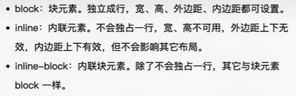

除了上述三种，display还有其他常用值，例如：

- display: flex：弹性布局，用于一维（行或列）排列。
- display: grid：网格布局，用于二维（行和列）排列。
- display: none：元素隐藏且不占据空间。

接下来我们来看几个效果，首先是block：

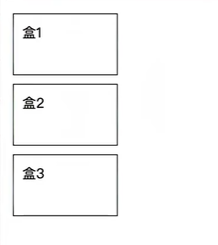

然后是inline：

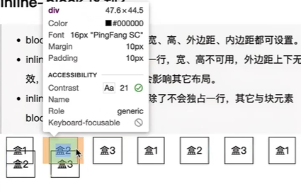

这里inline多解释一句，图中可以看到宽度和高度显然是不能设置的，但是很多对“内边距上下有效”的说法理解有争议，再来解释一下：图中这幅卡着的状态（盒2与盒3内容是黏在一起的），你是很明显能够看到两个盒子内边距上下是无效的，但是如果你单看盒2或者盒3，你就能看到实际上蓝色的外面有个绿色的就是内边距。所以最准确的说法是，**inline的padding没有占位，但在实际的某个元素中看它是有的**。

最后就是inline-block，这个还好理解：

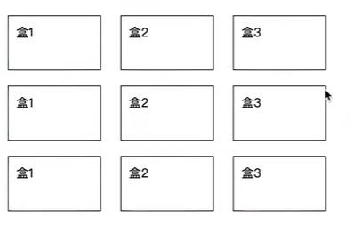

另外我们再来看一下常见的行级元素和块级元素：

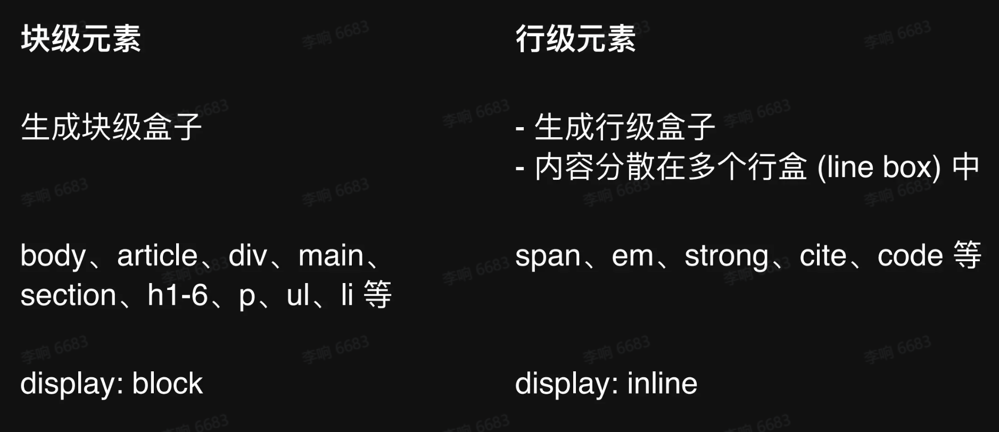

# 2026.3.24（感觉BFC记不住）

BFC：

【前端面试：什么是BFC？如何解决BFC带来的问题？】 https://www.bilibili.com/video/BV1irqTYUEhP/?share_source=copy_web&vd_source=adb76b0abd2583fe45600a97ce5e6760

这个概念初学时没怎么搞懂，其实说白了，BFC主要用于解决两个问题，一个是**margin合并**，另一个是**浮动塌陷**。今天复习先学到了一个概念，就是CSS中的**margin合并**：

当两个块级元素的**垂直外边距**相邻时，它们的外边距会合并。例如，一个元素的 margin-bottom 和另一个元素的 margin-top 会合并，最终的外边距高度为两者的**较大值**。

我们说解决上述问题的一个办法，就是使用BFC：

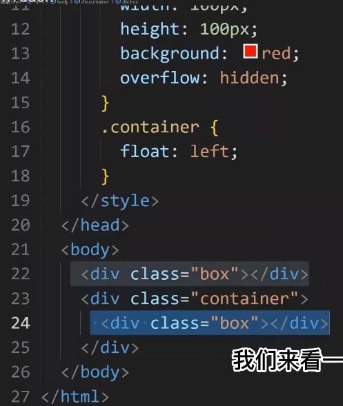

如上图所示，把一个盒子放入到BFC容器里，就可以解决margin合并的问题。

那么BFC究竟是干什么的呢？

BFC全称叫做块级格式化上下文（Block Formatting Context），它是一个完全独立的空间（布局环境），让空间里的子元素不会影响到外面的布局。

面试中常考触发BFC的方法，总结如下：

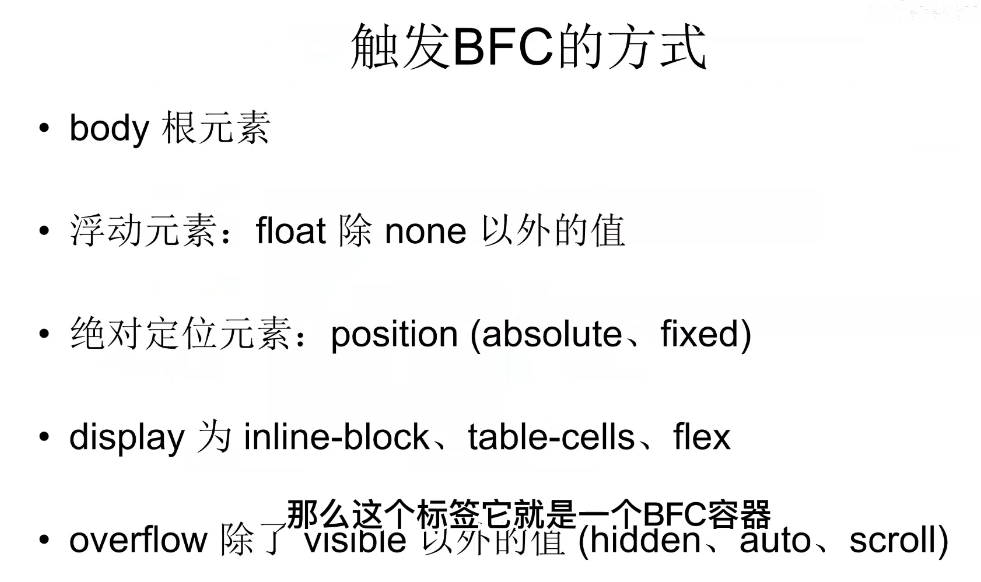

（其中table-cell是表格单元格布局）

上面有规律可循，其实就是**当元素需要独立管理内部布局或者避免外部干扰时**，浏览器会触发BFC。

上面说完了margin合并以及常见的触发BFC的方式，我们再来看第二个内容：**浮动塌陷**。在理解这个之前，我们先来看BFC的三个特性：

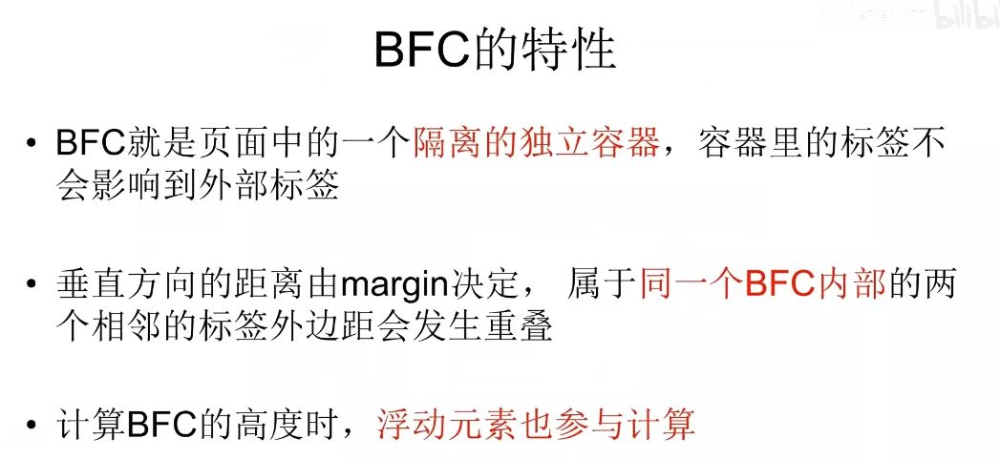

前面两个我们已经讲过了，我们来理解第三个：

我们来看下面的一段代码：

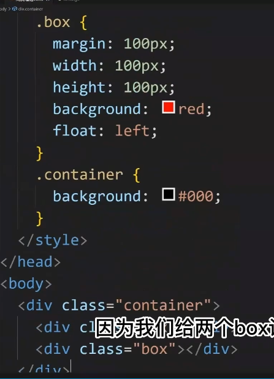

（图中有一部分被文字挡住了，它和下面一行代码相同也是box）

由于这个box是个浮动元素（设置了float），当元素浮动起来后，普通的父元素就不会去计算这个浮动元素的高度，所以导致父元素会认为自己的高度为0，我们给container设置了颜色，但是显然是看不到的。这个时候，如果我们把container给加一层属性比如display: inline-block，目的是把它变成BFC，那么在这个BFC中就会去计算浮动元素的高度，从而黑色背景就会正常显示了。

# 2026.4.5

Vue2和Vue3的生命周期对比：这个知识点我们要知道①首先它们的生命周期函数叫法发生了改变，Vue2的生命周期函数是：beforeCreate、created、beforeMount、mounted、beforeUpdate、updated、beforeDestroy、destroyed。Vue3的生命周期函数是：setup（这个setup把beforeCreate和created合到了一起）、onBeforeMount、onMounted、onBeforeUpdate、onUpdated、onBeforeUnmount、onUnmounted。

②同时我们要知道，在Vue3的内部逻辑里，setup()函数比Vue2中的beforeCreate()、created()函数更早执行，我们可以在setup()函数中初始化一些数据，然后再把它return出去，这样在template里面我们可以直接使用这些数据。同时我们也要知道，由于setup函数执行的时候，组件实例并没有被创建，因此在Vue3的setup()函数中是没有this的。

③此外，Vue3的生命周期函数，都需要import后去使用，这也是组合式API的一种函数式编程风格。实际上，在Vue3的任何生命周期函数里都没有this。这是因为在函数式编程之后，我们不再需要使用this来访问组件实例的属性和方法。

关于上面的说法，看一个例子：

Vue2：

```vue
<template>
  <div ref="container">Hello</div>
</template>

<script>
export default {
  mounted() {
    // 使用 this 访问组件实例的 $refs
    console.log(this.$refs.container) // 输出 DOM 元素
    this.$refs.container.style.color = 'red' // 修改样式
  },
}
</script>
```

Vue3:

```vue
<template>
  <div ref="container">Hello</div>
</template>

<script setup>
import { onMounted, ref } from 'vue'

// 定义 ref 引用 DOM 元素
const container = ref(null)

onMounted(() => {
  // 直接访问 ref 的 value 属性，无 this
  console.log(container.value) // 输出 DOM 元素
  container.value.style.color = 'red' // 修改样式
})
</script>
```

ref和reactive的区别：


请注意，reactive只能定义对象型的数据。另外在template中ref定义的数据可以直接使用，不需要加.value，要加的地方是在script中。

原型/原型链：看下面这张图就可以

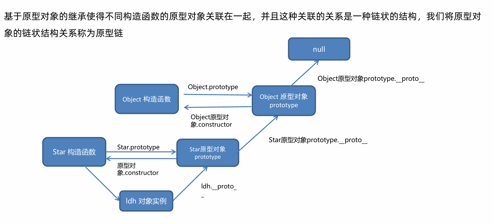

# 2026.4.19

JS的三种常见实现继承的方式：①简单原型链继承、②ES5寄生组合式继承、③ES6 extends语法实现现代继承。以上的三种写法，我们在面试中要都能默写出来。

①简单原型链继承：

```javascript
function Parent() {
  this.name = 'parent'
}
Parent.prototype.say = function () {
  console.log('hello')
}

function Child() {}
// 核心：子类原型 = 父类实例
Child.prototype = new Parent()

const child = new Child()
child.say() // hello
```

该种写法主要存在两个问题：①Parent中的引用属性，因为子类是new了一个Parent实例出来，作为所有Child的原型对象，导致所有由Child new出来的子类都会共用这同一引用属性，一旦对其修改，所有子类都会发生变化②子类也不能向父类的构造函数传参。

另：基本类型为什么不乱？

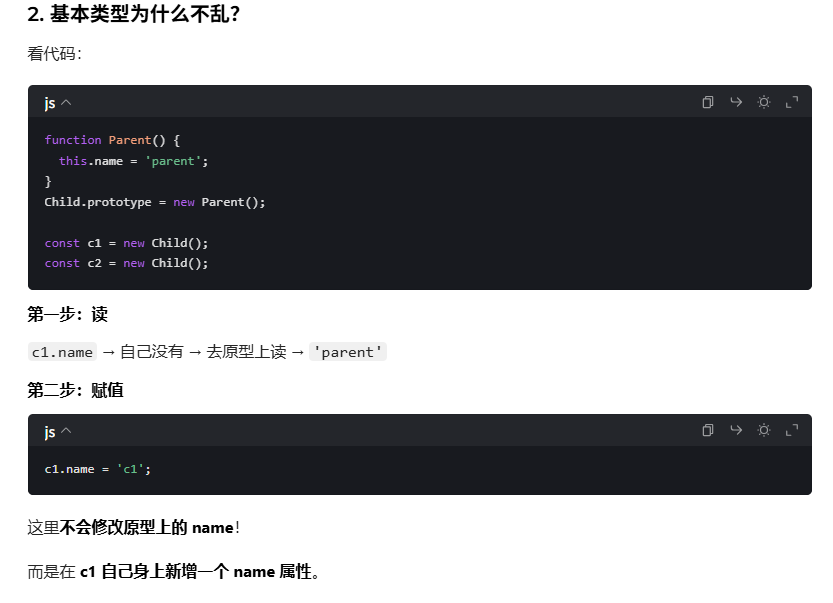

②ES5 寄生组合式继承：

```javascript
function Parent(name) {
  this.name = name
}
Parent.prototype.say = function () {
  console.log(this.name)
}

function Child(name, age) {
  // 借用构造函数继承属性
  Parent.call(this, name)
  this.age = age
}

// 核心：继承原型，不调用父构造函数
Child.prototype = Object.create(Parent.prototype)
Child.prototype.constructor = Child

const child = new Child('zs', 18)
child.say() // zs
```

我们说所谓的寄生组合式继承，就是通过借用构造函数来继承属性，通过`call`方法，实现子类可以在父类的构造函数中传参，同时也可以避免之前的引用类型共用问题；通过原型链的混成形式来继承方法。

③ES6 extends继承：

```javascript
class Parent {
  constructor(name) {
    this.name = name
  }
  say() {
    console.log(this.name)
  }
}

class Child extends Parent {
  constructor(name, age) {
    super(name) // 必须先调用super
    this.age = age
  }
}

const child = new Child('ls', 20)
child.say() // ls
```

是语法糖，本质上还是一个寄生组合式继承。

# 2026.4.20

对于事件循环的宏任务与微任务这个知识点，我们不再讲了，直接去看HeiMaAJAX.md里面的“事件循环中的宏任务与微任务”这一节即可，搞定那两个问题就没问题了。

我们需要注意，目前学过的东西，只有Promise.then()/.catch()/.finally()，以及async/await属于微任务，其他都是宏任务。

防抖与节流：这两个知识点我们就是要求会自己手写，两个的核心都是用到了定时器。先来手写一下防抖，防抖的作用是，如果在一段时间内频繁触发了一个事件，那么只执行最后一个，就像是我们如果快速在搜索引擎的输入框打字时，只返回最后一次输入的结果。

```javascript
function debounce(fn, delay) {
  let t = null
  return function () {
    if (t !== null) {
      clearTimeout(t)
    }
    t = setTimeout(() => {
      fn.call(this)
    }, delay)
  }
}
```

记忆关键点：

- 闭包保存 timer。
- 每次触发时 clearTimeout(timer)。
- 用 setTimeout 延迟执行。
- 需要用到`call`。

对于节流：其实就是打王者释放技能，每一定的时间里只能释放一次该技能：

```javascript
function throttle(fn, delay) {
  let t = null
  return function () {
    if (!t) {
      t = setTimeout(() => {
        fn.call(this)
        t = null
      }, delay)
    }
  }
}
```

**请注意，如果直接赋值`t = null`，并不会阻止定时器的执行！！！所以在防抖函数中，我们需要使用`clearTimeout`来清除定时器。**

# 2026.5.2

CSS中Flex布局实现圣杯布局、双飞翼布局：

①我们首先要知道，什么是圣杯布局，什么是双飞翼布局。它们两者要实现的最终页面效果一模一样：页面分为三栏：左边固定、中间自适应最宽、右边固定。上下还有通栏的头部和底部。

而关键的区别在于，圣杯布局的代码结构顺序，和我们在页面上看到的顺序是一模一样的；双飞翼布局，则是通过了CSS，把内容最多的中间部分放在代码的最前面。这就导致了双飞翼布局在网速比较慢的时候，优先加载重要内容，性能比圣杯布局要好。

②下来看一段圣杯布局的代码，了解一下Flex布局：

```javascript
<!DOCTYPE html>
<html lang="zh-CN">
<head>
  <meta charset="UTF-8">
  <title>Flex 圣杯布局</title>
  <style>
    * {
      margin: 0;
      padding: 0;
      box-sizing: border-box;
    }
    html, body {
      height: 100%;
    }
    body {
      display: flex;
      flex-direction: column;
    }
    /* 头部底部 */
    header, footer {
      height: 60px;
      background: #333;
      color: #fff;
      text-align: center;
      line-height: 60px;
    }
    /* 中间容器 */
    .container {
      flex: 1;
      display: flex;
    }
    /* 左侧侧边栏 */
    .left {
      width: 200px;
      background: #666;
    }
    /* 中间主体 */
    .main {
      flex: 1;
      background: #eee;
    }
    /* 右侧侧边栏 */
    .right {
      width: 200px;
      background: #999;
    }
  </style>
</head>
<body>
  <header>头部</header>
  <div class="container">
    <div class="left">左栏</div>
    <div class="main">中间主体（自适应）</div>
    <div class="right">右栏</div>
  </div>
  <footer>底部</footer>
</body>
</html>
```

③而双飞翼布局，通过设置order实现：

```javascript
<!DOCTYPE html>
<html lang="zh-CN">
<head>
  <meta charset="UTF-8">
  <title>Flex 双飞翼布局</title>
  <style>
    * {
      margin: 0;
      padding: 0;
      box-sizing: border-box;
    }
    html,body {
      height: 100%;
    }
    body {
      display: flex;
      flex-direction: column;
    }
    header, footer {
      height: 60px;
      background: #222;
      color: #fff;
      text-align: center;
      line-height: 60px;
    }
    .wrap {
      flex: 1;
      display: flex;
    }
    /* 中间主体放最前面 */
    .main {
      flex: 1;
      background: #f5f5f5;
    }
    .left {
      width: 200px;
      background: #444;
      /* 调整顺序 */
      order: -1;
    }
    .right {
      width: 200px;
      background: #777;
    }
  </style>
</head>
<body>
  <header>头部</header>
  <div class="wrap">
    <div class="main">中间主体（DOM优先渲染）</div>
    <div class="left">左栏</div>
    <div class="right">右栏</div>
  </div>
  <footer>底部</footer>
</body>
</html>
```

④关于Flex的一些细碎知识点：

(i) flex: 1，这玩意儿实际上是`flex-grow: 1; flex-shrink: 1; flex-basis: 0%;`这三个玩意儿的合写，具体可以问豆包，我们只需要知道，如果一个元素设置的flex: 1, 另一个设置的flex: 2，那么这两个占盒子的比例就是1:2。

(ii) flex-direction：主轴方向，设置为row时，里面的元素从左向右排，设置为column时，从上到下排。

媒体查询：这个概念是我在复习的时候新学的，之前没有学过，比较简单好理解。首先我们要知道什么叫做响应式Web设计，就是我的视口宽度发生变化时，比如说从电脑换到手机后，我们的同一套代码要实现手机的排版也是好看的，自动发生变化，这就是响应式设计。这可以通过媒体查询来实现。

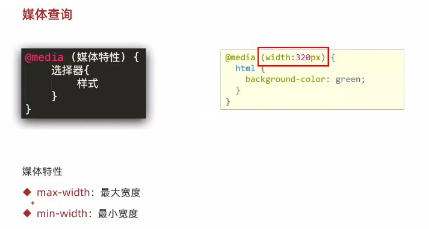

一般采用上面的简写形式。

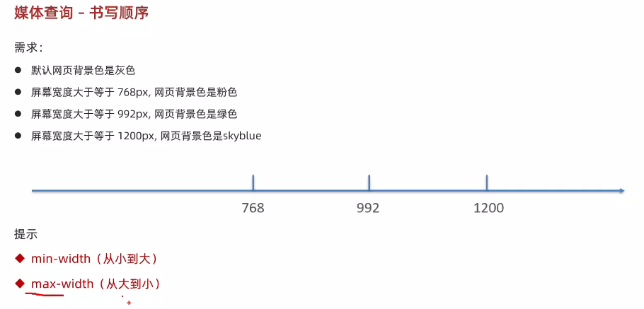

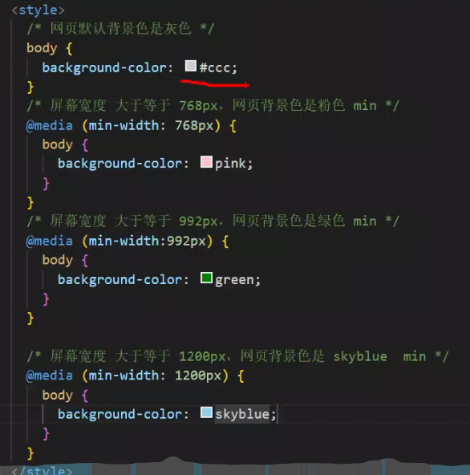

另外我们需要注意一下媒体查询的书写顺序，由于CSS会层叠覆盖的原因。如上图所示，用脑子简单想想就能想明白。

# 2026.5.3

rem/vw/vh：三者都是相对单位，分别是根元素的字体大小、视口宽度的1%、视口高度的1%。

云智怼人题：为什么不用 JS 获取屏幕做适配？做个保留，还不清楚。

Vue2双向绑定数据（响应式）原理：这个点也是在我复习时候新学的，Vue2采用`Object.defineProperty`来实现响应式数据绑定，这个API是ES5内置的，通过重写`getter`和`setter`来实现数据的响应式绑定。由于ES5比较老，因此面试的时候经常会问它有什么缺陷，我们来看一个具体例子：

```javascript
let num = 3
const cat = {
  name: '大橘',
  sex: 'boy',
  age: 5,
}
Object.defineProperty(cat, 'age', {
  get() {
    console.log('get value')
    return num
  },
  set(val) {
    console.log('set value', val)
    num = val
  },
})
cat.age = 6 // 可以被监听到
cat.breed = '狸花猫' // 无法被监听到
```

上面其实就是Vue2进行双向绑定数据的原理，在访问`cat.age`时，会触发`get()`，在设置`cat.age`时，会触发`set()`。显然上面的代码就引出了第一个问题，**如果我们要在对象上添加一个新的属性，比如`cat.breed`，那么这个属性就不会被监听到**。

而为了解决这个问题，Vue2里面又使用Vue2自己实现的`$set`和`$delete`来添加和删除属性。

另外，**Vue2无法监听数组下标的变化，通过数组下标修改元素，无法实时响应**。

再有就是，我们在初始化的时候，Vue2其实会遍历对象的所有属性，如果对象里面还有深层对象，那么会进行递归遍历，给每个属性都添加`getter`和`setter`，这样就可以实现响应式数据绑定。这就导致了**在初始化的时候效率非常的低**。
