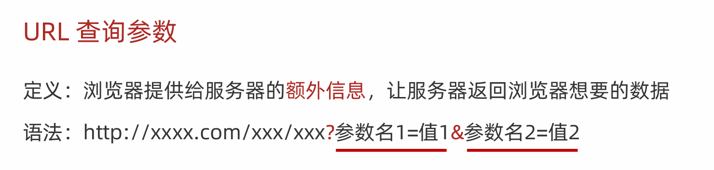
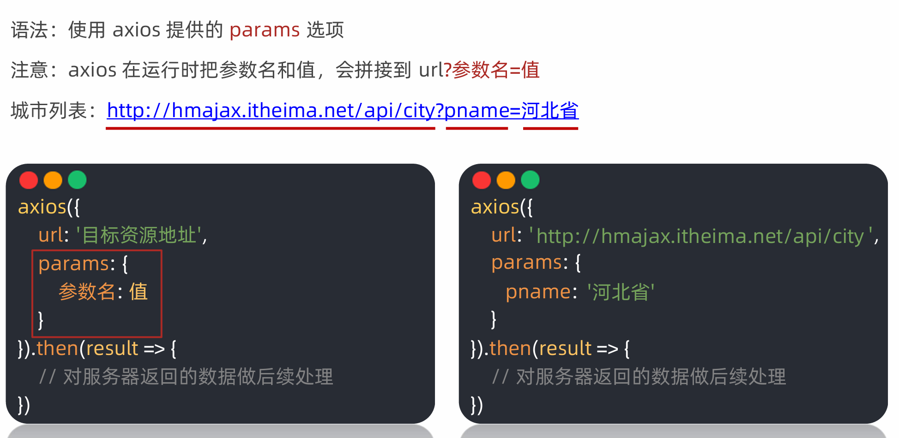
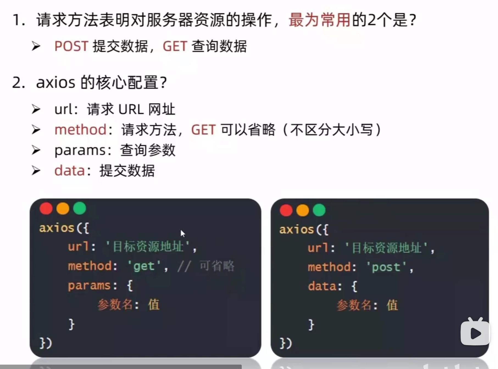
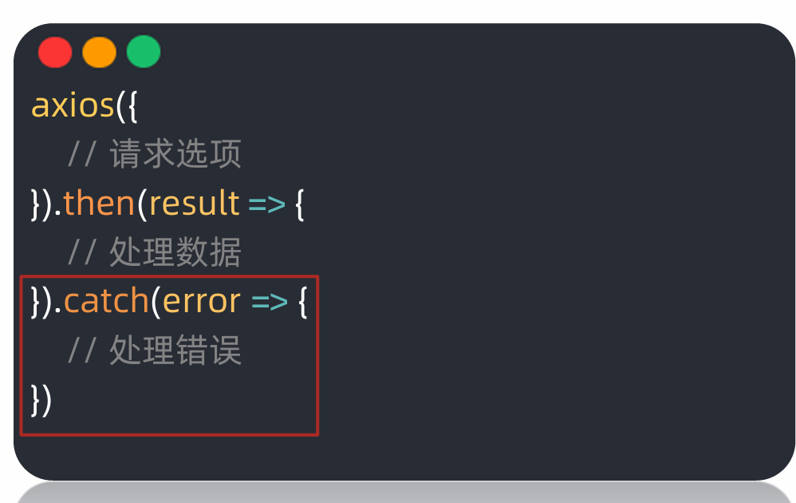
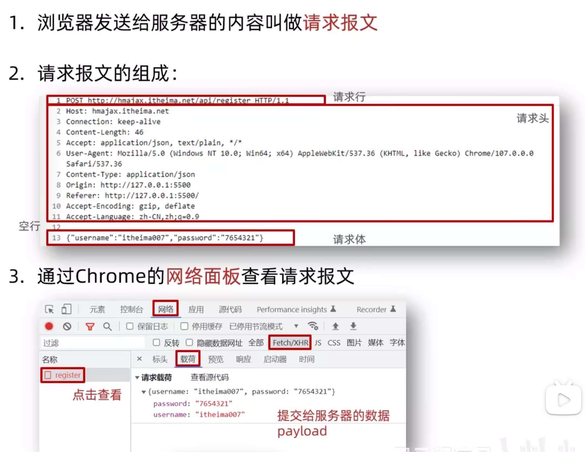
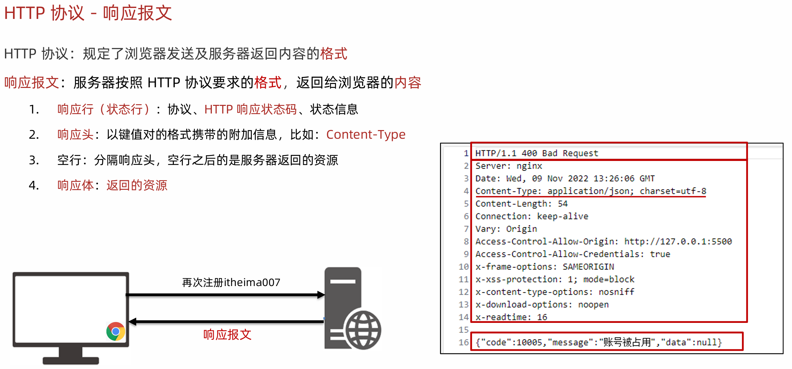
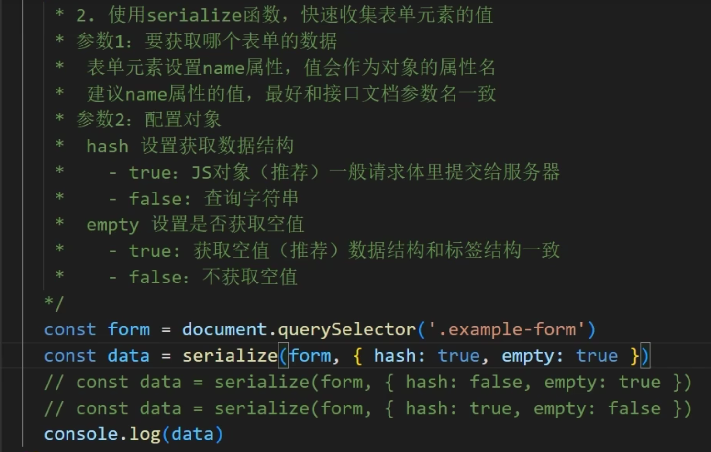
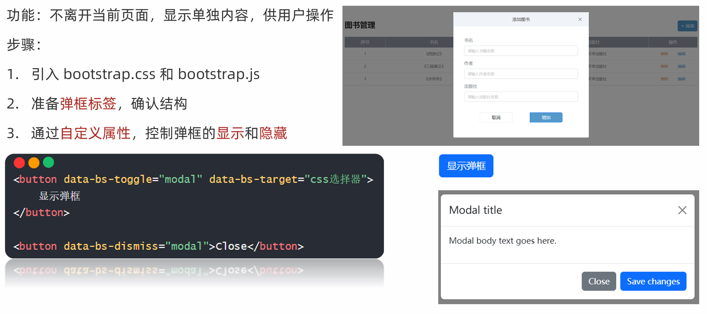

# Day1 AJAX入门

## 1 AJAX概念与axios

AJAX 是浏览器与服务器进行数据通信的技术，AJAX 允许网页在不重新加载整个页面的情况下与服务器交换数据，从而实现异步更新。

使用axios：

```javascript
<script src="https://cdn.jsdelivr.net/npm/axios/dist/axios.min.js">
    // 引入axios库
</script>
<script>
    axios({
        url: 'http://hmajax.itheima.net/api/province'
    }).then(result => {
        console.log(result.data);
    })
</script>
```

## 2 axios查询参数




axios 支持在请求中添加查询参数，可以通过 `params` 属性来实现。

## 3 常用请求方法和错误提交



## 4 axios错误处理

axios 提供了错误处理机制，可以通过 `catch` 方法来捕获请求中的错误。如果出现了错误，就不会执行`then` 方法中的回调函数，而是会执行 `catch` 方法中的回调函数。



## 5 HTTP协议请求报文



利用请求报文，我们可以排查相应的错误。

## 6 HTTP协议响应报文



## 7 form-serialize插件

form-serialize 插件可以将表单数据序列化为查询字符串格式，便于在 AJAX 请求中使用。一般默认使用`{ hash: true, empty: true }`配置。



# Day2 AJAX综合案例

## 1 Bootstrap 弹框使用



弹框必须要绑定Bootstrap的`modal`类，显示弹框和关闭弹框需要写的代码如上图。