# Day1 AJAX入门

## 1 AJAX概念与axios

AJAX 是浏览器与服务器进行数据通信的技术，AJAX 允许网页在不重新加载整个页面的情况下与服务器交换数据，从而实现异步更新。

使用axios：

```javascript
<script src="https://cdn.jsdelivr.net/npm/axios/dist/axios.min.js">
    // 引入axios库
</script>
<script>
    axios({
        url: 'http://hmajax.itheima.net/api/province'
    }).then(result => {
        console.log(result.data);
    })
</script>
```

**请注意，`axios`会返回一个Promise对象，这个特性在后面会用到**。

## 2 axios查询参数


axios 支持在请求中添加查询参数，可以通过 `params` 属性来实现。

## 3 常用请求方法和错误提交


## 4 axios错误处理

axios 提供了错误处理机制，可以通过 `catch` 方法来捕获请求中的错误。如果出现了错误，就不会执行`then` 方法中的回调函数，而是会执行 `catch` 方法中的回调函数。


## 5 HTTP协议请求报文


利用请求报文，我们可以排查相应的错误。

## 6 HTTP协议响应报文


## 7 form-serialize插件

form-serialize 插件可以将表单数据序列化为查询字符串格式，便于在 AJAX 请求中使用。一般默认使用`{ hash: true, empty: true }`配置。


# Day2 AJAX综合案例

## 1 Bootstrap 弹框使用


弹框必须要绑定Bootstrap的`modal`类，显示弹框和关闭弹框需要写的代码如上图。

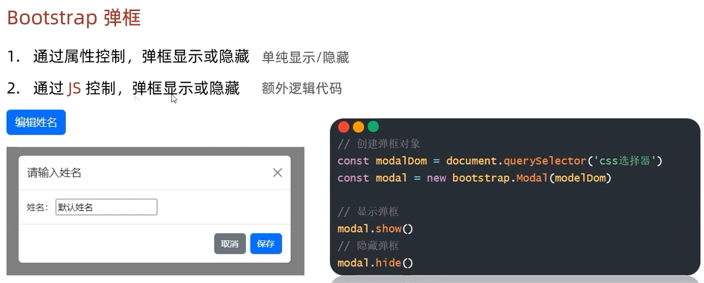

如果采用JS代码来控制Bootstrap的显示与隐藏，可以看上图。

## 2 图片上传

在涉及文件、图片的上传中，通常需要使用`FormData`对象来处理表单数据。

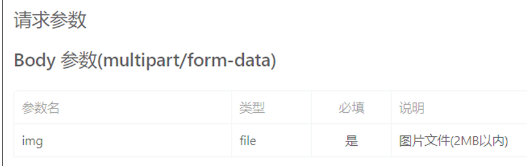

这种情况下，我们按照下面代码的思路来上传：

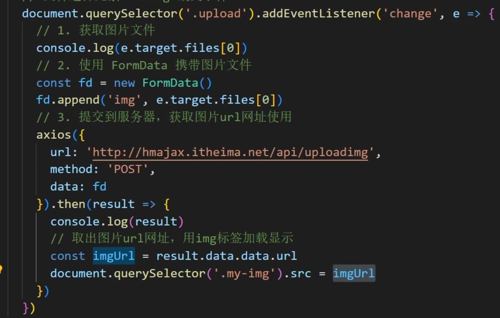
`e.target.files[0]` 代表用户选择的文件，如果不确定的话，我们在实战中打印一下就能知道。

# Day3 AJAX原理

## 1 XMLHttpRequest

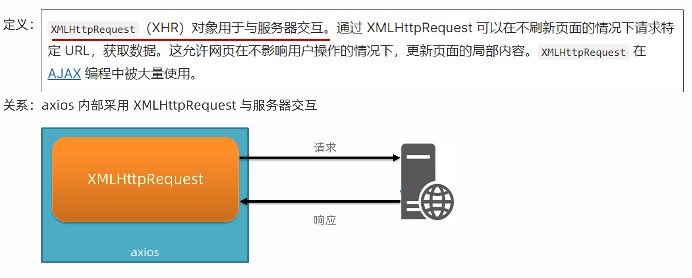
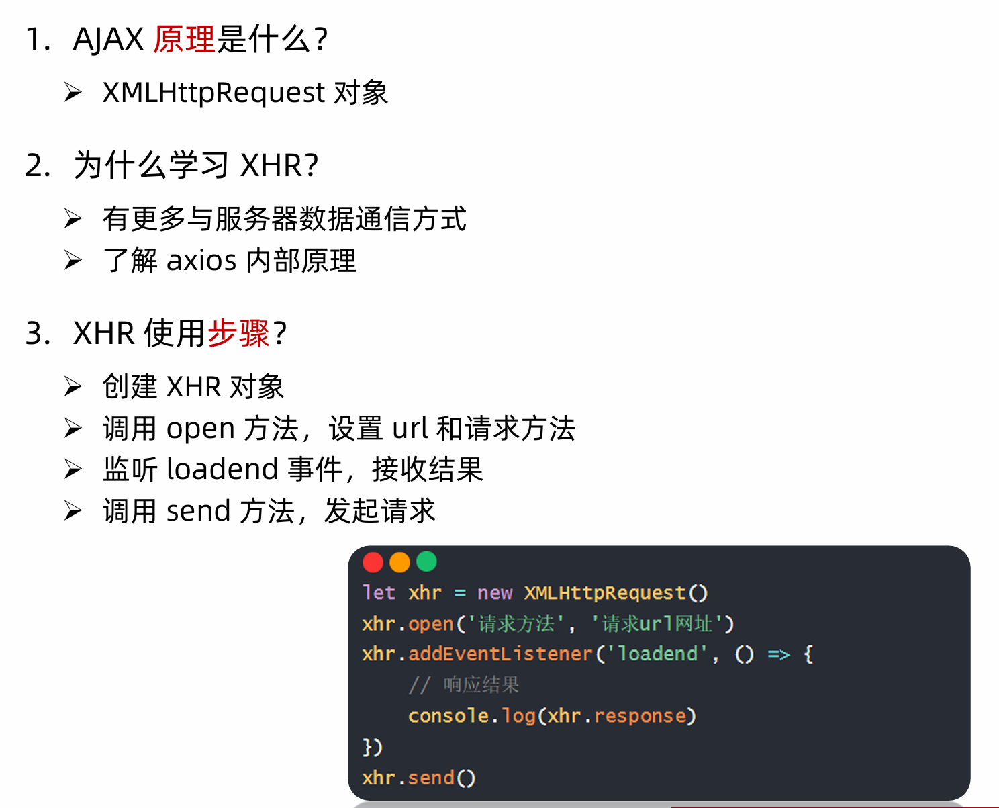

结果会返回在`xhr.response`中，返回的对象字符串应该是个JSON字符串，需要手动转换一下。

### 1.1 使用XMLHttpRequest携带查询参数

XMLHttpRequest没有像axios那样直接支持`params`属性，我们需要手动拼接查询字符串至URL中。

```javascript
const xhr = new XMLHttpRequest();
const params = new URLSearchParams({
    id: 123,
    name: 'John'
});
xhr.open('GET', 'http://hmajax.itheima.net/api/user?' + params.toString());
xhr.send();
xhr.onload = function() {
    if (xhr.status === 200) {
        console.log(JSON.parse(xhr.responseText));
    } else {
        console.error('请求失败:', xhr.status, xhr.statusText);
    }
};
```

### 1.2 XMLHttpRequest数据提交

XMLHttpRequest可以通过`send`方法提交数据，通常需要设置请求头。

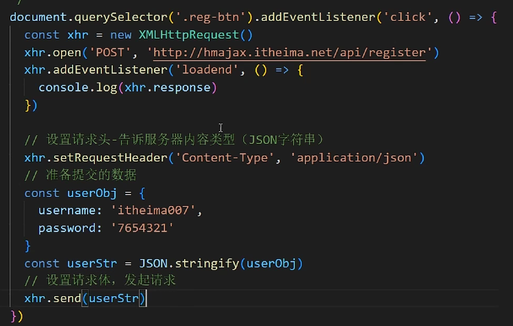

上面的代码中，调用`xhr.setRequestHeader`方法设置了请求头，指定了内容类型为`application/json`。在提交数据时，需要手动先把数据转换为JSON字符串。

## 4 Promise

### 4.1 Promise介绍
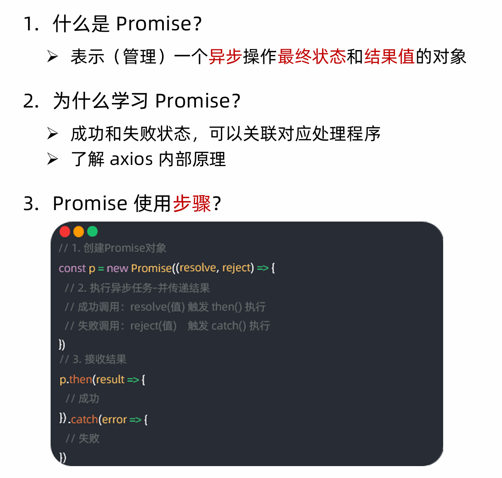
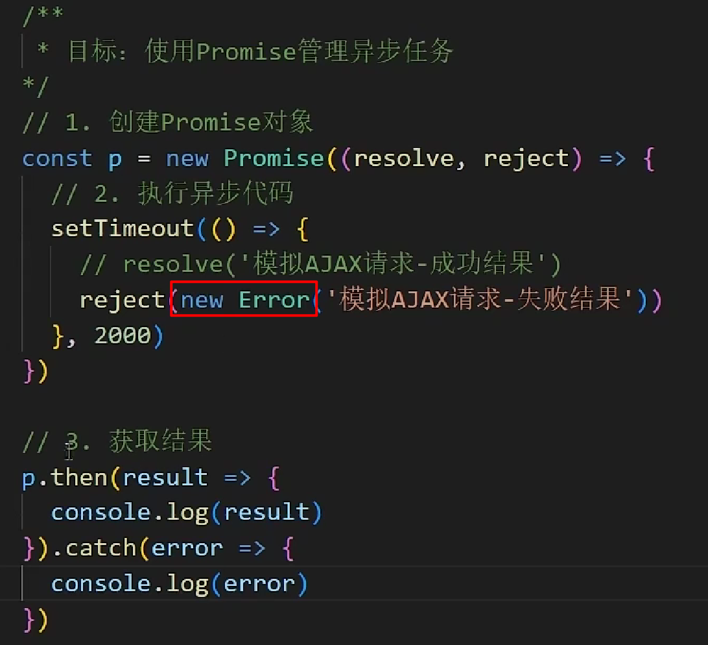

### 4.2 Promise三种状态

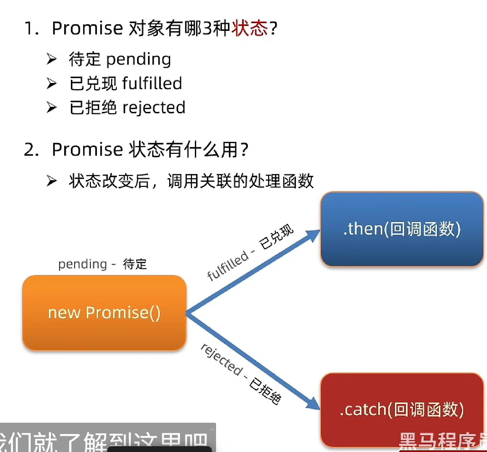

需要注意的是，Promise的状态一旦改变，就不能再改变了。即使后续调用了`resolve`或`reject`，也不会有任何效果。**另外，new了一个Promise对象之后，内部的同步代码会立即执行，只有异步代码会被放入到eventloop中执行**。

# Day4 AJAX进阶

## 1 Promise链式调用

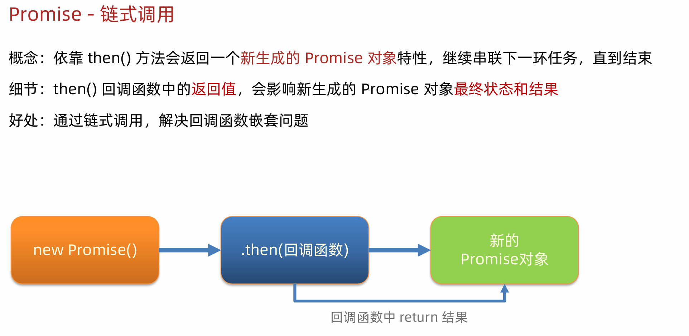

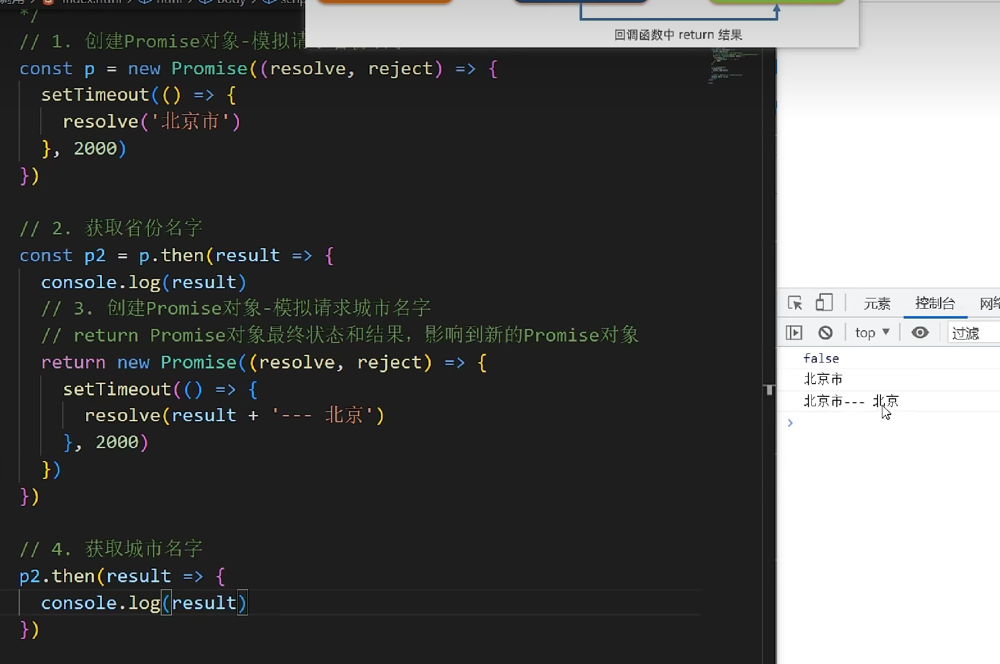

## 2 async/await

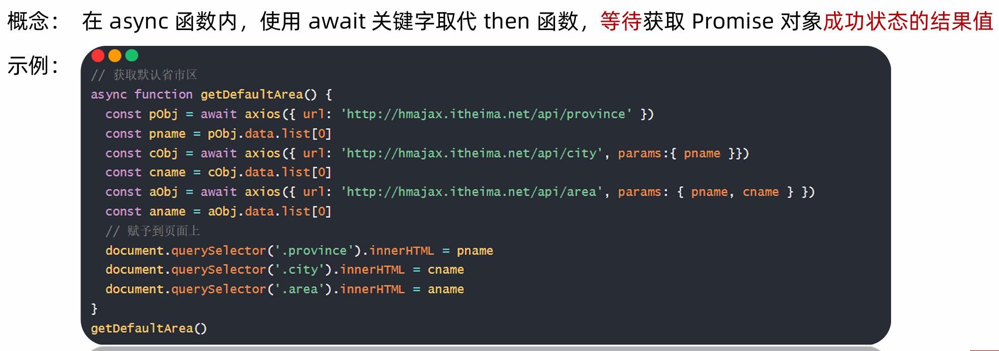

看上图中的代码，`async`修饰在函数前面，表示这个函数是一个异步函数。`await`用于等待一个Promise对象的结果，只有在`async`函数内部才能使用`await`。只有当`await`后面的Promise对象完成之后，才会执行后面的代码。

而如果要捕获`async/await`中的错误，可以使用`try/catch`语句。

```javascript
async function fetchData() {
    try {
        const response = await axios.get('http://hmajax.itheima.net/api/province');
        console.log(response.data);
    } catch (error) {
        console.error('请求失败:', error);
    }
}
fetchData();
```

需要注意的是，如果出现了错误，则在出现错误之后的后续代码都不会执行，而是直接跳转到`catch`块中处理错误。

## 3 事件循环中的宏任务与微任务

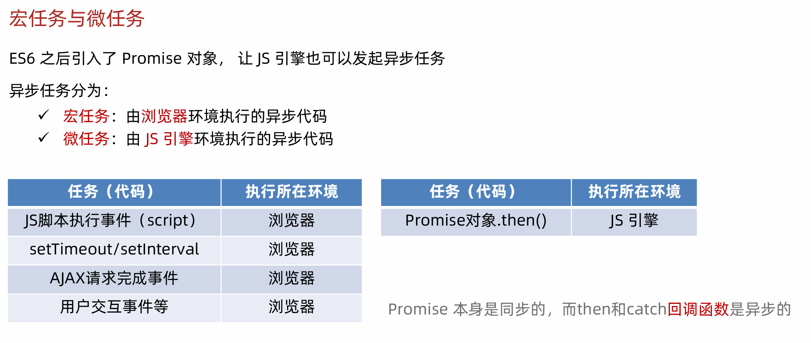

我们目前学过的东西中，只有`Promise.then()`属于微任务。JS引擎在执行任务时，微任务优先，只有所有的微任务等待队列中全部执行完毕，才会执行宏任务队列中的任务。下面图的代码要会分析。

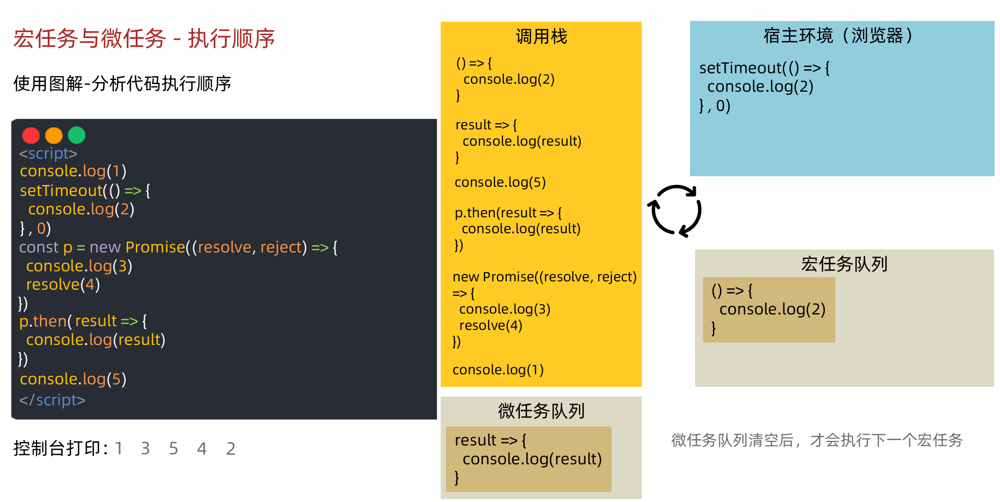
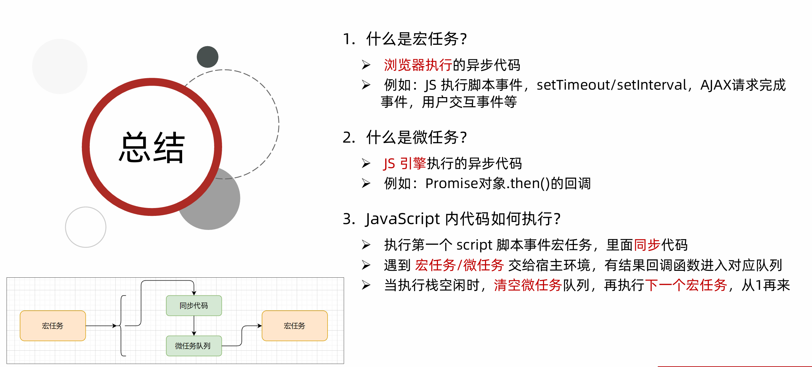

接下来看一个面试题：

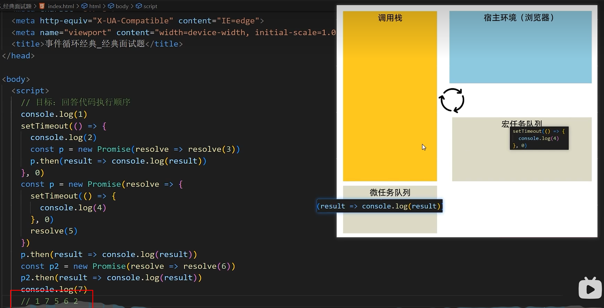

这个题有一定难度，需要注意的是在如图所示的情况中，虽然上一步先执行的是宏任务队列中的任务，但是该步宏任务中的任务会将新任务添加到微任务队列中，接着由于微任务队列中有任务，所以会再次优先执行。

## 4 Promise.all 静态方法

Promise.all() 方法用于将多个 Promise 实例包装成一个新的 Promise 实例。这个新的 Promise 实例在所有的 Promise 实例都成功时才会成功，并返回一个包含所有成功结果的数组；如果有任何一个 Promise 实例失败，则新的 Promise 实例会立即失败，并返回第一个失败的 Promise 的错误信息。

```javascript
const promise1 = Promise.resolve(1);
const promise2 = Promise.resolve(2);
const promise3 = Promise.resolve(3);

Promise.all([promise1, promise2, promise3])
    .then(results => {
        console.log('所有请求成功:', results);  // 输出: [1, 2, 3]，注意这里的结果会根据Promise数组的顺序返回
    })
    .catch(error => {
        console.error('请求失败:', error);
    });
```

# Day5 项目day与零碎知识介绍

## 1 token

Token 是一种用于身份验证和授权的机制，通常在用户登录后生成，并在后续请求中携带，以证明用户的身份。

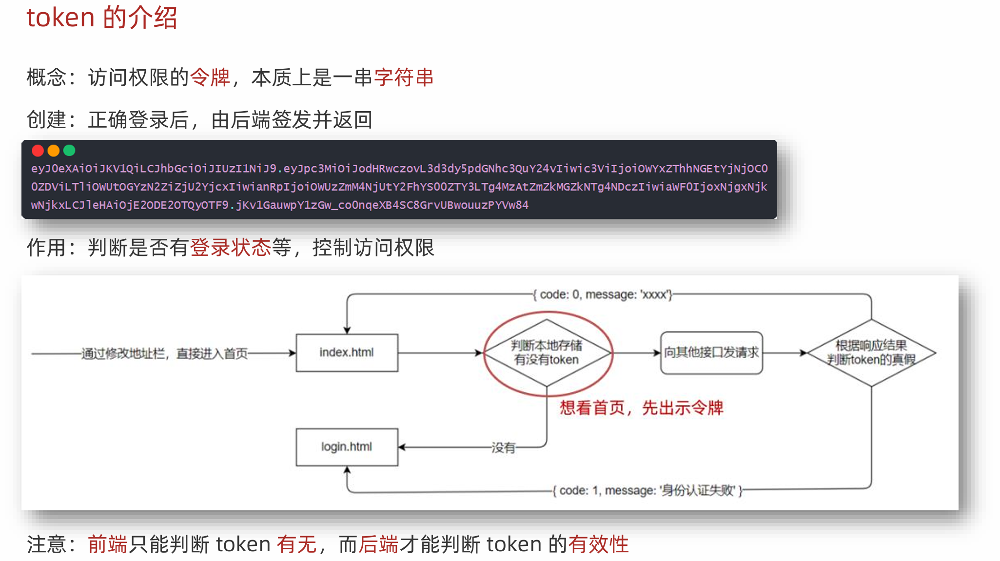

## 2 axios请求拦截器

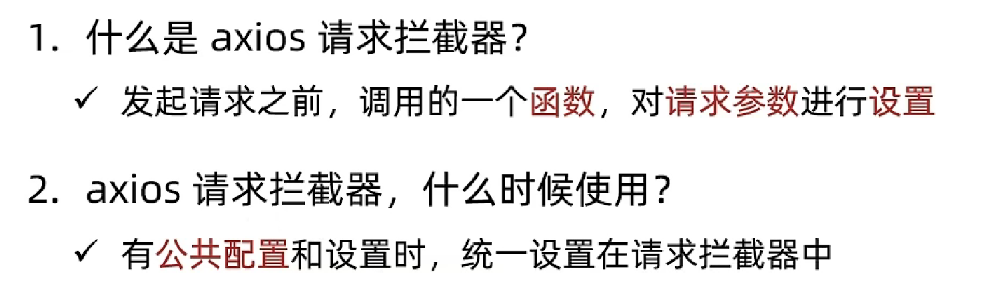
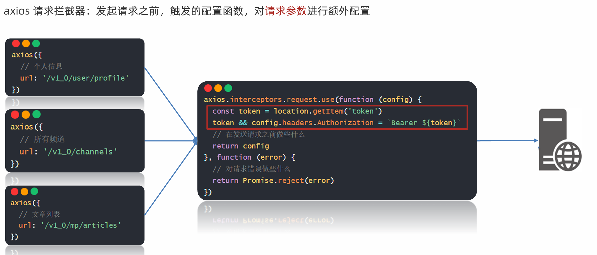
我们重点看上面那段代码中红框框起来的那段话，中间那个`&&`短路与的意思是，如果左边那句话不为空也就是`token`存在，则会执行右边的代码，如果不存在就不执行。

## 3 axios响应拦截器

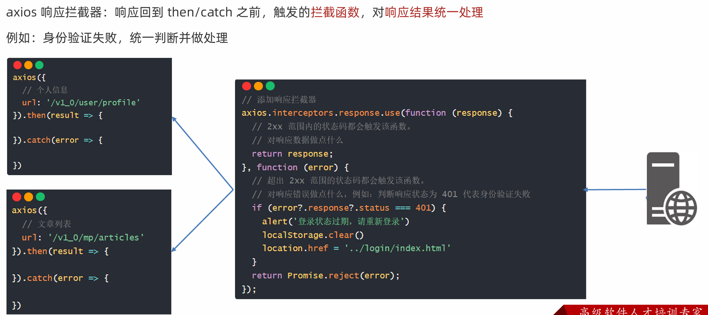

与请求拦截器相对应的就是响应拦截器。它的作用可以实现对响应数据的统一处理。一旦一个响应里说明出现了错误，就被拦截。