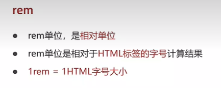
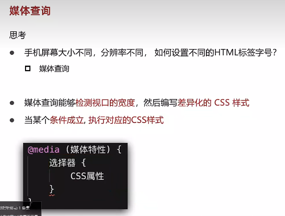
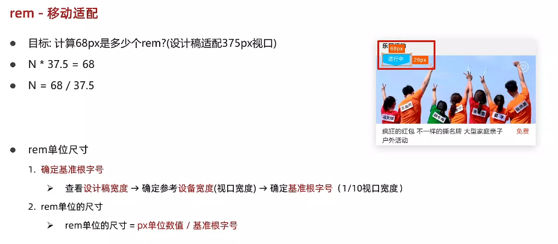
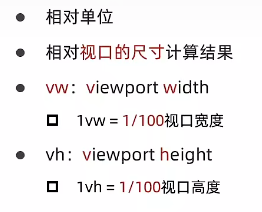
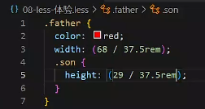
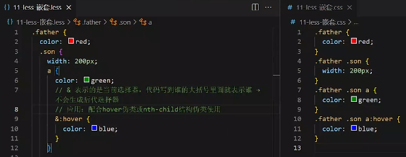
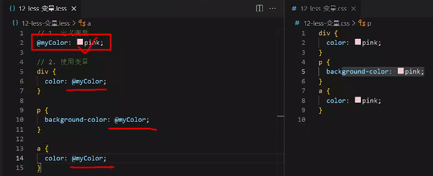
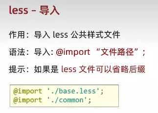
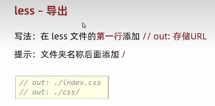

参照黑马的HTML和CSS教程来写笔记，只记录部分重点内容。

# 媒体查询

这个概念是我在复习的时候新学的，之前没有学过，比较简单好理解。首先我们要知道什么叫做响应式Web设计，就是我的视口宽度发生变化时，比如说从电脑换到手机后，我们的同一套代码要实现手机的排版也是好看的，自动发生变化，这就是响应式设计。这可以通过媒体查询来实现。

一般采用上面的简写形式。

另外我们需要注意一下媒体查询的书写顺序，由于CSS会层叠覆盖的原因。如上图所示，用脑子简单想想就能想明白。

# rem/vw/vh

这三个单位都是在适配移动端响应式设计的时候使用的，它们都是相对单位。

默认情况下，rem单位的大小是16px，因为浏览器根字号默认大小是16px。

如果使用rem来做适配，那么通常就会结合媒体查询，给某一些不同视口宽度大小的设备设置不同的rem单位大小。**在目前的rem布局方案中，通常HTML根字号大小设置为视口宽度的1/10**。举个例子，如果视口宽度是375px，那么HTML根字号大小就是37.5px。

另外在设计稿中，通常会使用px单位来表示元素的宽度和高度，而不是rem单位，所以我们需要根据设计稿的单位来计算出对应的rem单位。后面的vw和vh也同理。下面来看vw和vh。

另外请注意，对于一个元素，**要么使用vw单位，要么使用vh单位，不能同时使用**，这是因为不同设备的宽高比例不同，混用会导致元素的比例发生异常。工程中一般推荐使用vw，不用管vh。

# less

我们为了让css能够具有一些更强大的功能，比如变量、计算、嵌套等，就引入了less来写css代码。需要注意的是，less在最早是不能被浏览器识别的，需要先编译成css，才能被识别。现代的浏览器基本上能够识别less了，但是还是推荐把它编译成css，再去发布。

VS Code中，可以使用Easy LESS插件，来实现在保存less文件时，自动编译成css文件。

看上面这个简单示例，实现了计算功能。再来看一个更牛逼的嵌套写法：

此外less可以定义变量，使用`@`符号来定义。举个例子，定义一个变量`@color: pink;`，然后在代码中使用`@color`来引用。

关于less的导入与导出，看下面的图：

如果需要禁止导出，那么就在开头添加`// out: false`
