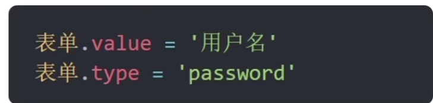
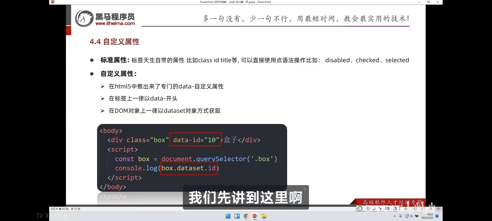
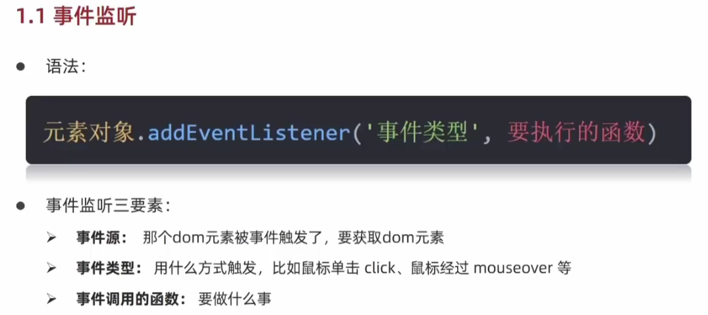
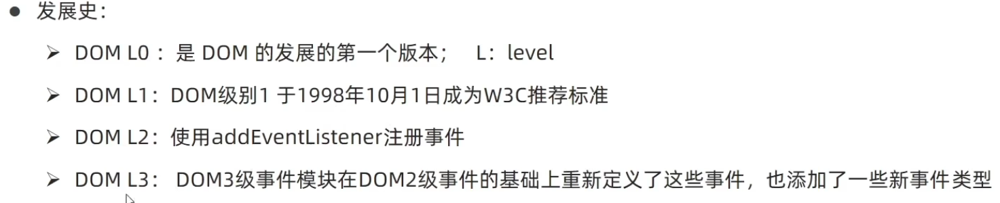
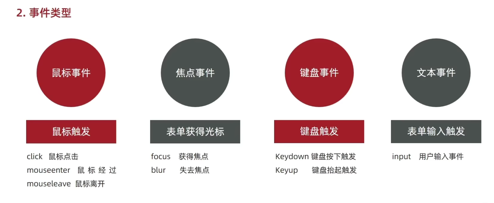

# Part 2 APIs 部分

这一部分主要讲解了操作DOM BOM，比如控制网页元素交互等各种网页交互效果。

## Day1 DOM-获取元素：获取元素、修改属性

### 1. 变量声明

**建议：`const`优先，尽量使用`const`，JS中有个不成文的约定，优先使用`const`，如果发现需要改成`let`时再改成`let`。**

**建议数组和对象使用`const`来声明。** 对象是引用类型，里面存储的是地址，只要地址不变，`const`声明的对象是可以修改里面的属性的，不会报错。

### 2. DOM树和DOM对象

JavaScript = ECMAScript(JSC语言基础) + WebAPIs(BOM + DOM)

**什么是DOM？** DOM，文档对象模型，是用来呈现以及与任意HTML或XML文档交互的API。简单理解，DOM是浏览器提供的一套专门用来**操作网页内容**的功能。

浏览器根据HTML标签生成JS对象，即为DOM对象，DOM的核心就是把内容当对象来处理。

**document是什么？** 是DOM里提供的一个对象，网页所有内容都在document里面。

### 3. 获取DOM元素

获取DOM元素有几种方法，一种是**根据CSS选择器来获取DOM元素，** 还有些其他方法，前者很重要。

#### 根据CSS选择器来获取DOM元素（重要）

1. `document.querySelector('css选择器')`：获取**第一个**符合条件的元素，返回的是一个元素对象。**注意：引号一定要加，css选择器同css写法。**

注：如果要选择指定的某个元素对象，例如一个`ul`中包含了一堆的`li`，使用`nth-child`，可以这么写：
    
```javascript
const li = document.querySelector('ul li:nth-child(2)');    // 获取第二个li，这里元素的下标是从1开始的！
```

2. `document.querySelectorAll('css选择器')`：获取所有符合条件的元素，返回的是一个**伪数组**（NodeList对象集合）。**伪数组有长度`length`和索引号，但是没有`pop()` `push()`等数组方法。** 哪怕只有一个元素，只要用`qurerySelectorAll`就会返回一个伪数组。

#### 其他获取DOM元素的方法

1. `document.getElementById('id名')`：根据id名获取元素，返回的是一个元素对象。

2. `document.getElementsByClassName('类名')`：根据类名获取元素，返回的是一个**伪数组**（HTMLCollection对象集合）。

3. `document.getElementsByTagName('标签名')`：根据标签名获取元素，返回的是一个**伪数组**（HTMLCollection对象集合）。

**注意，面试中可能还会问你`NodeList对象集合`和`HTMLCollection对象集合的区别`，先是要答出来他俩分别是由哪两个方法返回的，在要知道，`HTMLCollection`是实时更新的，当文档中元素发生变化时，集合会自动更新，而`NodeList`不会。**

### 4. 修改DOM元素内容

#### 4.1 `innerText`属性

`innerText`属性可以获取或设置元素的文本内容，**只能获取文本内容，不能获取标签内容。**

#### 4.2 `innerHTML`属性

`innerHTML`属性可以获取或设置元素的HTML内容，**可以获取标签内容。** 将字符串赋值给`innerHTML`时，需要通过引号包裹，例如`p.innerHTML = '<span>hello</span>'`。

**如果你还在纠结使用谁，我们就使用innerHTML。**

**注意：它得不到表单元素的内容，表单在后面单独拿出来讲。**

### 5. 操作DOM元素属性

#### 5.1 修改DOM元素常见属性

直接使用`元素对象.属性名 = 需要修改的属性值`这种方式来修改元素的属性。举例：

```javascript
// 获取元素
const img = document.querySelector('img');
// 修改img的src属性
img.src = 'https://www.baidu.com/img/flexible/logo/pc/result.png';  // 直接通过对象.属性名 = 属性值来修改
```

#### 5.2 修改DOM元素`样式`属性

**修改DOM元素的样式属性，常见有下面的三种方式：**

1. 通过`style`修改样式
2. 通过类名修改样式
3. 通过classList修改样式

##### 5.2.1 通过`style`修改样式

采用如下的语句：`对象.style.样式属性 = '值'`。**生成的是行内样式表，权重比较高。**

```javascript
// 获取元素
const p = document.querySelector('p');
// 修改p的样式
p.style.color = 'red';  // 通过style修改样式
p.style.fontSize = '30px';  // 注意，一般都需要带上单位
p.style.backgroundColor = 'black';  // 如果遇到多个单词使用'-'组成的属性，需要将后面的单词首字母大写，使用小驼峰命名法
```

**注意，当修改`body`元素的属性时，我们一般不需要先获取元素，因为整个页面只有一个body元素。**

```javascript
// 修改body的背景颜色
document.body.style.backgroundColor = 'black';
```

##### 5.2.2 通过`className`修改样式

有的时候，需要一次性修改多个样式，这时候直接修改`style`属性就显得很麻烦，这时候我们可以通过`className`来修改样式。

```css
/* CSS */
.active {
    color: red;
    font-size: 30px;
    background-color: black;
}
```

```javascript
/* JS */
// 获取元素
const p = document.querySelector('p');
// 修改p的样式
p.className = 'active';  // 通过className修改样式
```

**注：`className`是新值换旧值，如果需要添加一个类，要保留之前的类名。**

##### 5.2.3 通过`classList`修改样式（重要）

为了解决`className`容易覆盖此前类名的原因，我们可以使用`classList`来修改样式。**这是未来最常见的方式。**

`classList`是一个类数组对象，有3个方法，可以方便的操作类名。

```javascript
// 获取元素
const p = document.querySelector('p');
// 修改p的样式
p.classList.add('active');  // 通过classList添加类名

// 删除类名
p.classList.remove('active');  // 通过classList删除类名

// 切换类名
p.classList.toggle('active');  // 通过classList切换类名 没有就加上 有就删掉
```

#### 5.3 修改表单元素属性

注意，当我们设置表单元素（特指单个标签的表单元素，例如`input`）的值的时候，需要使用 `.value` 或者 `.type`，使用 `innerHTML` 往往取不到表单元素的值。**但是需要特别注意的是，我们可以使用`innerHTML`获取`button`的文本。**



此外，`input`标签可以通过`type`属性来设置输入框的类型，常见的有`text`、`password`、`radio`、`checkbox`、`file`等。当类型为`radio`或`checkbox`时，可以通过`checked`属性来设置是否选中，如果`checked`为`true`，则表示选中，否则表示未选中。

此外，`button`标签可以通过`disabled`控制按钮是否禁用，**特别要注意的是，如果`disabled`为`true`那么按钮被禁用。**

此外，H5新规范，如下面的控制`button`为`disabled`的示例：

```html
<button disabled>Click Me</button>
```

#### 5.4 自定义属性



自定义属性通过`data-`开头，在DOM上使用`dataset`对象方式获取。**这个在往后开发的过程中似乎经常用到。**

### 6. 定时器、间歇函数

`setInterval(fn, interval)`函数会返回一个标号，这个标号标识了定时器的独一无二的值。

给一个开启定时器和关闭定时器的例子：

```javascript
function fn() {
    console.log('111');
}

let n = setInterval(fn, 1000);  // 开启定时器，1. fn不写括号 2. 必须使用let进行声明，因为后面需要关闭开启时会对n进行重新赋值。
clearInterval(n);   // 关闭定时器
n = setInterval(fn, 1000);  // 重新打开定时器
```

## Day2 DOM-事件基础：注册事件、tab栏切换

### 1. 事件监听

`addEventListener`是一个非常重要的方法，用来给元素绑定事件。语法：

```javascript
元素.addEventListener('事件名', function() {
    // 事件处理程序
});
```



拓展：事件监听的版本：又L0~L4四个版本。



**绑定了事件监听之后，例如`.addEventListener('click', function(){})`，那么接下来可以在外面通过JS调用`element.click()`模拟点击。**

### 2. 事件类型

有鼠标触发、表单获得光标、键盘触发、表单输入触发等。



### 3. 事件对象

事件对象是浏览器提供的一个对象，当事件发生时，会自动创建一个事件对象，这个对象中包含了当前事件的相关信息。

`.addEventListener('click', function(event) {})`，**这里的`event`就是事件对象。**