# Part 2 APIs 部分

这一部分主要讲解了操作DOM BOM，比如控制网页元素交互等各种网页交互效果。

## Day1 DOM-获取元素：获取元素、修改属性

### 1. 变量声明

**建议：`const`优先，尽量使用`const`，JS中有个不成文的约定，优先使用`const`，如果发现需要改成`let`时再改成`let`。**

**建议数组和对象使用`const`来声明。** 对象是引用类型，里面存储的是地址，只要地址不变，`const`声明的对象是可以修改里面的属性的，不会报错。

### 2. DOM树和DOM对象

JavaScript = ECMAScript(JSC语言基础) + WebAPIs(BOM + DOM)

**什么是DOM？** DOM，文档对象模型，是用来呈现以及与任意HTML或XML文档交互的API。简单理解，DOM是浏览器提供的一套专门用来**操作网页内容**的功能。

浏览器根据HTML标签生成JS对象，即为DOM对象，DOM的核心就是把内容当对象来处理。

**document是什么？** 是DOM里提供的一个对象，网页所有内容都在document里面。

### 3. 获取DOM元素

获取DOM元素有几种方法，一种是**根据CSS选择器来获取DOM元素，** 还有些其他方法，前者很重要。

#### 根据CSS选择器来获取DOM元素（重要）

1. `document.querySelector('css选择器')`：获取**第一个**符合条件的元素，返回的是一个元素对象。**注意：引号一定要加，css选择器同css写法。**

注：如果要选择指定的某个元素对象，例如一个`ul`中包含了一堆的`li`，使用`nth-child`，可以这么写：
    
```javascript
const li = document.querySelector('ul li:nth-child(2)');    // 获取第二个li，这里元素的下标是从1开始的！
```

**下面一段使用属性选择器，很重要：**

```javascript
const li = document.querySelector('ul li[data-index="2"]');    // 获取data-index为2的li
```

2. `document.querySelectorAll('css选择器')`：获取所有符合条件的元素，返回的是一个**伪数组**（NodeList对象集合）。**伪数组有长度`length`和索引号，但是没有`pop()` `push()`等数组方法。** 哪怕只有一个元素，只要用`qurerySelectorAll`就会返回一个伪数组。

#### 其他获取DOM元素的方法

1. `document.getElementById('id名')`：根据id名获取元素，返回的是一个元素对象。

2. `document.getElementsByClassName('类名')`：根据类名获取元素，返回的是一个**伪数组**（HTMLCollection对象集合）。

3. `document.getElementsByTagName('标签名')`：根据标签名获取元素，返回的是一个**伪数组**（HTMLCollection对象集合）。

**注意，面试中可能还会问你`NodeList对象集合`和`HTMLCollection对象集合的区别`，先是要答出来他俩分别是由哪两个方法返回的，在要知道，`HTMLCollection`是实时更新的，当文档中元素发生变化时，集合会自动更新，而`NodeList`不会。**

### 4. 修改DOM元素内容

#### 4.1 `innerText`属性

`innerText`属性可以获取或设置元素的文本内容，**只能获取文本内容，不能获取标签内容。**

#### 4.2 `innerHTML`属性

`innerHTML`属性可以获取或设置元素的HTML内容，**可以获取标签内容。** 将字符串赋值给`innerHTML`时，需要通过引号包裹，例如`p.innerHTML = '<span>hello</span>'`。

**如果你还在纠结使用谁，我们就使用innerHTML。**

**注意：它得不到表单元素的内容，表单在后面单独拿出来讲。**

### 5. 操作DOM元素属性

#### 5.1 修改DOM元素常见属性

直接使用`元素对象.属性名 = 需要修改的属性值`这种方式来修改元素的属性。举例：

```javascript
// 获取元素
const img = document.querySelector('img');
// 修改img的src属性
img.src = 'https://www.baidu.com/img/flexible/logo/pc/result.png';  // 直接通过对象.属性名 = 属性值来修改
```

#### 5.2 修改DOM元素`样式`属性

**修改DOM元素的样式属性，常见有下面的三种方式：**

1. 通过`style`修改样式
2. 通过类名修改样式
3. 通过classList修改样式

##### 5.2.1 通过`style`修改样式

采用如下的语句：`对象.style.样式属性 = '值'`。**生成的是行内样式表，权重比较高。**

```javascript
// 获取元素
const p = document.querySelector('p');
// 修改p的样式
p.style.color = 'red';  // 通过style修改样式
p.style.fontSize = '30px';  // 注意，一般都需要带上单位
p.style.backgroundColor = 'black';  // 如果遇到多个单词使用'-'组成的属性，需要将后面的单词首字母大写，使用小驼峰命名法
```

**注意，当修改`body`元素的属性时，我们一般不需要先获取元素，因为整个页面只有一个body元素。**

```javascript
// 修改body的背景颜色
document.body.style.backgroundColor = 'black';
```

##### 5.2.2 通过`className`修改样式

有的时候，需要一次性修改多个样式，这时候直接修改`style`属性就显得很麻烦，这时候我们可以通过`className`来修改样式。

```css
/* CSS */
.active {
    color: red;
    font-size: 30px;
    background-color: black;
}
```

```javascript
/* JS */
// 获取元素
const p = document.querySelector('p');
// 修改p的样式
p.className = 'active';  // 通过className修改样式
```

**注：`className`是新值换旧值，如果需要添加一个类，要保留之前的类名。**

##### 5.2.3 通过`classList`修改样式（重要）

为了解决`className`容易覆盖此前类名的原因，我们可以使用`classList`来修改样式。**这是未来最常见的方式。**

`classList`是一个类数组对象，有3个方法，可以方便的操作类名。

```javascript
// 获取元素
const p = document.querySelector('p');
// 修改p的样式
p.classList.add('active');  // 通过classList添加类名

// 删除类名
p.classList.remove('active');  // 通过classList删除类名

// 切换类名
p.classList.toggle('active');  // 通过classList切换类名 没有就加上 有就删掉
```

#### 5.3 修改表单元素属性

注意，当我们设置表单元素（特指单个标签的表单元素，例如`input`）的值的时候，需要使用 `.value` 或者 `.type`，使用 `innerHTML` 往往取不到表单元素的值。**但是需要特别注意的是，我们可以使用`innerHTML`获取`button`的文本。**


此外，`input`标签可以通过`type`属性来设置输入框的类型，常见的有`text`、`password`、`radio`、`checkbox`、`file`等。当类型为`radio`或`checkbox`时，可以通过`checked`属性来设置是否选中，如果`checked`为`true`，则表示选中，否则表示未选中。

此外，`button`标签可以通过`disabled`控制按钮是否禁用，**特别要注意的是，如果`disabled`为`true`那么按钮被禁用。**

此外，H5新规范，如下面的控制`button`为`disabled`的示例：

```html
<button disabled>Click Me</button>
```

#### 5.4 自定义属性


自定义属性通过`data-`开头，在DOM上使用`dataset`对象方式获取。

**这个在往后开发的过程中似乎经常用到。**

### 6. 定时器、间歇函数

`setInterval(fn, interval)`函数会返回一个标号，这个标号标识了定时器的独一无二的值。

给一个开启定时器和关闭定时器的例子：

```javascript
function fn() {
    console.log('111');
}

let n = setInterval(fn, 1000);  // 开启定时器，1. fn不写括号 2. 必须使用let进行声明，因为后面需要关闭开启时会对n进行重新赋值。
clearInterval(n);   // 关闭定时器
n = setInterval(fn, 1000);  // 重新打开定时器
```

## Day2 DOM-事件基础：注册事件、tab栏切换

### 1. 事件监听

`addEventListener`是一个非常重要的方法，用来给元素绑定事件。语法：

```javascript
元素.addEventListener('事件名', function() {
    // 事件处理程序
});
```


拓展：事件监听的版本：又L0~L4四个版本。


**绑定了事件监听之后，例如`.addEventListener('click', function(){})`，那么接下来可以在外面通过JS调用`element.click()`模拟点击。**

### 2. 事件类型

有鼠标触发、表单获得光标、键盘触发、表单输入触发等。


**针对键盘一般更喜欢用`keyup`。**

### 3. 事件对象

事件对象是浏览器提供的一个对象，当事件发生时，会自动创建一个事件对象，这个对象中包含了当前事件的相关信息。

`.addEventListener('click', function(event) {})`，**这里的`event`就是事件对象。**

**常用属性：**

1. `event.type`：获取事件类型。
2. `event.clientX / event.clientY`：获取鼠标在**浏览器可见窗口左上角**中的X/Y坐标。
3. `event.offsetX / event.offsetY`：获取鼠标在**当前DOM元素左上角**中的X/Y坐标。
4. `event.key`：获取键盘按键。

**拓展：`trim`方法：**

`trim`方法可以去掉字符串两端的空格，但是不会去掉中间的空格。示例：

```javascript
const str = '  hello world  ';
console.log(str.trim());  // 'hello world'
```

### 4. 环境对象`this`

`this`是一个非常重要的对象，它代表当前函数运行时所处的环境。

判断`this`指向的粗略规则是：**谁调用，this就是谁。**

### 5. 回调函数

这里我们要求说出回调函数的定义：**把一个函数作为另外一个函数的参数传递，这个函数就叫回调函数。**

## Day3 DOM-事件进阶：事件流、事件委托、其他事件、元素尺寸与位置

### 1. 事件流

#### 1.1 事件流的两个阶段

**捕获、冒泡**

说明：假设页面里有个div，当触发事件时，会经历两个阶段，分别是捕获阶段、冒泡阶段。如下图：


捕获：从DOM的根元素开始去执行对应的事件。

冒泡：从当前元素开始，一直冒泡到DOM的根元素。**实际工作中，以事件冒泡为主。**

简单理解，当一个元素触发事件后，会一次向上调用所有父级元素的同名事件。事件冒泡是默认存在的，`addEventListener`的第三个参数默认为`false`，表示冒泡阶段，如果改成了true，就变成事件捕获了。

#### 1.2 阻止事件冒泡

因为默认就有冒泡模式的存在，所以容易导致事件影响到父级元素，若想把事件就限制在当前元素内，就需要阻止事件冒泡。`event.stopPropagation()`可以阻止事件冒泡，不光在冒泡阶段有效，捕获阶段也有效。

#### 1.3 事件解绑

1. L0移除：`element.onclick = null;`
2. L2移除：`element.removeEventListener('click', fn);`
**注意：匿名函数无法被解绑！**

#### 1.4 鼠标经过事件的区别

**`mouseover`和`mouseout`会有冒泡效果，`mouseenter`和`mouseleave`不会有冒泡效果。** 推荐使用`mouseenter`和`mouseleave`。

#### 拓展：两种注册事件的区别


#### 1.5 阻止默认行为

`event.preventDefault()`可以阻止默认行为，例如阻止a标签的跳转。

### 2. 事件委托


**通过`e.target`来获取当前点击的元素（`e`为事件对象），然后通过判断`e.target.tagName`来判断当前点击的元素是否是我们需要的元素。** 举例：`if (e.target.tagName === 'LI') { console.log('点击了li'); } // 需要使用全大写标签名`。

**案例学习小技巧**：把字符串转为数字，可以只需要在字符串前面加一个`+`号，例如`+'123'`。

### 3. 其他事件：页面加载事件、元素滚动事件、页面尺寸事件

#### 3.1 页面加载事件

要求较低，认识即可。

1. `load`等待**资源全部**加载完毕，再去执行事件。
2. `DOMContentLoaded`等待**DOM结构（HTML）**加载完毕，无需等待图片样式表等资源加载完毕就执行事件。

#### 3.2 元素滚动事件


**获取html元素写法**

`document.documentElement`

**开发中常用**

`scrollTop`获取被卷去的头部，**可读写**，获取到的是数字型的数据，不带单位。

`scrollLeft`被卷去的左侧。


**滚动到指定的坐标**

除此之外我们可以采用`window.scrollTo(x, y);`滚动到指定的坐标。

#### 3.3 页面尺寸事件

`resize`事件，当页面尺寸发生变化时触发。

**获取元素的可见部分边框**：`clientWidth`、`clientHeight`。


**获取元素的完整尺寸**：`offsetWidth`、`offsetHeight`。


**获取位置**：`offsetLeft`、`offsetTop`，这两个是只读属性，**最常用！**


`element.getBoundingClientRect()`：获取元素相对于**视口**的位置。（了解即可）

**总结**


### 4. 拓展：自执行函数

自执行函数是指在定义后立即执行的函数，语法如下：

```javascript
(function() {
    // 代码
})();
```

下面为一个简单的案例：

```javascript
(function (param1, param2) {
    console.log(param1 + ", " + param2);
})("Hello", "World");   // 参数传递
```

自执行函数的作用：

1. 防止变量污染。
2. 用于模块化开发。

## Day4 DOM节点、移动端滑动

### 1. 日期对象

#### 1.1 实例化

有两种实例化方式：不指定日期/指定日期：

```javascript
const d = new Date();  // 不指定日期
const d = new Date('2021-01-01');  // 指定日期
```

#### 1.2 日期对象方法


此外，我可以使用`date.toLocaleString()`来获取本地时间。还有`date.toLocaleDateString()`和`date.toLocaleTimeString()`，分别只获取日期和时间。

#### 1.3 时间戳

时间戳是指从1970年1月1日0时0分0秒到现在的毫秒数，可以通过`date.getTime()`或者`+new Date()`或者`Date.now()`来获取。选一个即可。

**时间戳转换为dd:hh:mm:ss的公式：**


### 2. 节点操作

#### 2.1 DOM 节点介绍


#### 2.2 查找节点

本节主要是通过元素节点的关系进行查找。**以前是无脑获取节点，现在可以通过关系进行查找。**

1. `parentNode`：获取父节点。
2. `childNodes`只做了解，重点掌握`children`。

3. 兄弟关系查找：`previousElementSibling`、`nextElementSibling`。

#### 2.3 增加节点（重要）

**创建节点**

`document.createElement('标签名')`：创建一个元素节点。

**追加节点**


**克隆节点**

`element.cloneNode(true)`：克隆节点，`true`表示深度克隆（类似深拷贝，把包含的后代节点一起克隆），`false`表示浅克隆（类似浅拷贝）。**大多数情况下，我们都会写上`true`，如果不写就只克隆标签。**

#### 2.4 删除节点

必须通过父元素调用删除。`父元素.removeChild(子元素)`：删除子元素。

### 3. M端（移动端）事件

**触摸事件有三个阶段：**

1. `touchstart`：手指触摸屏幕时触发。
2. `touchmove`：手指在屏幕上滑动时触发。
3. `touchend`：手指离开屏幕时触发。

### 4. JS 插件

**Swiper插件的使用**


**拓展**

`form`表单的`autocomplete`属性，可以设置为`off`，这样就可以关闭表单的自动填充功能。

`form`通过调用`reset()`方法可以重置表单。

## Day5 Window对象、本地存储

### 1. Window对象

#### 1.1 BOM

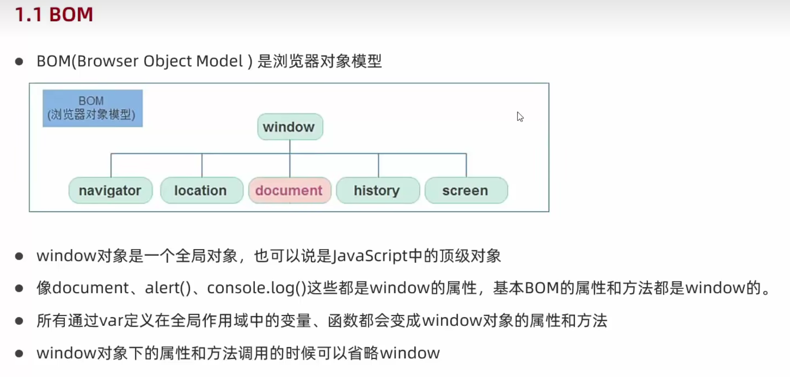

#### 1.2 定时器——延时函数

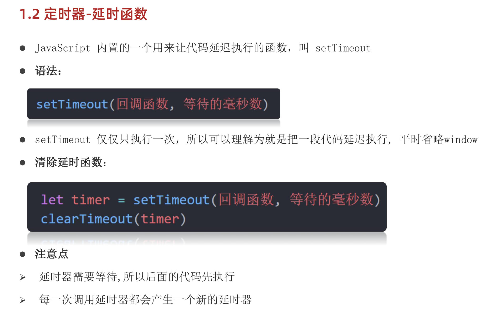

`setTimeout`返回的是一个id，用来标注定时器的序号。

#### 1.3 JS 执行机制（面试经常考）

JS是单线程的，JS会根据代码的特征，使用事件循环(event loop)机制来处理异步任务。如果是同步任务，放入执行栈中；如果是异步任务，提交给对应的异步进程进行处理，推入异步队列中。当执行栈中的所有任务执行完之后，JS会检查异步队列中是否有任务，如果有，就将其推入主线程中执行，待全部执行完之后，又回去检查同步的执行栈，如此循环我们称之为事件循环。

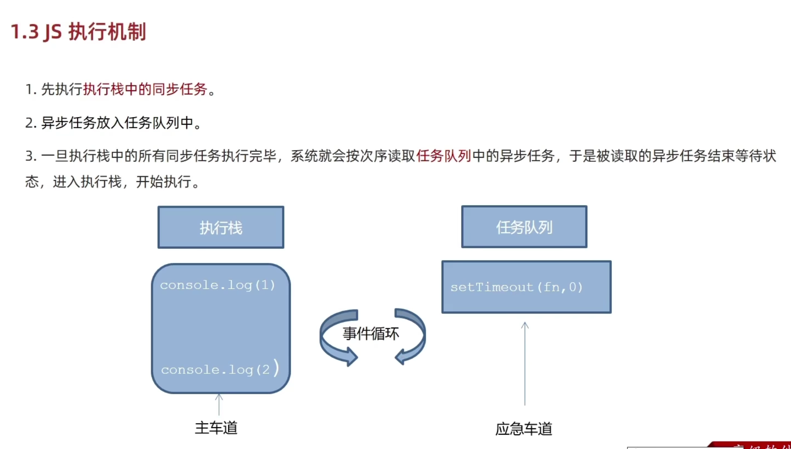

#### 1.4 location对象

`location`对象是`window`对象的一个属性，用来获取或设置当前页面的URL信息。最重要的是我们要知道`location.href`可以获取当前页面的完整URL，对其赋值时，可以实现对页面的跳转。

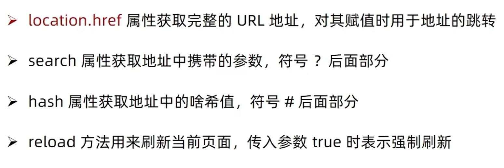

#### 1.5 navigator对象和history对象

`navigator`对象是浏览器提供的一个对象，用来获取浏览器的信息，例如浏览器的名称、版本、操作系统等。常用的方法是，通过浏览器UA检测浏览器的版本和平台：

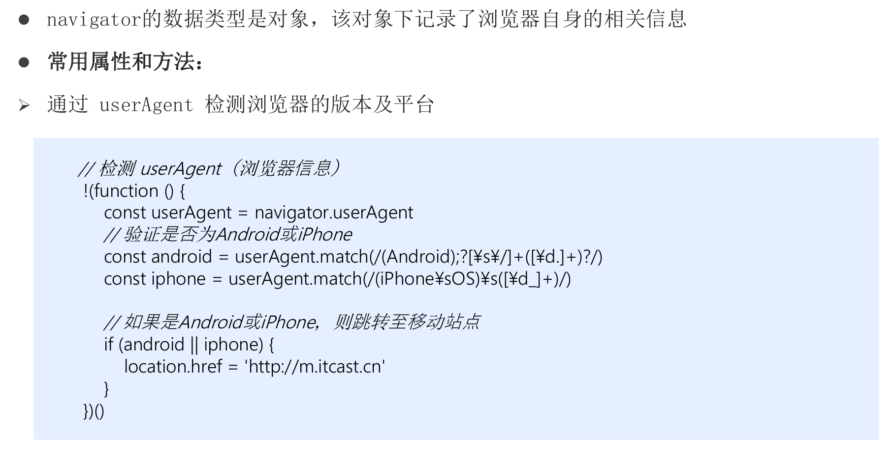

`history`对象是浏览器提供的一个对象，用来操作浏览器的历史记录，例如`history.back()`可以返回上一页，`history.forward()`可以前进到下一页。和浏览器的前进后退功能键类似。

### 2. 本地存储（重点）

#### 2.1 localStorage和sessionStorage

`localStorage`和`sessionStorage`都是浏览器提供的本地存储方案，用于在用户的浏览器中存储数据，它们的存储大小通常为5MB左右。

- `localStorage`：数据永久存储，直到手动删除。
- `sessionStorage`：数据仅在当前会话中有效，关闭页面后数据会被清除。

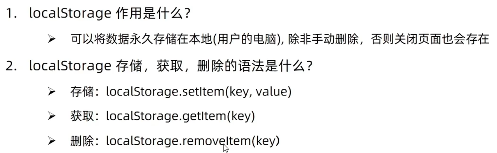

**请注意，`key`需要加引号，否则当作变量看，`value`会自动转换成字符串，理解是，本地存储只能存储字符串信息。**

方法如下：

```javascript
// 存储数据
localStorage.setItem('key', 'value');
sessionStorage.setItem('key', 'value');

// 获取数据
const value1 = localStorage.getItem('key');
const value2 = sessionStorage.getItem('key');

// 删除数据
localStorage.removeItem('key');
sessionStorage.removeItem('key');
```

#### 2.2 存储复杂数据类型

对于复杂数据类型（如对象、数组），我们需要先将其转换为字符串，再存储到本地存储中。可以使用`JSON.stringify()`将对象转换为JSON字符串，使用`JSON.parse()`将JSON字符串转换为对象。

```javascript
// 存储对象
const user = { name: 'Alice', age: 25 };
localStorage.setItem('user', JSON.stringify(user));

// 获取对象
const userStr = localStorage.getItem('user');
const userObj = JSON.parse(userStr);
```

### 拓展 数组中的`map`和`join`方法

设计`map`方法的初衷，在于直接对数组中的每个元素都进行操作（这个和`forEach`方法类似），最关键的是，它能够返回一个新的数组。如下所示：

```javascript
const arr = [1, 2, 3];
const newArr = arr.map(item => item * 2);  // 返回一个新的数组，每个元素都乘以2
console.log(newArr);  // [2, 4, 6]
```

`join`方法的作用是将数组中的所有元素连接成一个字符串，默认使用逗号分隔，也可以指定分隔符。如下所示：

```javascript
const arr = [1, 2, 3];
const str = arr.join('-');  // 使用'-'作为分隔符
console.log(str);  // "1-2-3"
```

## Day6 正则表达式

在JS中，正则表达式也是对象。我们学习到能看懂正则表达式即可。

### 1. 正则表达式介绍及语法

正则表达式是用于匹配字符串中字符组合的**模式**。使用起来很简单，先定义一个正则表达式，然后使用`test()`（或者`exec()`）方法来测试字符串是否匹配。

```javascript
const regex = /abc/;
console.log(regex.test('abcdef'));  // true
console.log(regex.test('123'));     // false
```

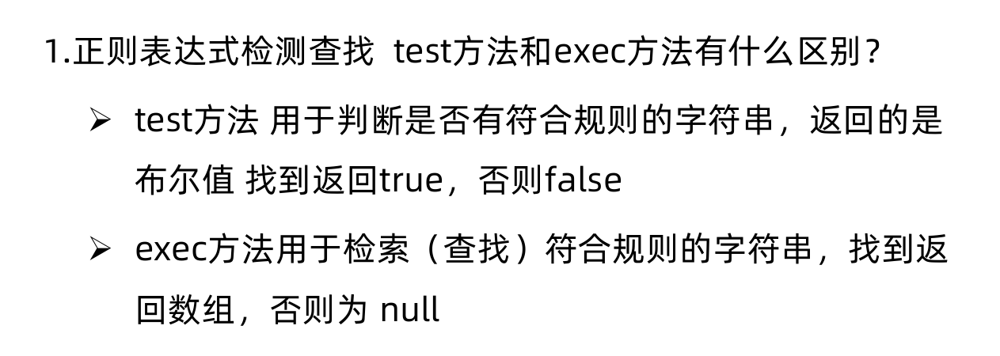

### 2. 元字符

元字符是正则表达式中的特殊字符，用于定义匹配规则。

#### 2.1 边界符

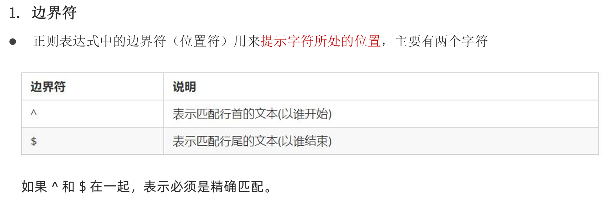

最后面一句话很重要！如果是精确匹配，那么只有唯一的字符串满足匹配情况。例如下面例子中的“二哈”，只有一种情况符合。

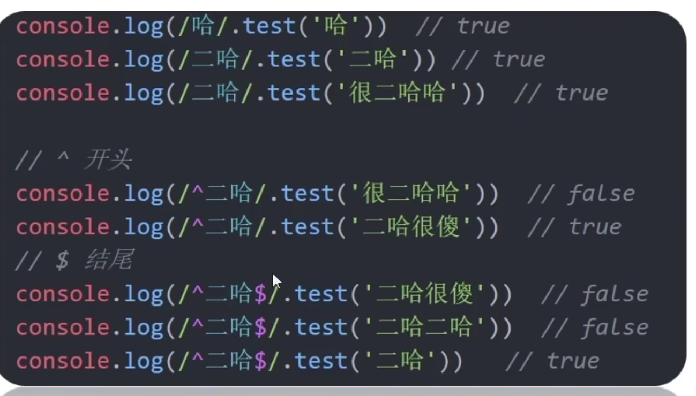

#### 2.2 量词

主要有下面四个：

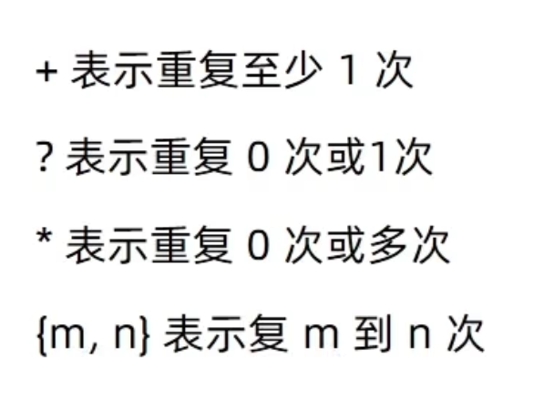
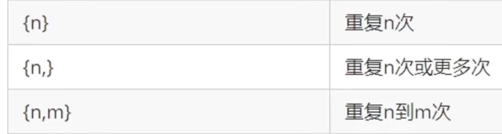

尤其要注意的是，`{m,n}`的逗号左右两边不能加空格！不能加空格！不能加空格！

看看下面几个例子：

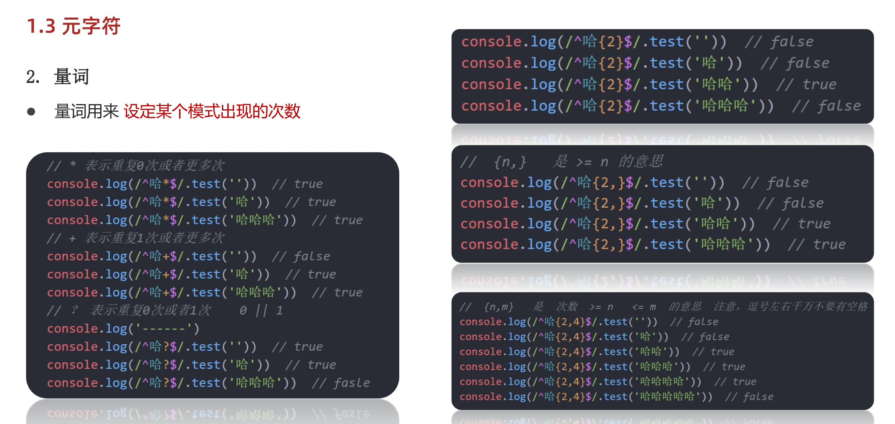

#### 2.3 字符类

字符类用来定义一组字符的集合，看下面的总结和例子：

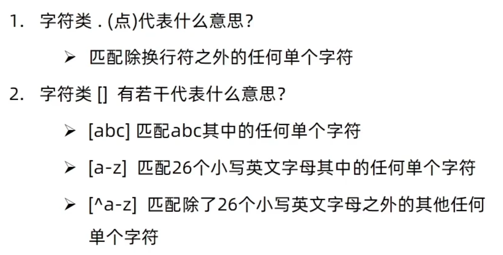
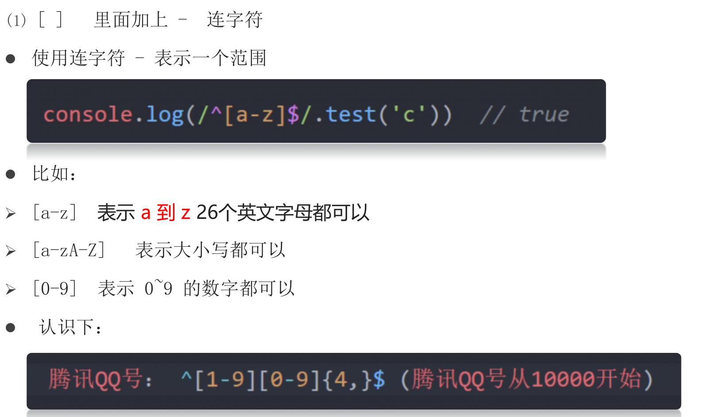

除此之外，还有预定义类，指的是某些常见的简写方式：

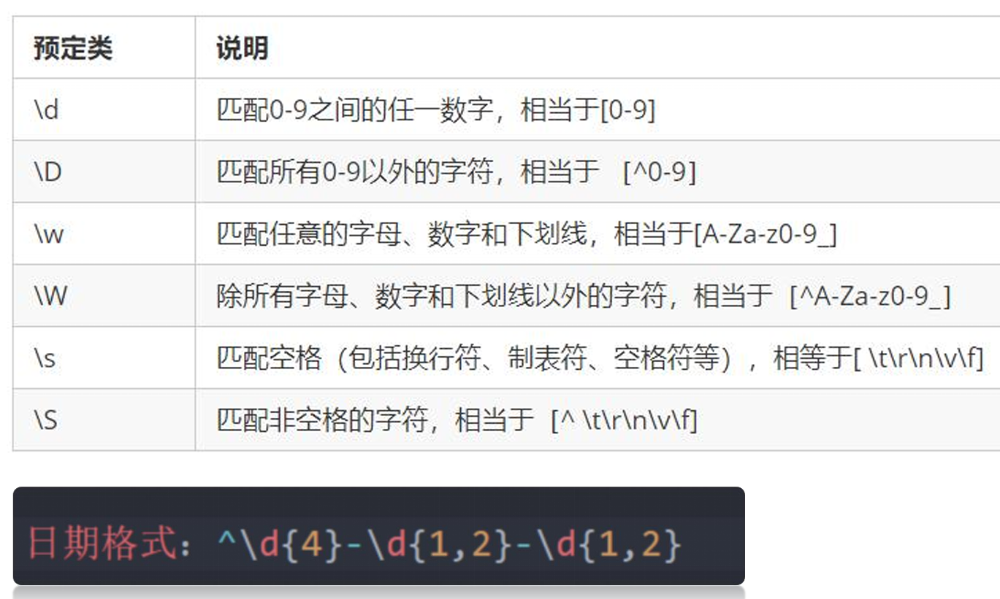

但是实际上，在日常开发中，我们还是喜欢使用中括号的方式，因为它简单明了。有的时候在确实需要简写，且大家都明白的情况下，采用预定义类的简写。

#### 2.4 修饰符

修饰符约束正则执行的某些细节行为，如是否区分大小写、是否支持多行匹配等。一般情况下，我们记住下面两个：

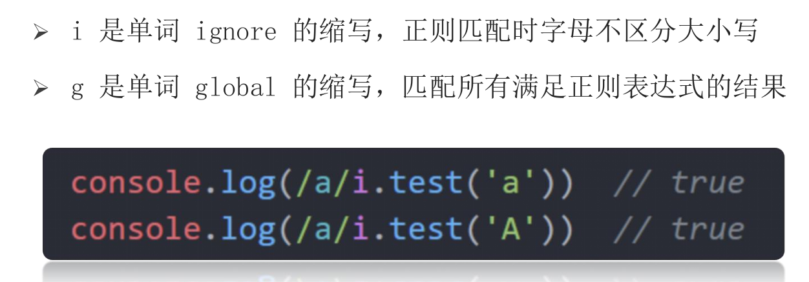

有的时候，我们需要替换字符串中的某一部分，这样子`replace()`方法就派上用场了。它的语法是：

```javascript
str.replace(/正则表达式/, '替换的内容');
```

例如：

```javascript
const str = 'Hello World';
const newStr = str.replace(/World/, 'JavaScript');
console.log(newStr);  // Hello JavaScript
```

我们可以使用`g`修饰符来进行全局替换，使用`i`修饰符来进行不区分大小写的替换：

```javascript
const str = 'Hello World';
const newStr = str.replace(/world/i, 'JavaScript');  // 不区分大小写
console.log(newStr);  // Hello JavaScript
const str2 = 'Hello world world';
const newStr2 = str.replace(/world/g, 'JavaScript');  // 全局替换
console.log(newStr2);  // Hello JavaScript
```

# Part 3 JS进阶部分

## Day1 作用域、函数进阶、解构赋值

### 1. 作用域（重点，面试常考）

#### 1.1 局部作用域

局部作用域包含下面两种：**函数作用域、块作用域**。函数作用域即变量在函数内声明，函数执行完毕后，函数内部的变量实际被清空了。
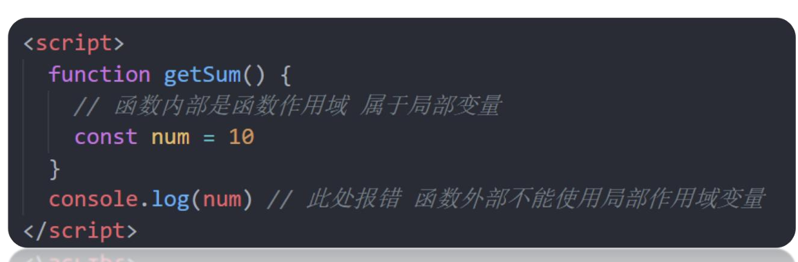
块作用域是指变量在`{}`中声明，只有在这个块内有效。注意，使用`let`和`const`声明的变量是会产生块作用域，而`var`声明的变量不会存在块作用域。
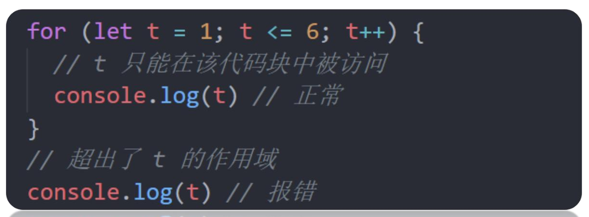

#### 1.2 全局作用域

`<script>`标签和`.js`文件的【最外层】就是所谓的全局作用域，在此声明的变量在函数内部也可以被访问。此外，函数中声明的变量如果没有使用`var`、`let`、`const`等关键字声明，那么它也会被提升到全局作用域中。

#### 1.3 作用域链

**作用域链的本质是底层的变量查找机制**。作用域链是指在查找变量时，JS会先在当前作用域中查找，如果没有找到，就会去上一级作用域中查找，一直向上查找，直到找到全局作用域为止。

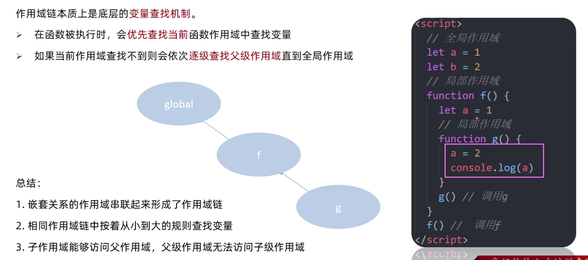

#### 1.4 垃圾回收机制

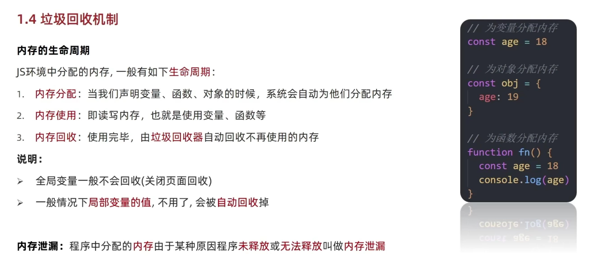

拓展：堆栈空间分配区别——①栈用来存放基本数据类型，由操作系统自动分配释放，例如函数的参数值、局部变量等；②堆用来存放复杂数据类型，例如对象、数组等，一般由程序员分配释放，**如果程序员不释放，那么由垃圾回收机制进行回收**。常见的垃圾回收算法有**引用计数算法、标记清除算法**等。
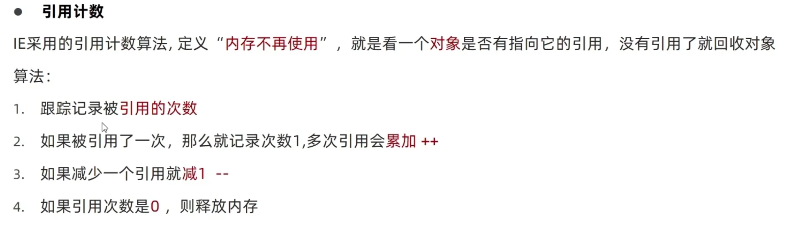
引用计数算法虽然简单，但是如果出现循环引用，那么就永远无法释放那块内存，导致内存泄漏。由此产生了标记清除算法（只保留能找到的，其他的全部回收）：
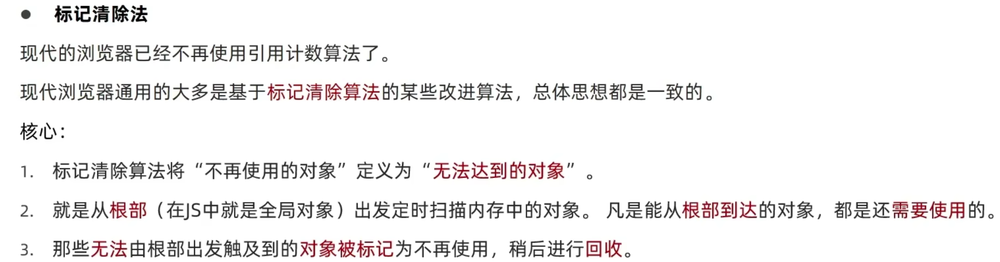

#### 1.5 闭包

闭包的概念：

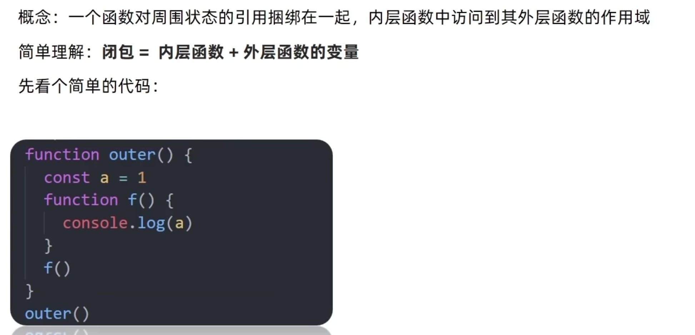
如上代码所示，`f()`这个函数访问到了`a`这个变量，这个变量是定义在外部函数`outer()`中的，所以`f()`函数和`a`状态（变量）捆绑到了一起，就形成了闭包。

闭包的作用：**实现数据的私有**


如上图所示，`count`变量被定义在了`fn()`里面，外部无法直接访问它进行修改，但是通过`fun()`函数进行访问，`fun()`函数和`count`变量捆绑在了一起形成了闭包。接着通过最外层的`result()`调用，实现了对`count`变量的访问。

闭包的问题：**可能会导致内存泄漏**

仍旧看上面那张图右边，程序执行完之后，由于`result()`定义在全局范围内，导致了`fn()`函数和`count`变量一直存在于内存中，无法被垃圾回收机制回收，导致内存泄漏。

#### 1.6 变量提升（了解即可）

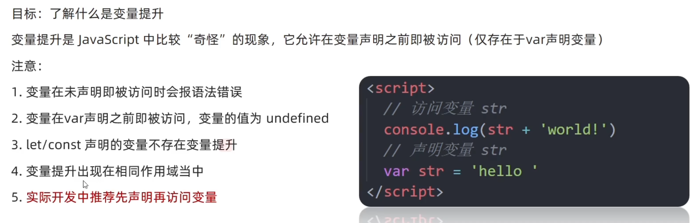
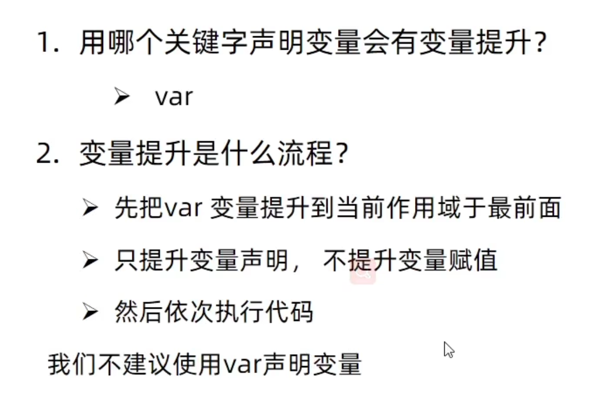

上面的代码中，实际上变成了下面这样：
```javascript
var str;
console.log(str + 'world');  // undefinedworld
str = 'hello ';
```

注意：**只提升到当前作用域最前面！只提升声明，不提升赋值！**

### 2. 函数进阶

#### 2.1 函数提升

和变量提升类似，函数提升是指函数声明会被提升到当前作用域的最前面。**注意，只有函数声明会被提升，函数表达式不会被提升。**

```javascript   
fn();  // hello
function fn() {
    console.log('hello');
}
```

上面的代码中，函数`fn()`在声明之前被调用，仍能正常运行，是因为函数声明也会被提升到当前作用域的最前面。同样的，只提升声明，不提升调用。

但是，下面的情况要注意：

```javascript
fn();  // 报错
var fn = function() {
    console.log('hello');
}
```

上面的代码中，函数表达式不会被提升，所以在调用`fn()`时会报错。实际上，它等价于：

```javascript
var fn;
fn();  // 报错，用var会优先当成变量而不是函数，变量未被定义即报错
fn = function() {
    console.log('hello');
}
```

#### 2.2 函数参数

这一块我们主要讲两种参数：**动态参数和剩余参数**。

**动态参数**：使用`arguments`对象来获取函数的所有参数。`arguments`是一个类数组对象，包含了函数调用时传入的所有参数。**需要特别注意的是，`arguments`对象是一个伪数组，因此不能直接使用数组的方法（当然它也有属于自己的一些方法）。**

```javascript
function fn() {
    console.log(arguments);  // 输出所有参数
}
fn(1, 2, 3);  // 输出：{ '0': 1, '1': 2, '2': 3 }
```
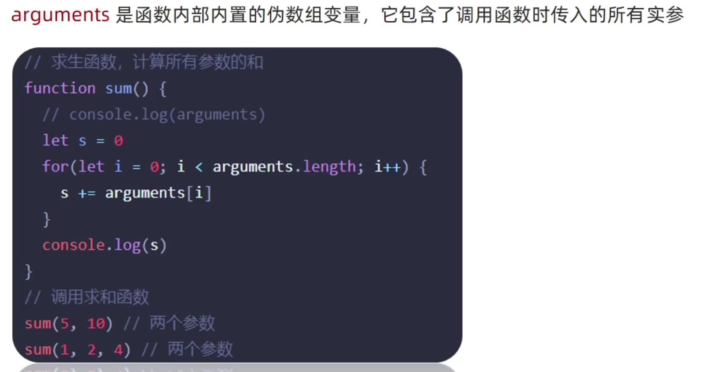

**剩余参数**：使用`...`语法来获取函数的剩余参数。剩余参数是真正的数组，可以使用数组的方法。

```javascript
function fn(...args) {
    console.log(args);  // 输出所有参数
}
fn(1, 2, 3);  // 输出：[1, 2, 3]
```
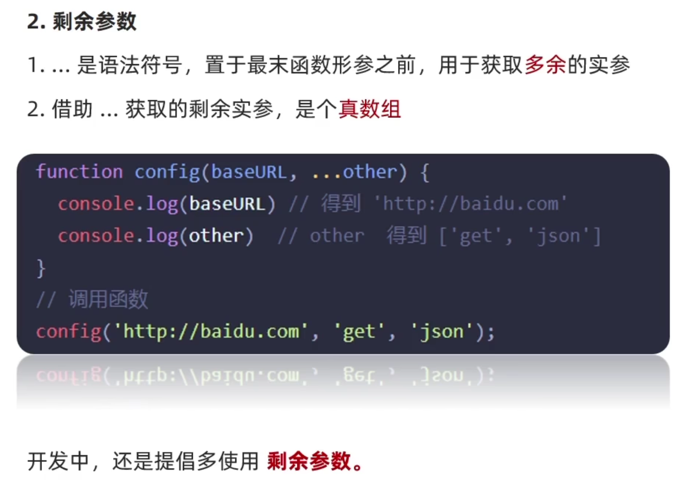

**动态参数和剩余参数最大的区别是，它们一个是伪数组，一个是真数组，开发过程中我们还是更推荐采用剩余参数。**

#### 2.3 展开运算符

讲到剩余参数后，这是一个补充的知识点：它有两个比较大的作用，一个是求数组最大值，另一个是合并数组。
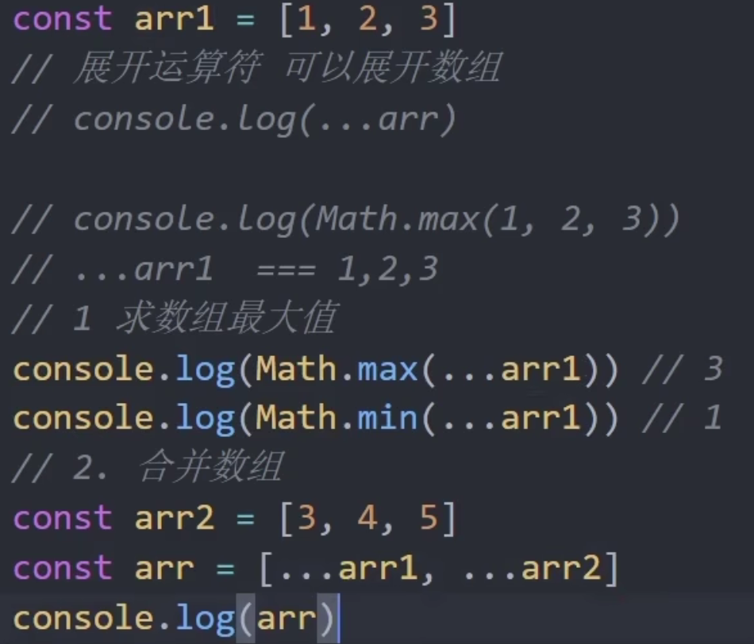

#### 2.4 箭头函数（非常重要）

箭头函数从三个方面来学习：基本语法、箭头函数参数、箭头函数的this指向。

##### 2.4.1 箭头函数基本语法

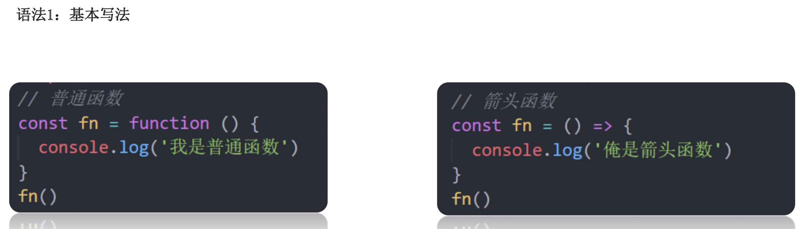
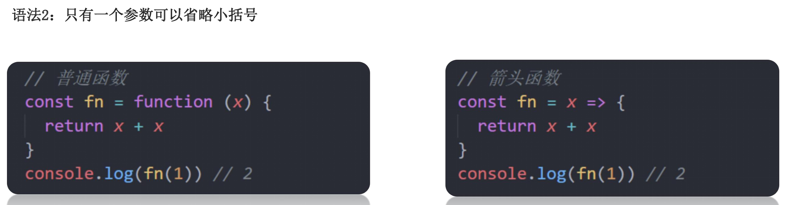
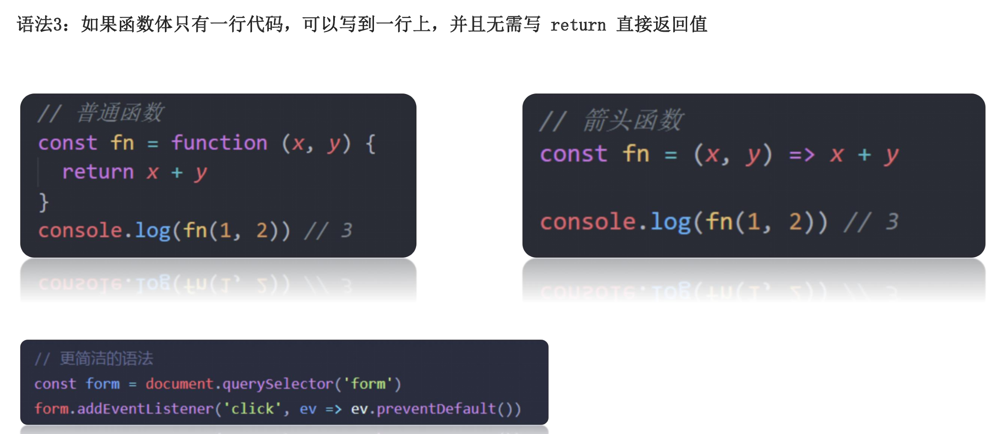
此外，还可以加小括号，直接返回一个对象。
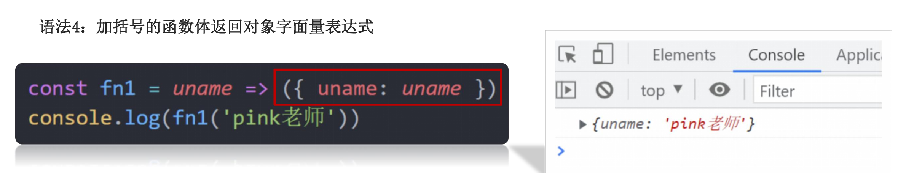

##### 2.4.2 箭头函数参数

箭头函数没有`arguments`动态参数，但是有剩余参数：
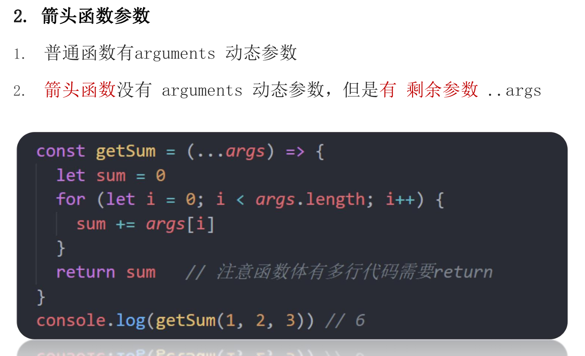

##### 2.4.3 箭头函数的this指向


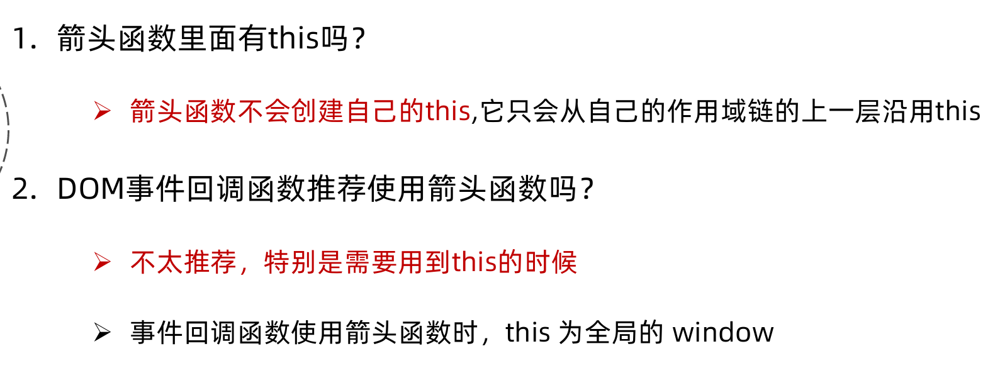

**箭头函数没有自己的`this`，并且在DOM事件回调函数中，最好不要用箭头函数**。关于更多的`this`指向，看下面的几个例子好好体会：


对最后一张图的理解：在对象方法中的箭头函数，`this`指向外部作用域，原因是**对象字面量不产生作用域**，所以最后一张图的`this`指向`window`，具体见：https://blog.csdn.net/2301_81854535/article/details/148829976

### 3. 解构赋值（很重要）

在这一部分，我们主要学习**数组解构和对象解构**。解构赋值是一种快速为变量赋值的简洁**语法**，本质上仍然是为变量赋值。

#### 3.1 数组解构

数组解构是将数组的**单元值**快速**批量**赋值给一系列变量的**简洁语法**，示例：

```javascript
const arr = [1, 2, 3];
const [a, b, c] = arr;
console.log(a, b, c);  // 1 2 3
```

数组解构的一大好处就是可以快速交换变量的值：

```javascript
let a = 1, b = 2;
[a, b] = [b, a];
console.log(a, b);  // 2 1
```

另外，补充一个细节，JS中有两种情况一定要加上分号：

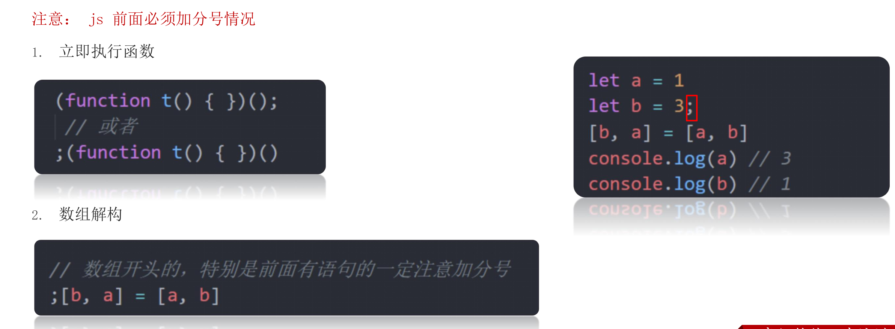

此外，一共有6个特殊的细节，在此不整理建议直接看黑马PPT，总结如下：

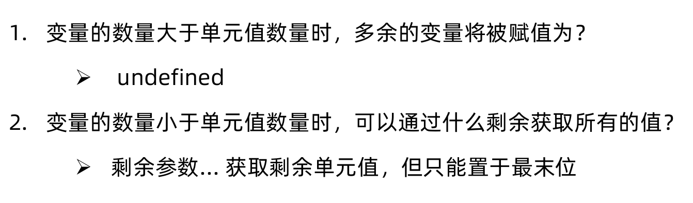

#### 3.2 对象解构（太重要了）

对象解构是将对象的**属性和方法**快速批量赋值给一系列变量的简洁语法。

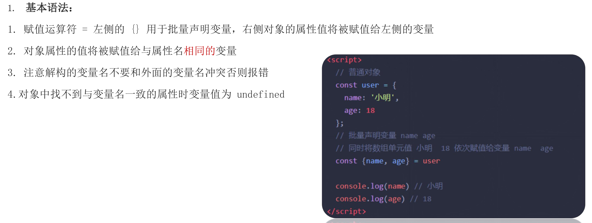

如上图所示，需要注意的是，**解构赋值的变量名必须和对象的属性名一致**，否则会报错。当然，有的时候我们也需要在外面重命名变量，此种情况下可以使用冒号来重命名变量：

```javascript
const obj = { name: 'Alice', age: 25 };
const { name: userName, age: userAge } = obj;
console.log(userName, userAge);  // Alice 25
```

除此之外还有数组对象解构、多级对象解构，都比较简单。下面列举多级对象解构：

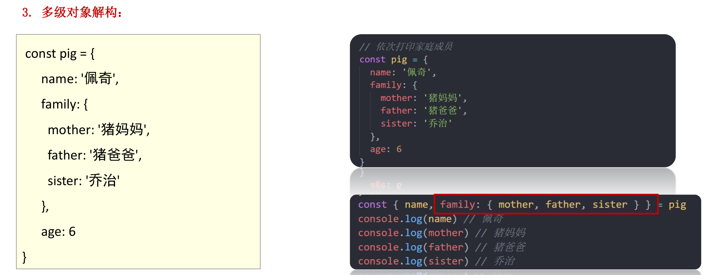

#### 3.3 补充知识点：`forEach`循环（重点）

`forEach`循环是数组的一个方法，用来遍历数组中的每个元素。它接受一个回调函数作为参数，这个回调函数会在每个元素上执行。

```javascript
const arr = [1, 2, 3];
arr.forEach((item, index) => {
    console.log(item, index);  // 输出每个元素和索引
});
```

需要注意的是，`forEach`循环不会返回新的数组，它只是对每个元素执行回调函数，并且回调函数中不需要`return`，而`map`方法会根据`return`的值生成一个新的数组。

#### 3.4 补充知识点：筛选数组的`filter`方法

`filter`方法是数组的一个方法，用来筛选出符合条件的元素，并返回一个新的数组。它接受一个回调函数作为参数，这个回调函数会在每个元素上执行，返回`true`表示保留该元素，返回`false`表示不保留。

```javascript
const arr = [1, 2, 3, 4, 5];
const newArr = arr.filter((item) => {
    return item > 2;
});
console.log(newArr);  // 输出：[3, 4, 5]
```

## Day2 构造函数、数据常用函数

### 1. 深入对象

之前我们学会了两种创建对象的方式，一种是字面量（`const obj = {}`）方式，另一种是`new Object()`方式。现在我们来学习构造函数的方式。

#### 1.1 构造函数

构造函数是一个特殊的函数，用来创建对象。**我们约定**，它的命名通常以大写字母开头，表示这是一个构造函数。使用`new`关键字调用构造函数时，会创建一个新的对象，并将其赋值给`this`。注意，构造函数的返回值是一个对象，它不需要写`return`语句。

```javascript
function Person(name, age) {
    this.name = name;
    this.age = age;
}
const person1 = new Person('Alice', 25);
console.log(person1);  // 输出：{ name: 'Alice', age: 25 }
```

使用构造函数在创建对象时，会有下面四步（**面试常考**）：

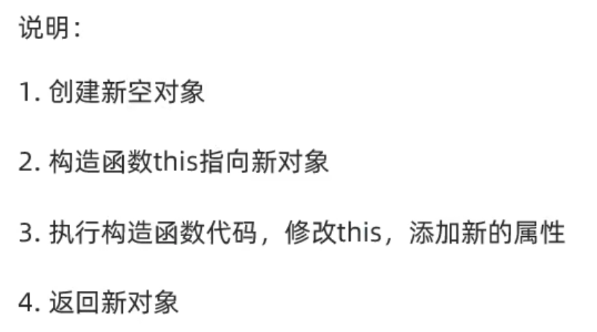

#### 1.2 实例成员和静态成员

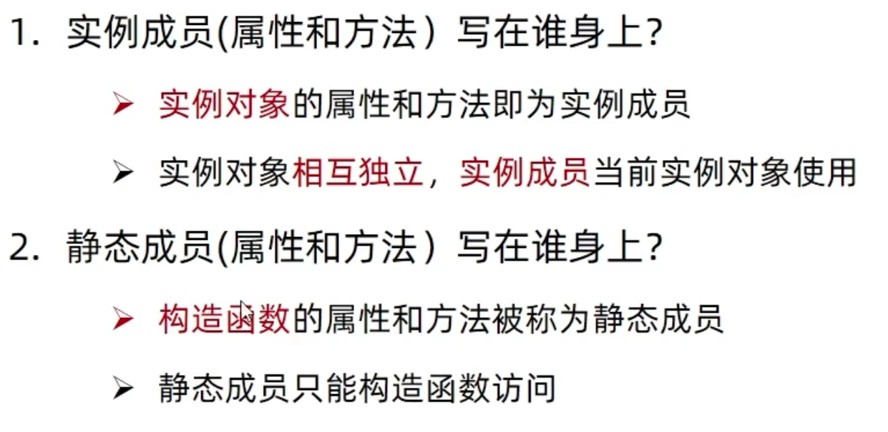

请看下面的例子：

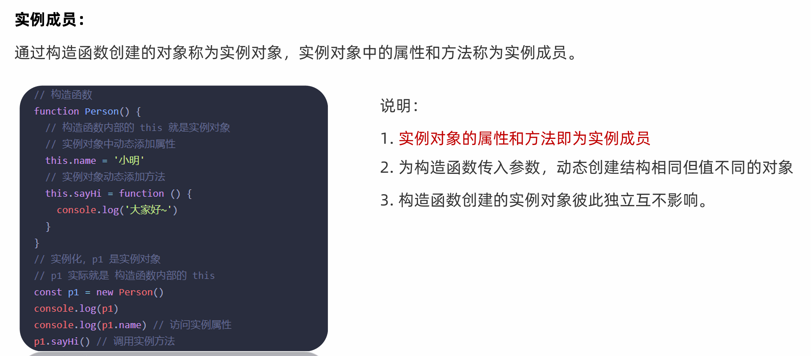
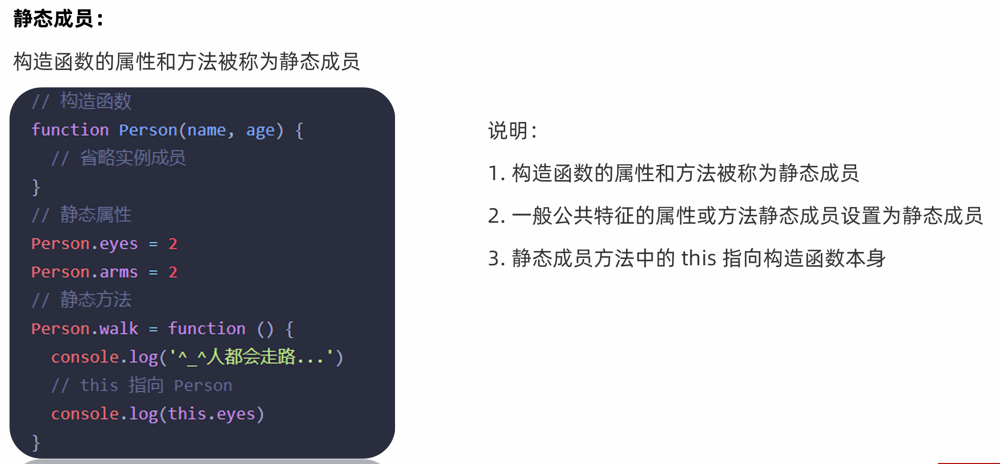

### 2. 内置构造函数

#### 2.1 基本包装类型

在JS中，基本数据类型（`string`、`number`、`boolean`）都有对应的内置构造函数，用来创建对象。它们的作用是将基本数据类型转换为对象类型。

```javascript
const str = new String('Hello');
const num = new Number(123);
const bool = new Boolean(true);
```

我们在实例化一个基本数据类型时，JS底层实际上为我们创造了一个基本包装类型的对象，才拥有了后期我们可以使用的各种方法，提高了我们的编程效率。

#### 2.2 Object

针对`Object`，我们学习它的三个常用静态方法：`Object.keys()`、`Object.values()`、`Object.assign()`。**静态方法是只能给构造函数使用的方法。**

```javascript
const obj = { a: 1, b: 2, c: 3 };
console.log(Object.keys(obj));    // 获取对象的全部属性名，输出：["a", "b", "c"]
console.log(Object.values(obj));  // 获取对象的全部属性值，输出：[1, 2, 3]
const add = { d: 5 };
const result = Object.assign(obj, add);
console.log(result);               // 输出：{ a: 1, b: 2, c: 3, d: 5 }
```

#### 2.3 数组的`reduce`方法（稍微有些麻烦）

`reduce`方法是数组的一个方法，用来对数组中的每个元素执行一个函数，并将结果汇总为单个值。它接受一个回调函数和一个初始值作为参数。**常用来计算数组的总和。**

```javascript
const arr = [1, 2, 3, 4, 5];
const sum = arr.reduce((accumulator, currentValue) => {     // accumulator是上一个值（累加器），currentValue是当前值
    return accumulator + currentValue;
}, 0);      // 初始值为0
console.log(sum);  // 输出：15
```

#### 2.4 数组的`find`、`every`、`Array.from`方法

`find`方法用来查找数组中第一个满足条件的元素。它接受一个回调函数作为参数，返回第一个满足条件的元素，如果没有找到，则返回`undefined`。

```javascript
const arr = [1, 2, 3, 4, 5];
const found = arr.find((item) => {
    return item > 3;  // 查找第一个大于3的元素
});
console.log(found);  // 输出：4
```

`every`方法用来检查数组中的**所有**元素是否满足条件。它接受一个回调函数作为参数，如果所有元素都满足条件，则返回`true`，否则返回`false`。另外，如果是`some`方法，则只要有一个元素满足条件就返回`true`。

```javascript
const arr = [1, 2, 3, 4, 5];
const allGreaterThanZero = arr.every((item) => {
    return item > 0;  // 检查所有元素是否大于0
});
console.log(allGreaterThanZero);  // 输出：true
```

`Array.from`方法用来将类数组对象或可迭代对象或**伪数组**转换为**真数组**。它接受一个类数组对象或可迭代对象作为参数，并返回一个新的数组。

```javascript
const str = 'Hello';
const arr = Array.from(str);
console.log(arr);  // 输出：["H", "e", "l", "l", "o"]
```

#### 2.5 String

掌握`String`的三个常用方法：`substring()`、`startsWith()`、`includes()`。

```javascript
const str = 'Hello World';
console.log(str.substring(0, 5));  // 子字符串，输出：Hello
console.log(str.startsWith('Hello'));  // 检查是否某个字符串开头，输出：true
console.log(str.includes('World'));  // 检查是否包含某个字符串，输出：true
```

#### 2.6 Number.toFixed()

`Number.toFixed()`方法用来将数字格式化为指定的小数位数，并返回一个字符串。它接受一个参数，表示小数点后保留的位数。

```javascript
const num = 3.14159;
console.log(num.toFixed(2));  // 输出：3.14
console.log(num.toFixed(4));  // 输出：3.1416
```

## Day3 深入面向对象

### 1. 构造函数

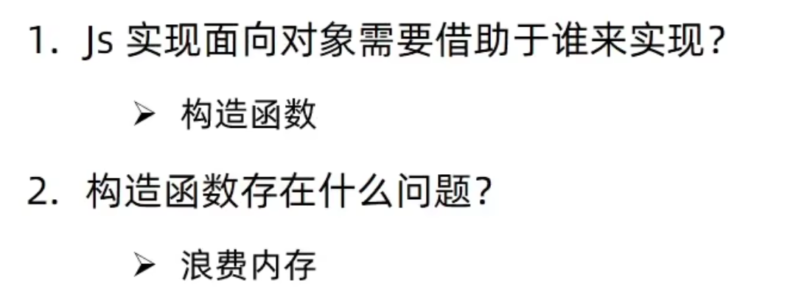

为啥会浪费内存呢？因为每次调用构造函数都会创建一个新的对象，如果这些对象里面有很多共同的方法，那么就会重复实例化，浪费很多内存。

### 2. 原型

原型是JS中实现继承的核心概念。每个函数都有一个`prototype`属性，指向一个对象，这个对象就是该函数的原型。通过原型，我们可以将方法和属性共享给所有实例。也通过原型，我们可以实现方法的复用，节省内存空间。**固定属性写在构造函数中，固定方法写在原型对象中。**

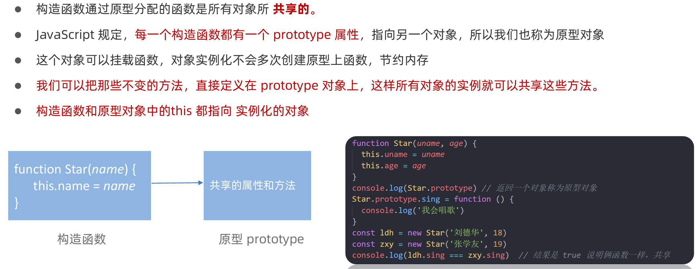

构造函数和原型对象中的`this`指向谁？都是**实例对象**。

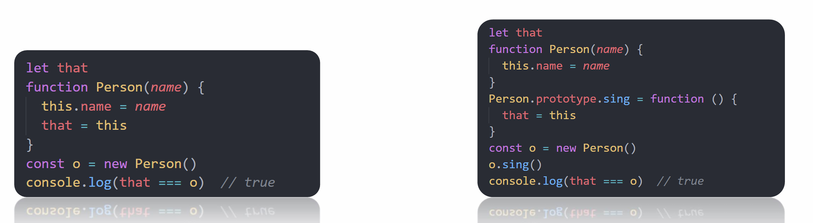
如上图所示，构造函数的比较好理解，原型对象的`this`之所以也指向实例对象，是因为原型方法是通过**实例对象**调用的。谁调用了它，实例对象就指向谁。

