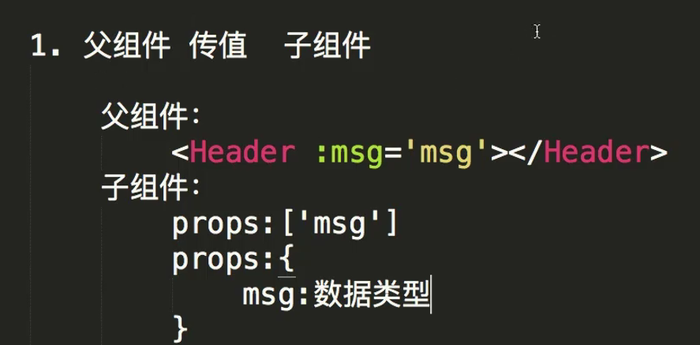

# 1 Vue

## 1.1 渐进式框架

Vue.js核心库只有Vue，没有VueRouter、Vuex等，这些都是Vue的插件，Vue是一个渐进式框架，可以根据项目的需求选择性的使用插件。

## 1.2 生命周期

**1. 生命周期钩子函数：**
```js
beforeCreate
created
beforeMount
mounted
beforeUpdate
updated
beforeDestroy
destroyed
```

**2. 一旦进入到页面或者组件，会执行哪些？**

```js
beforeCreate
created
beforeMount
mounted
```

**3. 在哪些阶段有$el, 在哪个阶段有$data?**

```js
beforeCreate: $el没有，$data没有
created: $el没有，$data有
beforeMount: $el没有，$data有
mounted: $el有，$data有
```

**4. 如果加入keep-alive（缓存）会多两个生命周期：**

```js
activated
deactivated
```

如果加入了keep-alive，第一次进入组件时会执行在原有四个生命周期的基础上加上activated，如果第二次或者第N次进入组件时，只会执行activated。

## 1.3 keep-alive

**1. 作用：** 缓存组件，避免多次重复渲染。
**2. 使用场景：** 缓存组件，提升项目性能。具体比如：首页进入到详情页，如果用户在首页每次点击都是相同的，那么详情页就没必要请求N次，直接缓存起来就可以了。当然如果点击的不是同一个，那么久直接请求。

**场景说的越多，面试成功率越高。**

## 1.4 v-if 和 v-show

**1. v-if：** 如果条件为false，DOM元素不会渲染到页面中。

**2. v-show：** 如果条件为false，DOM元素会渲染到页面中，只是不显示。`display: none 、 block`。

初次加载，v-if比v-show好，因为页面不会去渲染多加载的元素；
但是如果是频繁切换v-show要比v-if好，因为v-if创建和删除的开销太大了，显示和隐藏的开销要小很多。

## 1.5 v-if与v-for 优先级

不建议这两个东西一起写。

在Vue3中，v-if的优先级比v-for要高，所以在Vue3中可以直接在v-for中使用v-if。先判断是否需要渲染在渲染，这也是新版本的Vue减少了渲染的次数。

## 1.6 ref是什么

**1. 作用：** 获取DOM元素或者组件实例，类似于document.getElementById()。其实就是给标签加一个id值类似的操作。

## 1.7 $nextTick

**1. 作用：** 在下次DOM更新循环结束之后执行延迟回调。在修改数据之后立即使用这个方法，**获取更新后的DOM。**

## 1.8 scoped原理

**1. 作用：** 限制样式的作用域，只在当前组件中生效。
**2. 原理：**给结点新增自定义属性，然后css根据选择器添加样式。

## 1.9 SCSS样式穿透

scss、stylus太难了。到目前为止，我能理解的是它们是CSS的一个与编译器。还没看。**视频Vue-9**

## 1.10 父组件传值给子组件




校招：
1、计算机基础（很重要）
2、前端基础

了解：知道这么个东西
熟悉：常用API都读过了

深拷贝、浅拷贝
事件循环（宏任务、微任务）
操作系统事件循环
nodejs的事件循环和js事件循环的区别
键入一个url会发生什么
DNS查找方式有两种，哪两种？
缓存策略：强制缓存、协商缓存
script标签的defer和async区别
重绘和重排
校招会看你是不是值得培养，重在看学习能力