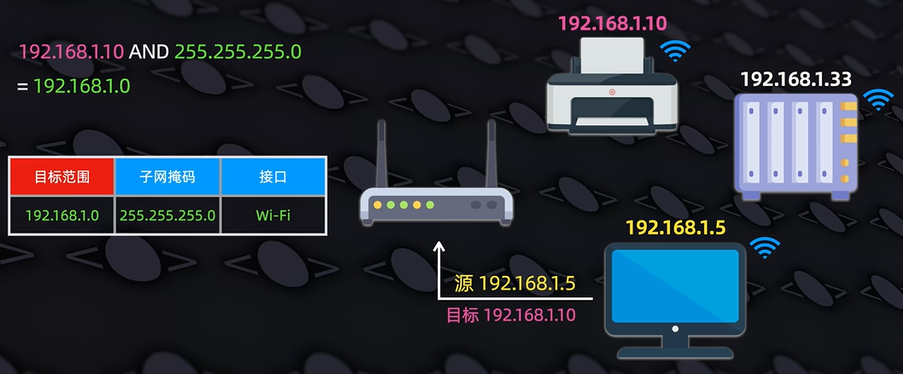
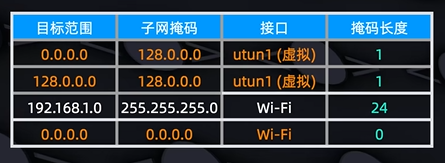
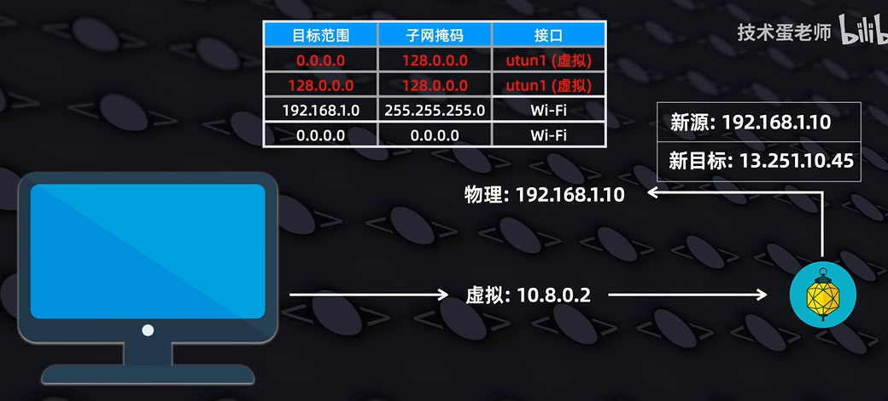
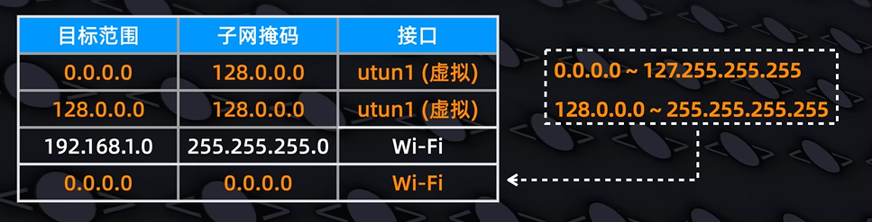

# 为什么VPN会让本地局域网设备瘫痪？

【为什么VPN会让局域网设备瘫痪？】 https://www.bilibili.com/video/BV1UgRpBjEmi/

## 路由表与ARP表

| 对比项       | 路由表                                                                                                           | ARP表                                             |
| ------------ | ---------------------------------------------------------------------------------------------------------------- | ------------------------------------------------- |
| 核心作用     | 决定数据包转发方向，匹配目标网段选择出口网关/网卡                                                                | 根据目标IP查询对应的设备MAC地址                   |
| 通俗类比     | 导航地图，确定走哪条路、去往哪个网关                                                                             | 小区住户登记表，通过门牌号（IP）查住户门牌（MAC） |
| 存储内容     | 目标网络、子网掩码、下一跳网关、出接口、跃点                                                                     | IP地址、对应MAC地址、老化缓存时间                 |
| 工作协同逻辑 | 1. 主机发包先查路由表，确定出口网卡/下一跳IP 2. 再查询ARP表，获取该下一跳IP的MAC地址 3. 封装二层帧完成发送 |

需要注意的是，路由表可不是记录了所有的IP地址，而是记录了一定的地址范围。**目的就是为了确定数据包的转发方向，而不是直接发送到目标设备**。否则如果直接记录了所有的IP地址，那么路由表就会变得非常庞大，导致查询效率下降。

路由器会把你电脑发送过来的目标IP地址与子网掩码做与运算，然后检查是否与目标范围一致，如果一致，说明符合这条路由表，会进行发送，如上图所示。

需要注意的是，路由表可能会有多条记录，那么哪条先发送呢？这就是需要根据路由表的**最长前缀匹配原则**，也就是看子网掩码的二进制数字个数。我们来看下面这张图，掩码长度越长的规则会被进行优先匹配，如果不成功那么就找下一条规则。

在确定了数据包的转发方向后，路由器会根据ARP表，查询该下一跳IP的MAC地址，然后封装二层帧完成发送。下图为示例的ARP表。

## 虚拟接口

在连上VPN之后，VPN应用程序会在你的电脑上创建一个虚拟接口，这个接口会接管你的数据包，然后根据VPN应用程序的配置，将数据包发送到VPN服务器。VPN最重要的是，它会修改你电脑的路由表。

一般就是修改成这样，可以发现，上面两条合二为一就变成了最下面这条默认规则，但是VPN巧妙借用了我们之前说到的路由表的最长前缀匹配原则，让VPN的虚拟接口会优先被使用，而不是走原来的接口，就实现了全局流量走VPN。

## 为什么让本地设备瘫痪？

从上面两个解释中我们可以看出，VPN并不会让本地局域网的设备失去路由，而为什么最终还是瘫痪了呢？那是因为，VPN一般会直接开启本地LAN禁止访问策略，通过防火墙阻止本地的直接局域网连接，从而最终导致设备的瘫痪。
