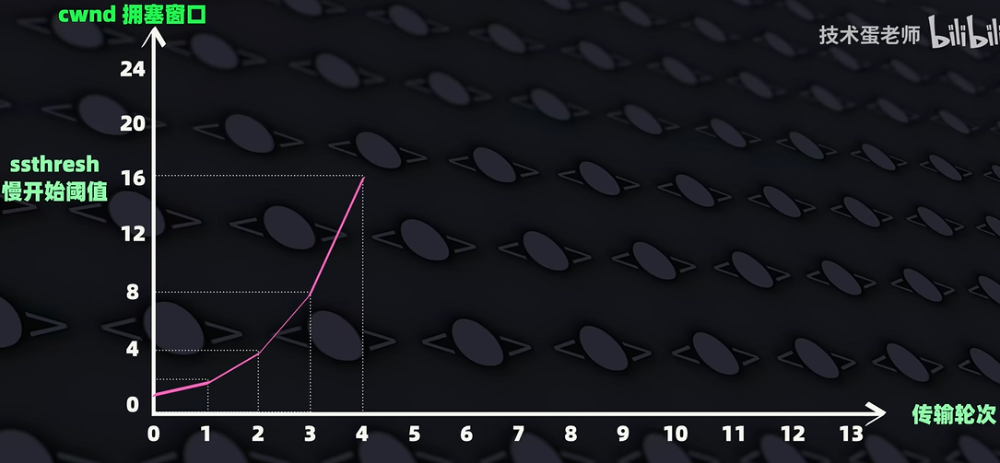
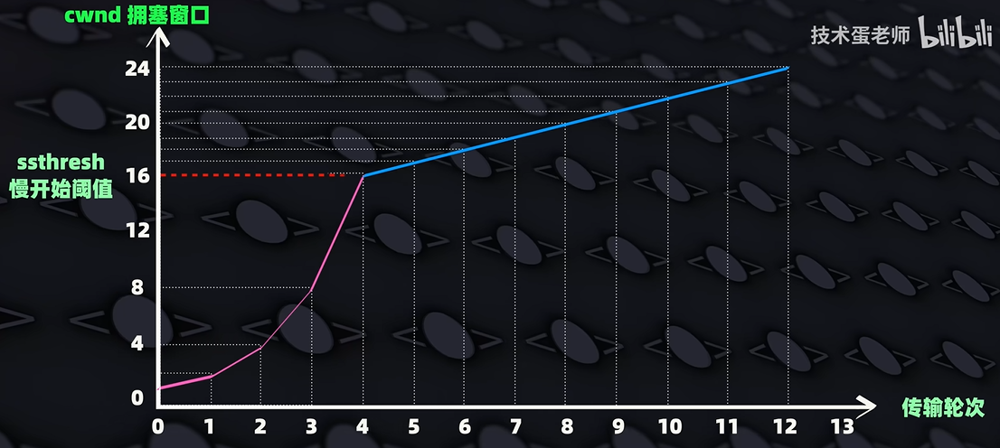
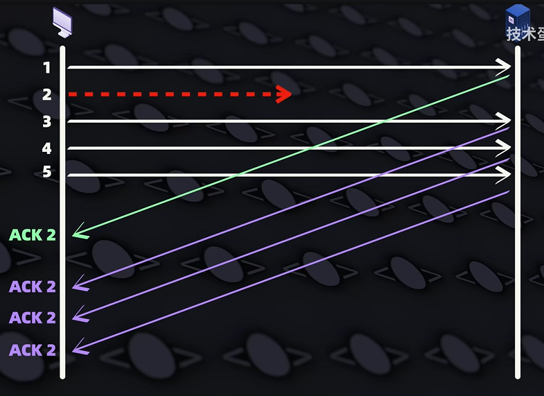
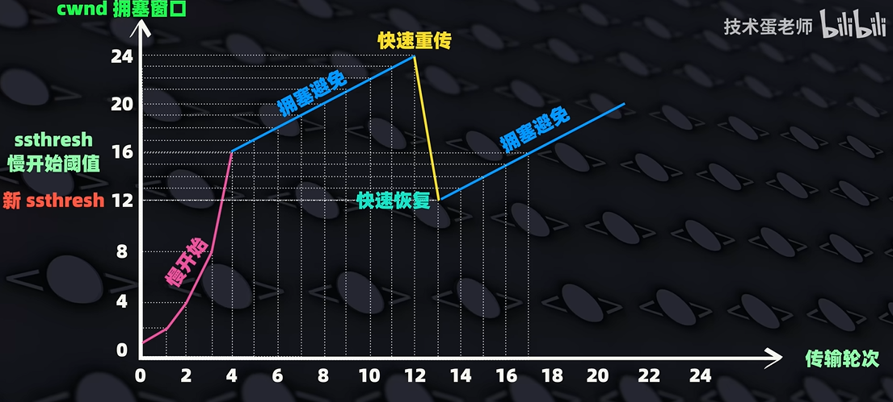
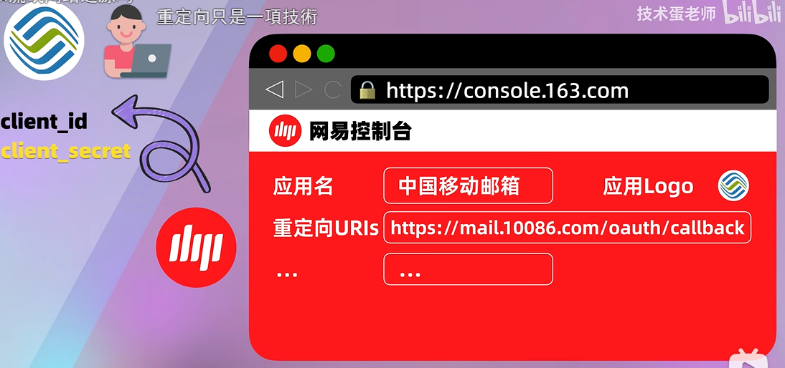
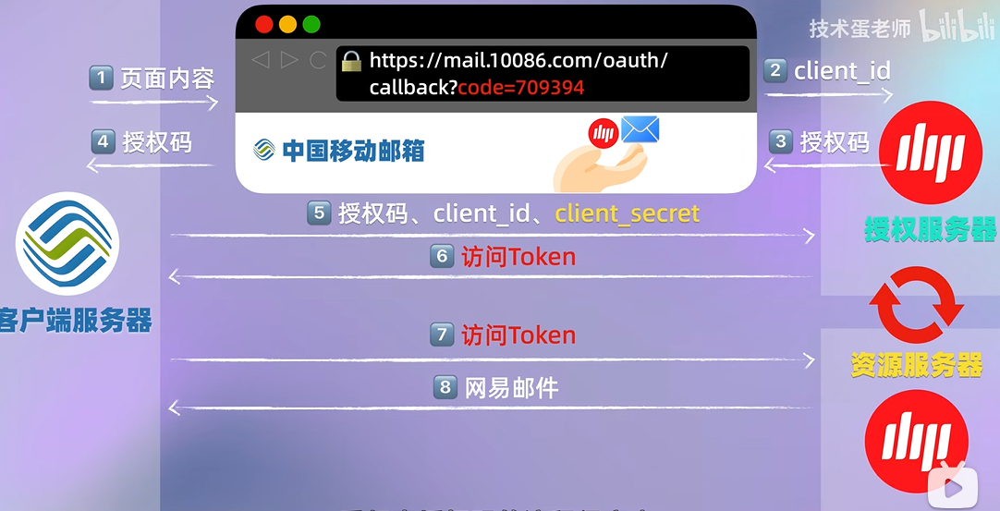
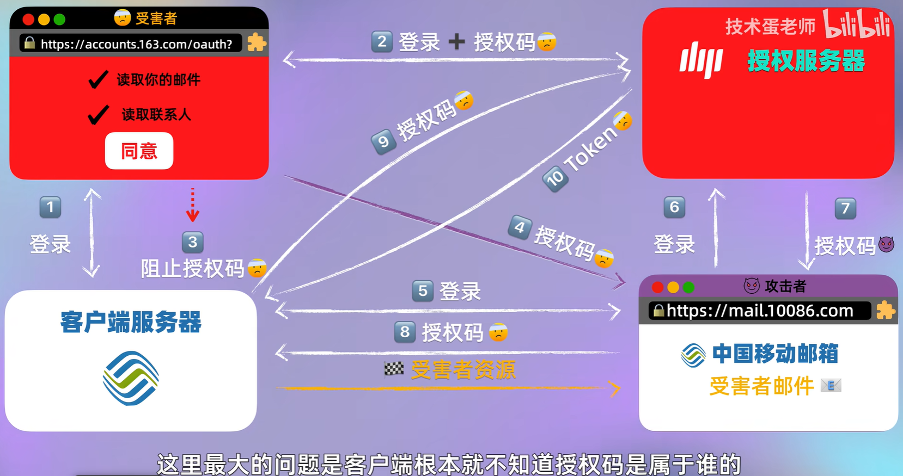
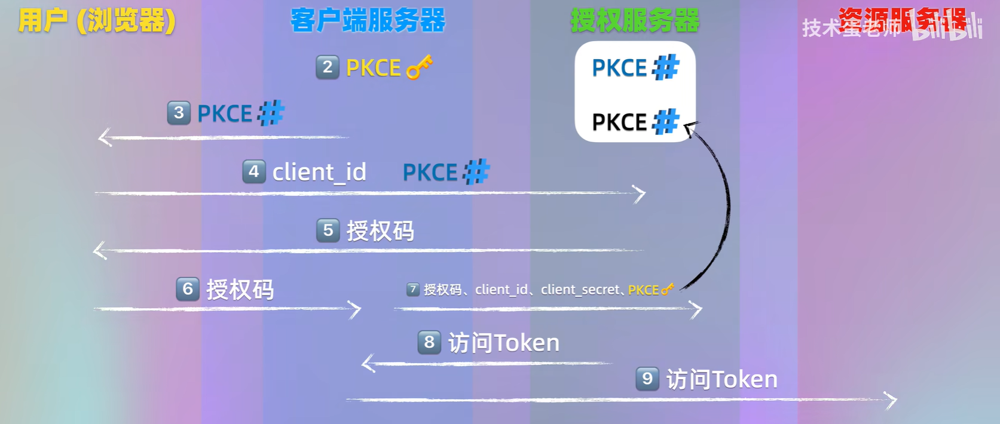

# 为什么VPN会让本地局域网设备瘫痪？

【为什么VPN会让局域网设备瘫痪？】 https://www.bilibili.com/video/BV1UgRpBjEmi/

## 路由表与ARP表

| 对比项       | 路由表                                                                                                           | ARP表                                             |
| ------------ | ---------------------------------------------------------------------------------------------------------------- | ------------------------------------------------- |
| 核心作用     | 决定数据包转发方向，匹配目标网段选择出口网关/网卡                                                                | 根据目标IP查询对应的设备MAC地址                   |
| 通俗类比     | 导航地图，确定走哪条路、去往哪个网关                                                                             | 小区住户登记表，通过门牌号（IP）查住户门牌（MAC） |
| 存储内容     | 目标网络、子网掩码、下一跳网关、出接口、跃点                                                                     | IP地址、对应MAC地址、老化缓存时间                 |
| 工作协同逻辑 | 1. 主机发包先查路由表，确定出口网卡/下一跳IP 2. 再查询ARP表，获取该下一跳IP的MAC地址 3. 封装二层帧完成发送 |

需要注意的是，路由表可不是记录了所有的IP地址，而是记录了一定的地址范围。**目的就是为了确定数据包的转发方向，而不是直接发送到目标设备**。否则如果直接记录了所有的IP地址，那么路由表就会变得非常庞大，导致查询效率下降。

路由器会把你电脑发送过来的目标IP地址与子网掩码做与运算，然后检查是否与目标范围一致，如果一致，说明符合这条路由表，会进行发送，如上图所示。

需要注意的是，路由表可能会有多条记录，那么哪条先发送呢？这就是需要根据路由表的**最长前缀匹配原则**，也就是看子网掩码的二进制数字个数。我们来看下面这张图，掩码长度越长的规则会被进行优先匹配，如果不成功那么就找下一条规则。

在确定了数据包的转发方向后，路由器会根据ARP表，查询该下一跳IP的MAC地址，然后封装二层帧完成发送。下图为示例的ARP表。

## 虚拟接口

在连上VPN之后，VPN应用程序会在你的电脑上创建一个虚拟接口，这个接口会接管你的数据包，然后根据VPN应用程序的配置，将数据包发送到VPN服务器。VPN最重要的是，它会修改你电脑的路由表。

一般就是修改成这样，可以发现，上面两条合二为一就变成了最下面这条默认规则，但是VPN巧妙借用了我们之前说到的路由表的最长前缀匹配原则，让VPN的虚拟接口会优先被使用，而不是走原来的接口，就实现了全局流量走VPN。

## 为什么让本地设备瘫痪？

从上面两个解释中我们可以看出，VPN并不会让本地局域网的设备失去路由，而为什么最终还是瘫痪了呢？那是因为，VPN一般会直接开启本地LAN禁止访问策略，通过防火墙阻止本地的直接局域网连接，从而最终导致设备的瘫痪。

# TCP拥塞控制——我为人人，人人为我

【“我为人人，人人为我”的TCP拥塞控制】 https://www.bilibili.com/video/BV1jWS7BeEX5/

首先要区分，拥塞控制和流量控制。**流量控制**是为了防止接收方一下子接收不了那么多的数据，也就是发送方和接收方两端的事情。而在发送过程中，需要经过很多中间设备，有的时候不是接收方存不下这些数据，而是中间设备存不下，那就是由**拥塞控制**来解决这个问题。

## 拥塞窗口

拥塞窗口是指发送方和接收方之间，用于控制发送速率的窗口大小。首先在三次握手建立连接时，接收方会向发送方发送一个接收方的**接收窗口**大小（rwnd，receive window size）；此外，发送方会维护一个窗口大小，也就是**拥塞窗口**（cwnd，congestion window），因为显然，你不能是接收方一个人说了算，如果中间路程很堵，按接收窗口来发远远不行的话，就需要以我们的拥塞窗口作为基准了。这个窗口大小会根据接收方的接收窗口大小和网络拥塞程度来动态调整。至于怎么调整呢，就需要**慢开始、拥塞避免、快速重传、快速恢复**四个核心的技能。

## 慢开始

在慢开始过程中，起初发送方会试探性的发送少量的数据，然后根据接收方的反馈，按指数级别去增加发送速率。一旦达到了如图所示的慢开始阈值，就会开始拥塞避免阶段，变成线性增加。

## 拥塞避免

如上图所示，拥塞避免就按照这样的方式来增加发送速率。但是也不可能无限增长上去，总有一天会超。如下图所示，如果接收方连续返回多次相同的ACK，表示我没收到那个数据包，我想要发送方重新发送，就说明出现了丢包。一旦发生了丢包，就要进行到快速重传阶段。

## 快速重传、快速恢复

此时新版本的TCP会把cwnd重置为原来最大值的一半，然后继续执行拥塞避免算法。同时，还会把ssthresh重置为原来最大值的一半，作为快速恢复的阈值。然后不断重复上述过程。

# OAuth 2.0核心流程、攻击原理和保护机制

【OAuth 2.0核心流程、攻击原理和保护机制】 https://www.bilibili.com/video/BV195Yfz9Ebw/

这个视频知识点讲的比较深刻。视频中设想这样一个场景，我们想要使用移动邮箱去代收网易邮箱里面的东西。下面会出现三个身份，网易就是授权服务器，移动就是客户端服务器，而浏览器则存在于用户地方，用户是资源的拥有者。

## 客户端注册

首先，中国移动的开发者要向网易申请一个**客户端ID**，也就是**client_id**。这个客户端ID会被用于在后续的授权过程中，验证移动客户端的身份。来实现移动能够接入网易。这个步骤也叫做**客户端注册**。

## 授权码工作流

在完成了客户端注册之后，来自世界各地的用户就可以通过中国移动对接网易云的接口，来实现代收邮箱了，那么具体是怎么鉴权的呢，我们来看下下面的授权码工作流：

一张完整的图示见上面。用户肯定首先访问的是中国移动的网站，然后网站会跳转到网易的授权服务器，同时携带了client_id，来表明是中国移动想使用网易邮箱。用户在网易的授权界面下登录网易账号，完成授权之后，网易的授权服务器会发送给用户一个授权码，这个授权码是明文携带在浏览器地址栏上的。拿到授权码之后，用户的浏览器会把授权码发送给中国移动客户端的服务器，接着客户端服务器带上授权码、client_id以及用户看不到的后端client_secret信息给授权服务器，授权服务器返回访问token给到客户端，就可以使用这个token来获取网易邮件了。

这里面重要的是client_secret始终在客户端后端存在，不会被泄露给用户，所以在没有第三方插件的浏览器中，OAuth 2.0授权码工作流过程还算是比较安全的。

## 注入攻击

我们来看一下注入攻击，在这个攻击中，攻击者会组织受害者发送授权码到客户端服务器中，也就是图中的第三步，而转而把授权码发送给攻击者。然后攻击者用自己的账号执行登录授权过程，同时在第8步发送授权码给客户端服务器时，会把授权码替换为受害者的授权码，这样子授权服务器最终会把受害者的token发送给客户端服务器，最终客户端服务器再把受害者的资源转给攻击者。

那么解决方法，就是在用户登录授权时，客户端服务器按照一定的算法生成一个具有用户标识的PKCE。这样子，黑客没有办法伪造这个PKCE，服务器最终发现PKCE不匹配，就会拒绝请求。（建议听视频，视频讲的更清楚）
